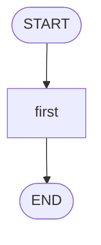

# Simulated agent review artifacts

## FEEDBACK.md skeleton

~~~markdown
# Agent Name implementation feedback

Review target: `<path/to/graph.py>`

## Overall verdict

Short verdict. Mention whether the graph shape is correct and what the biggest learning improvement is.



## What you did well

- ...

## Main issues to improve

### 1. Issue title

Why it matters.

```python
# concrete before/after when helpful
```

## Suggested next learning target

Compare `graph.py` with `graph_reference.py`, focusing on:

1. required vs optional state;
2. clean state payloads;
3. direct graph invocation vs thin CLI adapters;
4. graph invariants.
~~~

## Bootstrap-to-reference path

- Bootstrap skill may create `respond()` as a placeholder CLI adapter. That is acceptable for first-run ergonomics.
- User implementation may keep `respond()` if it stays thin: build initial state, call `graph.invoke(...)`, return the final output.
- Reference implementation should usually show direct `graph.invoke(...)` in `__main__` when teaching state flow.
- Feedback should not say “remove `respond()`” unless the wrapper hides behavior, adds unrelated logic, or conflicts with the user's requested learning goal.

## graph_reference.py pattern

Use this shape for a sequential simulated council/orchestrator graph. Adapt node names and fields to the specific agent.

```python
from __future__ import annotations

from typing import NotRequired, TypedDict

from dotenv import load_dotenv
from langchain.messages import HumanMessage, SystemMessage
from langchain_openai import ChatOpenAI
from langgraph.graph import END, START, StateGraph

from simulated_agents.settings import get_settings

load_dotenv()
settings = get_settings()
llm = ChatOpenAI(model=settings.openai_model, reasoning_effort="low")


class ExampleState(TypedDict):
    question: str
    first_response: NotRequired[str]
    final_summary: NotRequired[str]


def first_node(state: ExampleState) -> dict[str, str]:
    question = state["question"]
    response = llm.invoke(
        [
            SystemMessage(content="You are the first simulated role."),
            HumanMessage(content=f"Question:\n{question}"),
        ]
    )
    content = response.content if isinstance(response.content, str) else str(response.content)
    return {"first_response": content}


def final_node(state: ExampleState) -> dict[str, str]:
    question = state["question"]
    first_response = state["first_response"]
    response = llm.invoke(
        [
            SystemMessage(content="Synthesize the prior simulated role output."),
            HumanMessage(content=f"Question:\n{question}\n\nFirst response:\n{first_response}"),
        ]
    )
    content = response.content if isinstance(response.content, str) else str(response.content)
    return {"final_summary": content}


graph_builder = StateGraph(ExampleState)
graph_builder.add_node("first_node", first_node)
graph_builder.add_node("final_node", final_node)
graph_builder.add_edge(START, "first_node")
graph_builder.add_edge("first_node", "final_node")
graph_builder.add_edge("final_node", END)
graph = graph_builder.compile()


if __name__ == "__main__":
    while True:
        try:
            user_input = input("🧑‍💻 User: ")
            if user_input.lower() in ["/quit", "/exit", "/q"]:
                print("Goodbye!")
                break

            initial_state: ExampleState = {"question": user_input}
            result = graph.invoke(initial_state)
            print(result["final_summary"])
        except KeyboardInterrupt:
            print("\nGoodbye!")
            break
        except Exception as exc:
            print(f"{type(exc).__name__}: {exc}")
            break
```

## Common review comments

- If the state stores `AIMessage` but nodes only need `.content`, recommend storing `str`.
- If a fixed sequence graph returns `{}` when required prior state is missing, recommend failing loudly with `state[...]`.
- If `respond()` is a thin CLI adapter in user code, treat it as acceptable; if it hides state flow or unrelated logic, recommend direct invocation or a thinner adapter.
- If a prompt interpolates whole message objects, recommend `.content` or string state.
- If README says the graph is still a placeholder, update the README pair after implementation/reference files are added.
