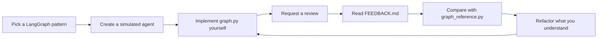

# langgraph-playground

A personal playground for learning LangGraph by building, breaking, and experimenting with graphs.

This repository started as a collection of LangGraph experiments inside my main project. Over time, the learning material became useful enough to deserve its own home, so I split it into a standalone repository.

Rather than building production systems, this repository focuses on understanding how graph-based agents are designed.

Topics explored here include:

- Graph state design
- Conditional routing
- Reducers
- Reflection loops
- Map-reduce workflows
- Multi-agent collaboration
- Human-in-the-loop patterns
- Graph refactoring and composition

The repository is designed to work alongside LLM coding assistants such as Codex and ChatGPT.

The examples, pattern notes, and repo-local skills provide enough context for an assistant to act as a learning partner rather than just a code generator. The goal is to help create exercises, review implementations, and generate reference solutions that support deliberate practice.

> This is a place to learn LangGraph by building graphs, not just reading about them.

Korean version: [README.md](./README.md)

---

## What is this?

This repository is a collection of LangGraph learning exercises.

Each exercise focuses on a specific graph pattern or design idea.

Examples include:

- Reducer exercises
- Router exercises
- Reflection loop exercises
- Multi-agent workflows
- State design practice
- Interview-style agents
- Evaluation and review loops

The goal is not to build agents.

The goal is to understand why a graph is structured the way it is.

---

## Learning workflow

The recommended workflow for this repository looks like this:



The core idea is simple:

Build something yourself, get feedback, compare it with a reference implementation, and only adopt improvements you actually understand.

Most of the learning happens during comparison and iteration.

---

## Repository structure

### `simulated_agents/`

Tutorial-style graph experiments and practice agents.

Each folder represents a self-contained learning exercise built around a particular LangGraph pattern.

### `.agents/skills/`

Platform-neutral repo-local skills.

These skills help bootstrap new exercises and review existing implementations.

### `.codex/skills/`

Codex compatibility wrappers.

The canonical skill definitions live under `.agents/skills/`; these wrappers simply make them available to Codex.

### `docs/agent-patterns/`

A catalog of LangGraph patterns and exercise ideas.

Use it whenever you're deciding what to practice next.

### `tests/`

Regression tests that help ensure reference implementations and learning examples continue to behave as expected.

---

## Learning philosophy

This repository treats LLM assistants as learning partners rather than automatic coding tools.

Assistants can help by:

- Creating new exercises
- Explaining graph structures
- Reviewing implementations
- Suggesting improvements
- Generating reference implementations
- Discussing design trade-offs

A typical learning loop looks like this:

1. Pick a pattern.
2. Implement it yourself.
3. Request a review.
4. Compare against a reference implementation.
5. Apply only the improvements you understand.
6. Repeat.

Learning comes from iteration, not generation.

---

## Project boundaries

This repository intentionally stays focused on learning.

Examples should generally favor:

- Explicit graph code
- Small and understandable examples
- Simulated agents
- Fake tools
- Fake stores
- Reproducible experiments
- Educational explanations

Unless the purpose of the repository changes, examples should generally avoid:

- Production APIs
- Authentication
- Databases
- Frontend applications
- Deployment infrastructure
- Cloud operations
- Production architecture

The goal is to understand graph design, not production engineering.

---

## Learning with an LLM assistant

Think of the assistant as a LangGraph pair-programming tutor.

A typical workflow might look like:

1. Choose a concept from `docs/agent-patterns/README.md`.
2. Ask the assistant to scaffold a new simulated agent.
3. Implement the graph in `simulated_agents/<agent_name>/graph.py`.
4. Request an implementation review.
5. Compare your solution with the generated reference implementation.
6. Refine and repeat.

Example prompts:

```text
Use simulated-agent-bootstrap to create a reducer playground exercise.

Review simulated_agents/support_ticket_router and write feedback plus a reference implementation.

Help me understand why this conditional edge is not routing to the expected node.

Suggest the next practice agent after the editor-in-chief review loop.
```

Assistants should generally keep exercises learning-focused.

Unless explicitly requested, avoid expanding exercises into production APIs, databases, authentication systems, frontend applications, or deployment infrastructure.

You can continue growing the repository by adding notes under `docs/agent-patterns/`.

Future assistant runs can use those notes when proposing or scaffolding new exercises, turning the pattern catalog into reusable learning context rather than one-off chat history.

---

## Agent skills

Repo-local skills live under `.agents/skills/`.

Their purpose is to make the learning workflow repeatable and discoverable.

| Skill                                   | Purpose                                                                                           |
| --------------------------------------- | ------------------------------------------------------------------------------------------------- |
| `simulated-agent-bootstrap`             | Creates a new exercise with README guides, starter files, and implementation scaffolding.         |
| `simulated-agent-implementation-review` | Reviews an implementation and generates learner-focused feedback plus a reference implementation. |

Codex compatibility wrappers live under `.codex/skills/` and simply point back to the canonical skill definitions.

### Using a skill

In assistants that can read repo-local skills:

```text
Use simulated-agent-bootstrap to scaffold a study planner map-reduce agent.

Use simulated-agent-implementation-review on simulated_agents/reducer_playground.
```

In environments that support explicit skill invocation:

```text
$simulated-agent-bootstrap I want to practice a new agent design pattern.

$simulated-agent-implementation-review Please review the implementation I made.
```

If automatic skill discovery is unavailable:

```text
Follow .agents/skills/simulated-agent-bootstrap/SKILL.md and create a new simulated agent named "Evidence Collector".

Follow .agents/skills/simulated-agent-implementation-review/SKILL.md and review simulated_agents/mbti.
```

Keep `.agents/skills/` as the source of truth whenever skill behavior changes.

---

## Skill-generated artifacts

The skills are not magic buttons that finish the work for you.

They exist to structure and preserve the learning process.

| File                 | Purpose                                      |
| -------------------- | -------------------------------------------- |
| `README.md`          | Korean learning guide                        |
| `README.en.md`       | English learning guide                       |
| `graph.py`           | Your implementation                          |
| `FEEDBACK.md`        | Review and improvement suggestions           |
| `graph_reference.py` | Comparison-oriented reference implementation |

Recommended learning loop:

1. Generate a new exercise.
2. Implement it yourself.
3. Generate feedback and a reference implementation.
4. Compare the two approaches.
5. Apply only the improvements you understand.
6. Test again.

Treat `graph_reference.py` as a study companion, not an answer key.

Its purpose is to help explain why state structures changed, how responsibilities were separated, and how alternative graph designs might be implemented.

---

## Setup

```bash
uv sync --dev
```

For OpenAI-backed examples:

```bash
export OPENAI_API_KEY=sk-...
export LANGGRAPH_PLAYGROUND_OPENAI_MODEL=gpt-5.5
export LANGGRAPH_PLAYGROUND_OPENAI_TIMEOUT_SECONDS=30
export LANGGRAPH_PLAYGROUND_OPENAI_MAX_OUTPUT_TOKENS=1200
```

Short-form `PLAYGROUND_OPENAI_*` environment variable aliases are also supported.

---

## Running examples

Most simulated agents expose a simple terminal loop:

```bash
uv run python -m simulated_agents.mbti.graph
uv run python -m simulated_agents.study_coach.graph
uv run python -m simulated_agents.missing_info_interviewer.graph
```

Some reference implementations are intended for reading, comparison, and testing rather than direct execution.

---

## Verification

```bash
uv run pytest -q

uv run ruff check . --no-cache

uv run ruff format --check .
```
