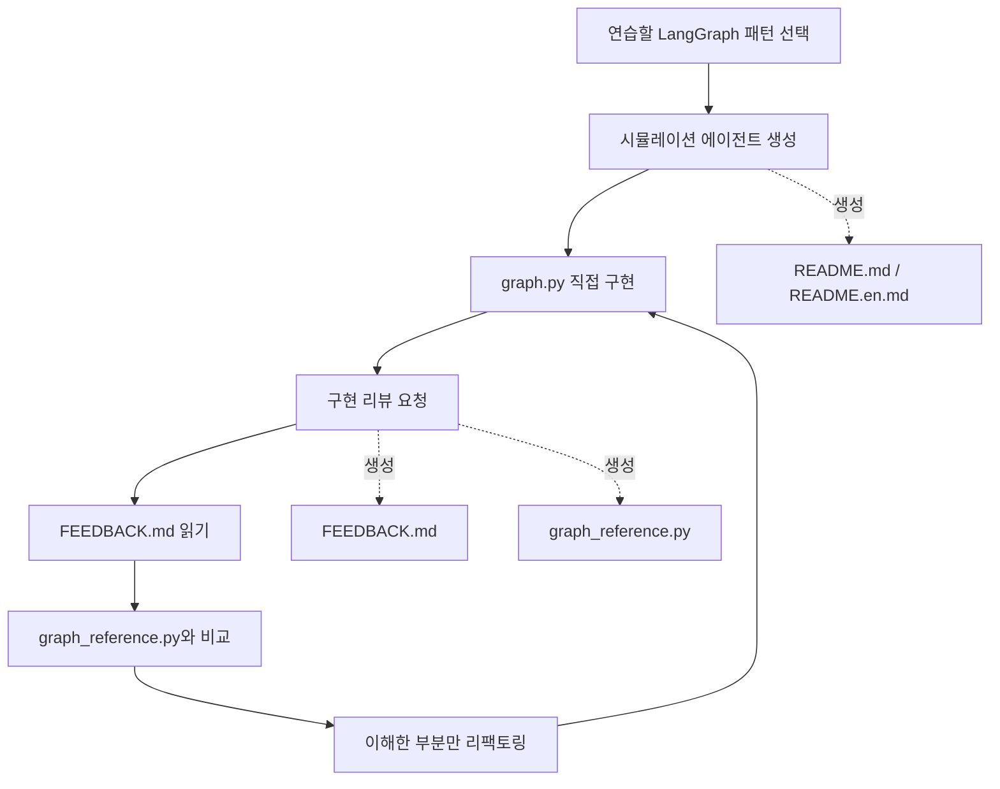

# langgraph-playground

작게 만들고, 직접 고치고, 반복해서 실험하면서 LangGraph를 배우기 위한 개인 학습 플레이그라운드입니다.

이 저장소는 원래 제 개인 프로젝트 안에서 진행하던 LangGraph 실험들을 분리해 만든 공간입니다. 실제 서비스를 만들기 위한 저장소라기보다, 그래프 구조와 에이전트 패턴을 이해하기 위해 다양한 아이디어를 시도해 보는 실험실에 가깝습니다.

여기서는 프로덕션 시스템을 만드는 대신 다음과 같은 것들을 연습합니다.

- Graph State 설계
- Conditional Routing
- Reducer
- Reflection Loop
- Map-Reduce 패턴
- Multi-Agent 협업
- Human-in-the-loop 흐름
- Graph 구조 리팩토링

또한 이 저장소는 Codex, ChatGPT 같은 LLM 코딩 어시스턴트와 함께 사용하는 것을 전제로 설계되었습니다.

저장소 안의 문서, 패턴 노트, 로컬 스킬은 어시스턴트가 프로젝트 맥락을 이해하고 학습 파트너처럼 동작하도록 돕습니다. 단순히 코드를 대신 작성하는 것이 아니라, 연습 문제를 만들고, 구현을 리뷰하고, 비교용 참조 구현을 제공하는 역할을 목표로 합니다.

> LangGraph를 "읽어서" 배우는 곳이 아니라, 직접 그래프를 만들고 부수면서 배우는 곳입니다.

English version: [README.en.md](./README.en.md)

---

## 이 저장소는 무엇인가?

이 저장소는 LangGraph 학습을 위한 연습 문제 모음입니다.

각 연습은 하나의 그래프 패턴이나 설계 아이디어를 중심으로 구성됩니다.

예를 들어:

- Reducer 연습
- Router 연습
- Reflection Loop 연습
- Multi-Agent 패턴 연습
- State 설계 연습
- 인터뷰형 에이전트 연습
- 평가 및 리뷰 루프 연습

중요한 것은 "에이전트를 만드는 것"이 아닙니다.

왜 그래프가 그런 구조를 가지는지 이해하는 것이 목표입니다.

---

## 학습 흐름

이 저장소에서 권장하는 학습 루프는 다음과 같습니다.



직접 구현하고, 리뷰를 받고, 참조 구현과 비교한 뒤, 이해한 개선점만 다시 반영하는 과정을 반복하는 것이 핵심입니다.

실제 학습은 구현보다 비교 과정에서 많이 일어납니다.

---

## 저장소 구성

### `simulated_agents/`

튜토리얼 스타일의 그래프 실험과 연습용 시뮬레이션 에이전트가 들어 있습니다.

각 폴더는 하나의 독립적인 학습 과제이며 특정 LangGraph 패턴을 연습하기 위한 예제로 구성됩니다.

### `.agents/skills/`

플랫폼에 종속되지 않는 저장소 로컬 스킬입니다.

새 연습 문제를 만들거나 구현을 리뷰할 때 사용합니다.

### `.codex/skills/`

Codex 호환용 래퍼입니다.

실제 스킬 정의는 `.agents/skills/` 아래에 있으며, 이 디렉터리는 Codex가 같은 스킬을 사용할 수 있도록 연결만 제공합니다.

### `docs/agent-patterns/`

LangGraph 패턴 카탈로그입니다.

다음에 무엇을 연습할지 고민될 때 참고할 수 있습니다.

### `tests/`

참조 구현과 예제가 의도한 형태를 유지하는지 검증하는 테스트입니다.

---

## 학습 철학

이 저장소는 LLM 어시스턴트를 "자동 코딩 도구"가 아니라 "학습 파트너"로 사용하는 것을 목표로 합니다.

어시스턴트는 다음과 같은 역할을 수행할 수 있습니다.

- 새로운 연습 문제 생성
- 그래프 구조 설명
- 구현 리뷰
- 개선점 제안
- 참조 구현 제공
- 설계 선택의 장단점 설명

추천하는 학습 흐름은 다음과 같습니다.

1. 연습할 패턴을 하나 고른다.
2. 직접 구현한다.
3. 리뷰를 요청한다.
4. 참조 구현과 비교한다.
5. 이해한 부분만 반영한다.
6. 반복한다.

---

## 저장소의 경계

이 저장소는 의도적으로 학습 환경에 집중합니다.

따라서 예제는 다음을 우선합니다.

- 명시적인 그래프 코드
- 작은 규모의 예제
- 시뮬레이션 에이전트
- Fake Tool
- Fake Store
- 재현 가능한 실험
- 설명 가능한 설계

반대로 특별한 이유가 없다면 다음은 포함하지 않습니다.

- 프로덕션 API
- 인증
- 데이터베이스
- 프론트엔드
- 배포 인프라
- 클라우드 운영
- 서비스 아키텍처

이 저장소의 목적은 서비스를 만드는 것이 아니라 그래프를 이해하는 것입니다.

---

## LLM 어시스턴트와 함께 학습하기

어시스턴트를 LangGraph 페어 프로그래밍 튜터처럼 활용할 수 있습니다.

예시 학습 흐름:

1. `docs/agent-patterns/README.md`에서 하나의 패턴을 고른다.
2. 새 시뮬레이션 에이전트를 만들어 달라고 요청한다.
3. `simulated_agents/<agent_name>/graph.py`에 직접 구현한다.
4. 구현 리뷰를 요청한다.
5. 참조 구현과 비교한다.
6. 개선 후 다시 반복한다.

예시 프롬프트:

```text
Use simulated-agent-bootstrap to create a reducer playground exercise.

Review simulated_agents/support_ticket_router and write feedback plus a reference implementation.

Help me understand why this conditional edge is not routing to the expected node.

Suggest the next practice agent after the editor-in-chief review loop.
```

어시스턴트는 기본적으로 학습 중심 접근을 유지해야 합니다.

특별한 요청이 없는 한 프로덕션 API, 데이터베이스, 인증, 배포 같은 주제로 확장하지 않는 것을 권장합니다.

또한 `docs/agent-patterns/` 아래에 패턴 노트를 계속 추가하면서 플레이그라운드를 확장할 수 있습니다.

이후 어시스턴트는 새로운 연습 문제를 제안하거나 생성할 때 해당 노트를 참고할 수 있으며, 패턴 카탈로그는 일회성 대화 기록이 아니라 재사용 가능한 학습 자산이 됩니다.

---

## 에이전트 스킬

저장소 로컬 스킬은 `.agents/skills/` 아래에 있습니다.

이 스킬들은 반복 가능한 학습 과정을 만들기 위해 존재합니다.

| 스킬                                    | 목적                                                                     |
| --------------------------------------- | ------------------------------------------------------------------------ |
| `simulated-agent-bootstrap`             | 새로운 학습 과제를 만들고 README, 기본 파일, 구현 스캐폴드를 생성합니다. |
| `simulated-agent-implementation-review` | 구현을 리뷰하고 피드백 및 참조 구현을 생성합니다.                        |

Codex 전용 래퍼는 `.codex/skills/` 아래에 있으며 실제 스킬 정의를 참조하는 역할만 수행합니다.

### 스킬 사용 예시

저장소 로컬 스킬을 읽을 수 있는 어시스턴트에서는 스킬 이름을 직접 언급할 수 있습니다.

```text
Use simulated-agent-bootstrap to scaffold a study planner map-reduce agent.

Use simulated-agent-implementation-review on simulated_agents/reducer_playground.
```

Codex처럼 명시적 호출을 지원하는 환경에서는:

```text
$simulated-agent-bootstrap 새로운 패턴을 연습하고 싶어.

$simulated-agent-implementation-review 내가 만든 구현을 리뷰해줘.
```

자동 스킬 발견이 지원되지 않는다면:

```text
Follow .agents/skills/simulated-agent-bootstrap/SKILL.md and create a new simulated agent named "Evidence Collector".

Follow .agents/skills/simulated-agent-implementation-review/SKILL.md and review simulated_agents/mbti.
```

스킬 동작을 수정할 때는 `.agents/skills/`를 기준으로 관리하는 것을 권장합니다.

---

## 스킬이 만드는 산출물

스킬은 코드를 대신 완성하는 도구가 아닙니다.

학습 과정을 구조화하고 기록하는 도구입니다.

| 파일                 | 용도                        |
| -------------------- | --------------------------- |
| `README.md`          | 한국어 학습 가이드          |
| `README.en.md`       | 영어 학습 가이드            |
| `graph.py`           | 사용자가 직접 구현하는 파일 |
| `FEEDBACK.md`        | 구현 리뷰 및 개선 제안      |
| `graph_reference.py` | 비교를 위한 참조 구현       |

추천 학습 루프:

1. 새로운 연습 문제를 생성한다.
2. 직접 구현한다.
3. 리뷰를 생성한다.
4. 참조 구현과 비교한다.
5. 이해한 개선점만 반영한다.
6. 다시 테스트한다.

`graph_reference.py`는 정답지가 아닙니다.

자신의 구현을 덮어쓰기보다, 왜 상태 구조가 달라졌는지, 왜 노드 책임이 분리되었는지, 왜 호출 방식이 달라졌는지를 이해하기 위한 비교 대상으로 활용하는 것이 좋습니다.

---

## 설정

```bash
uv sync --dev
```

OpenAI 기반 예제는 표준 API 키와 선택적인 플레이그라운드 설정을 사용합니다.

```bash
export OPENAI_API_KEY=sk-...
export LANGGRAPH_PLAYGROUND_OPENAI_MODEL=gpt-5.5
export LANGGRAPH_PLAYGROUND_OPENAI_TIMEOUT_SECONDS=30
export LANGGRAPH_PLAYGROUND_OPENAI_MAX_OUTPUT_TOKENS=1200
```

`PLAYGROUND_OPENAI_*` 형태의 짧은 환경 변수 별칭도 지원합니다.

---

## 예제 실행

대부분의 시뮬레이션 에이전트는 간단한 터미널 루프를 제공합니다.

```bash
uv run python -m simulated_agents.mbti.graph
uv run python -m simulated_agents.study_coach.graph
uv run python -m simulated_agents.missing_info_interviewer.graph
```

일부 참조 구현은 직접 실행보다 코드 읽기와 비교 학습을 위한 용도로 제공됩니다.

---

## 검증

```bash
uv run pytest -q

uv run ruff check . --no-cache

uv run ruff format --check .
```
