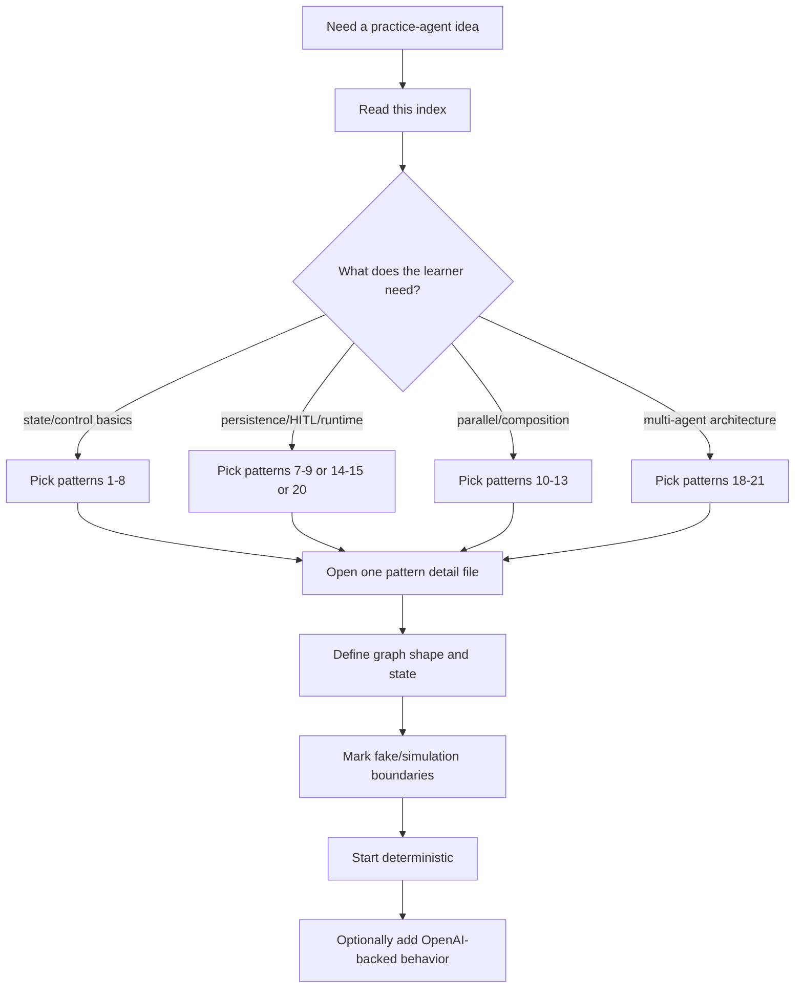
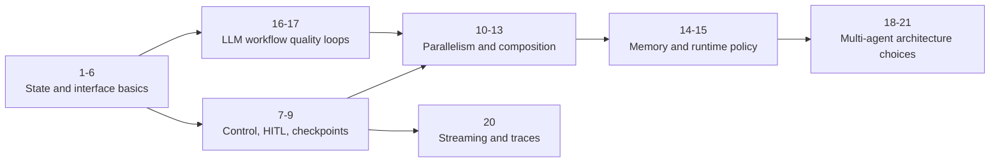

# Agent pattern practice catalog

This folder is a context-efficient, self-contained catalog for future `simulated_agents/` practice-agent idea generation.

Use this index to choose a pattern, then open only the relevant detail file under `patterns/`. Each pattern file is written so the bootstrap skill can turn it into a concrete simulated-agent README pair and starter `graph.py` scaffold.

## Context policy

- Keep this index loaded when choosing an idea.
- Load one pattern detail file at a time.
- Do not load every pattern file unless the user explicitly asks for a full survey.
- Prefer ideas that teach one primary LangGraph concept at a time.
- If the user adds more notes under this folder, treat them as reusable source material for future bootstrap/review runs.

Difficulty is a learning-sequence hint, not a strict gate. Pick an easier pattern for isolated practice and a harder pattern when the user wants integration or challenge.

## Source material used for this catalog

The expanded pattern files synthesize:

- local LangGraph study notes from `/Users/heecheonpark/Library/Mobile Documents/iCloud~md~obsidian/Documents/Obsidian Vault/raw/langgraph/`;
- the current LangGraph workflows/agents, persistence, interrupts, time-travel, streaming, and multi-agent documentation;
- existing simulated-agent examples in `simulated_agents/`.

Do not copy private note prose into generated agent READMEs. Use the pattern files here as the sanitized, repo-local teaching layer.

## Idea generation workflow

For each proposed simulated agent, include:

1. target LangGraph pattern;
2. why it fits the current practice goal;
3. graph shape;
4. suggested state fields;
5. fake/simulation boundaries;
6. smallest deterministic version;
7. optional OpenAI-backed extension.

## Practice foundations

- [Convention: simulated agents may favor learning clarity over production consistency](./convention-simulated-agents-may-favor-learning-clarity-over-production-consistency.md)
- [LangGraph implementation fluency: turning requirements into graph design](./langgraph-implementation-fluency-turning-requirements-into-graph-design.md)

## Pattern index

| # | Pattern | Difficulty | What it teaches | Example idea seeds |
| --- | --- | --- | --- | --- |
| 1 | [Basic state graph](./patterns/01-basic-state-graph.md) | Beginner | State schema, nodes, static edges, partial updates | Function Role Classifier, Request Lifecycle Explainer |
| 2 | [Conditional routing](./patterns/02-conditional-routing.md) | Beginner | Runtime route decisions over a fixed route set | Support Ticket Router, Learning Question Router |
| 3 | [Tool-calling router and agent loop](./patterns/03-tool-calling-router-and-agent-loop.md) | Beginner/Intermediate | Assistant-tool-assistant loop with `MessagesState` | Calculator Tutor Agent, Backend Helper ReAct Simulation |
| 4 | [State reducers and parallel merge rules](./patterns/04-state-reducers-and-parallel-merge-rules.md) | Beginner | State channels and concurrent update merge behavior | Reducer Playground, Evidence Collector |
| 5 | [Public, private, input, and output schemas](./patterns/05-public-private-input-and-output-schemas.md) | Beginner/Intermediate | Clean public interface versus internal graph state | Private State Pipeline, Hidden Rubric Evaluator |
| 6 | [Message trimming and summarization](./patterns/06-message-trimming-and-summarization.md) | Beginner/Intermediate | Prompt compression versus stored message history | Conversation Janitor, Summary Gate Chatbot |
| 7 | [Human-in-the-loop interrupt and approval](./patterns/07-human-in-the-loop-interrupt-and-approval.md) | Intermediate | Dynamic interrupts, resume values, approval gates | Editor-in-Chief Review Loop, Risky Tool Approval Agent |
| 8 | [`Command` routing](./patterns/08-command-routing.md) | Intermediate | State update plus `goto` in one node return | Revision Commander, Escalation Router |
| 9 | [Time travel, replay, and state editing](./patterns/09-time-travel-replay-and-state-editing.md) | Intermediate/Advanced | Checkpoint timelines, replay, fork, state correction | Time Travel Debug Lab, Alternate Ending Simulator |
| 10 | [Fixed parallelization](./patterns/10-fixed-parallelization.md) | Intermediate | Static fan-out/fan-in with known branches | Evidence Collector, Multi-Lens Code Reviewer |
| 11 | [Dynamic map-reduce with `Send`](./patterns/11-dynamic-map-reduce-with-send.md) | Intermediate | Runtime-created workers with narrow worker state | Study Plan Map-Reduce, Bug Hypothesis Tournament |
| 12 | [Subgraphs and bridge nodes](./patterns/12-subgraphs-and-bridge-nodes.md) | Intermediate/Advanced | Graph composition and schema translation | Department Workflow Simulator, Delivery Bridge Demo |
| 13 | [Persona workers and research panel](./patterns/13-persona-workers-and-research-panel.md) | Advanced | Role-specific workers, approval, fan-out, synthesis | Mini Research Panel, Product Project Review Board |
| 14 | [Long-term memory and profile updates](./patterns/14-long-term-memory-and-profile-updates.md) | Advanced | Store-backed durable memory versus thread state | Learning Preference Memory Agent, Memory Diff Inspector |
| 15 | [Runtime and double-texting policy](./patterns/15-runtime-and-double-texting-policy.md) | Advanced | Concurrent input policy for active graph runs | Run Policy Simulator, Assistant Config Lab |
| 16 | [Prompt chaining and quality gates](./patterns/16-prompt-chaining-and-quality-gates.md) | Beginner/Intermediate | Sequential LLM workflow with intermediate artifacts | Translation QA Chain, README Polisher |
| 17 | [Evaluator-optimizer loop](./patterns/17-evaluator-optimizer-loop.md) | Intermediate | Generate, evaluate, revise, stop with max attempts | Tagline Optimizer, Answer Rubric Coach |
| 18 | [Supervisor and subagents](./patterns/18-supervisor-and-subagents.md) | Advanced | Centralized manager routing to specialist workers | Research-Write-Review Supervisor, Support Desk Supervisor |
| 19 | [Handoff network](./patterns/19-handoff-network.md) | Advanced | Active specialist transfers control to another specialist | Customer Support Handoff Network, Tutor Mode Handoff |
| 20 | [Streaming and observability](./patterns/20-streaming-and-observability.md) | Intermediate/Advanced | Node updates, tokens, custom progress, debug views | Graph Trace Tutor, Long Task Progress Simulator |
| 21 | [Tool-skill-workflow-agent escalation](./patterns/21-tool-skill-workflow-agent-escalation.md) | Advanced | Choosing the smallest useful abstraction | Capability Escalation Coach, Email Automation Boundary Lab |

## Pattern families

## Candidate simulated-agent backlog

| Candidate | Primary pattern | Difficulty | Smallest deterministic version |
| --- | --- | --- | --- |
| Function Role Classifier | Basic graph + routing | Beginner | Keyword-based classifier over a pasted function snippet. |
| Support Ticket Router | Conditional routing | Beginner | Rule-based route labels and canned specialist responses. |
| Calculator Tutor Agent | Tool loop | Beginner | Fake arithmetic tools and deterministic final explanation. |
| Reducer Playground | Reducers | Beginner | Two branches append fixed strings, then merge. |
| Private State Pipeline | Multiple schemas | Beginner/Intermediate | Hidden normalization and rubric fields, clean final output. |
| Conversation Janitor | Message trimming | Beginner/Intermediate | Deterministic keep/remove/summarize labels over fake messages. |
| Editor-in-Chief Review Loop | Human-in-the-loop | Intermediate | Draft, fake review status, revise-or-publish loop. |
| Revision Commander | `Command` routing | Intermediate | Reviewer returns next node plus feedback update. |
| Time Travel Debug Lab | Checkpoint replay/fork | Intermediate/Advanced | Run a graph, inspect checkpoints, fork with edited feedback. |
| Evidence Collector | Fixed parallel fan-out | Intermediate | Fake web/docs/notes evidence, reducer-backed synthesis. |
| Study Plan Map-Reduce | Dynamic `Send` | Intermediate | Generate subtopics, worker per subtopic, reduce into plan. |
| Department Workflow Simulator | Subgraphs | Intermediate/Advanced | Parent graph invokes one child workflow through a bridge. |
| Mini Research Panel | Persona workers | Advanced | Generate personas, run one memo per persona, synthesize. |
| Learning Preference Memory Agent | Long-term memory | Advanced | Fake profile store plus visible memory diff. |
| Run Policy Simulator | Runtime policy | Advanced | Deterministic policy decision table with explanations. |
| Translation QA Chain | Prompt chaining | Beginner/Intermediate | Draft translation, check required term, improve if missing. |
| Tagline Optimizer | Evaluator-optimizer | Intermediate | Generate tagline, evaluate constraints, revise with max attempts. |
| Research-Write-Review Supervisor | Supervisor/subagents | Advanced | Manager routes through three deterministic specialist nodes. |
| Customer Support Handoff Network | Handoff network | Advanced | Reception transfers to billing/technical and specialists can transfer back. |
| Graph Trace Tutor | Streaming observability | Intermediate/Advanced | Print node updates and progress notes from a small graph. |
| Capability Escalation Coach | Abstraction selection | Advanced | Classify a feature as function/tool/skill/workflow/agent. |

## Recommended build order

If the user asks “what should I build next?” and gives no other constraints, recommend this progression:

1. **Reducer Playground** — smallest project that clarifies an important hidden LangGraph rule.
2. **Support Ticket Router** — reinforces conditional routing and structured route labels.
3. **Private State Pipeline** — teaches public/private state boundaries before examples grow large.
4. **Conversation Janitor** — introduces message state, trimming, and summary boundaries.
5. **Editor-in-Chief Review Loop** — practices human review and revision loops.
6. **Revision Commander** — makes dynamic `Command` routing concrete.
7. **Time Travel Debug Lab** — shows why checkpointed state matters.
8. **Evidence Collector** — introduces fixed parallel fan-out/fan-in.
9. **Study Plan Map-Reduce** — introduces dynamic worker creation with `Send`.
10. **Department Workflow Simulator** — introduces subgraphs and bridge nodes.
11. **Translation QA Chain** — practices prompt chaining with gates.
12. **Tagline Optimizer** — practices evaluator-driven revision loops.
13. **Mini Research Panel** — combines personas, approval, parallel workers, and synthesis.
14. **Learning Preference Memory Agent** — introduces long-term memory once graph state is comfortable.
15. **Research-Write-Review Supervisor** — teaches centralized multi-agent control.
16. **Customer Support Handoff Network** — teaches active-agent transfer and handoff contracts.
17. **Graph Trace Tutor** — teaches streaming and observability as the graph grows.
18. **Capability Escalation Coach** — teaches when not to make something an agent.

## Design rules for future simulated agents

- Start with functions/tools before inventing separate agents.
- Promote to workflow/graph when ordering, approval, retries, or state transitions matter.
- Promote to subgraph/subagent only when context, state, tools, or decision loops are meaningfully separate.
- Keep simulated roles honest: call them graph nodes, workers, or personas unless they are truly autonomous agents.
- Prefer explicit state fields over passing entire message objects unless message history is the learning point.
- Store `.content` or clean strings when later nodes only need text.
- Use reducers whenever parallel branches update the same key.
- Keep worker state narrow in map-reduce patterns.
- Do not mix static edges and dynamic `Command(goto=...)` casually from the same node.
- Use checkpointing for interrupt/resume, replay, forking, and cross-invocation memory patterns.
- Keep long-term memory separate from summaries and message history.
- Use streaming as verification evidence when graph behavior is otherwise hard to see.
- Keep real side effects out of simulations; use fake tools and fake stores first.
- Write bilingual README pairs for new simulated-agent folders.

## Revision history

- 2026-06-08: Expanded the catalog from 15 terse entries to 21 descriptive patterns with clearer pattern families and bootstrap-ready guidance.
- 2026-05-18: Revised into a self-contained pattern catalog so future agents can generate ideas without access to the original source materials.
- 2026-05-18: Created candidate-materials map from LangChain Academy and Obsidian LangGraph study sources.
