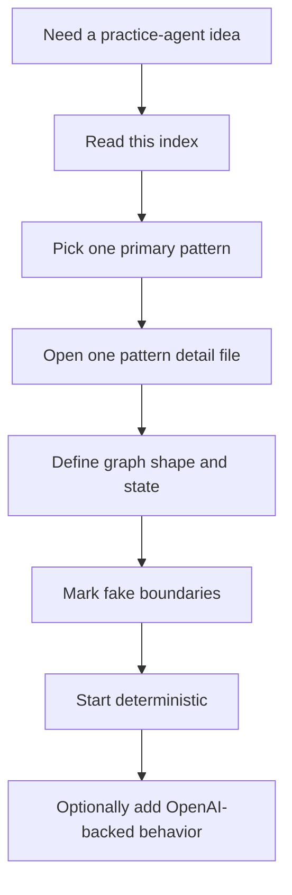

# Agent pattern practice catalog

This folder is a context-efficient, self-contained catalog for future `simulated_agents/` practice-agent idea generation.

Use this index to choose a pattern, then open only the relevant detail file under `patterns/`.

## Context policy

- Keep this index loaded when choosing an idea.
- Load one pattern detail file at a time.
- Do not load every pattern file unless the user explicitly asks for a full survey.
- Prefer ideas that teach one primary LangGraph concept at a time.

Difficulty is a learning-sequence hint, not a strict gate. Pick an easier pattern for isolated practice and a harder pattern when the user wants integration or challenge.

## Idea generation workflow

For each proposed simulated agent, include:

1. target LangGraph pattern;
2. why it fits the current practice goal;
3. graph shape;
4. suggested state fields;
5. fake/simulation boundaries;
6. smallest deterministic version;
7. optional OpenAI-backed extension.

## Practice foundations

- [Convention: simulated agents may favor learning clarity over production consistency](./convention-simulated-agents-may-favor-learning-clarity-over-production-consistency.md)
- [LangGraph implementation fluency: turning requirements into graph design](./langgraph-implementation-fluency-turning-requirements-into-graph-design.md)

## Pattern index

| # | Pattern | Difficulty | Example idea seeds |
| --- | --- | --- | --- |
| 1 | [Basic state graph](./patterns/01-basic-state-graph.md) | Beginner | Function Role Classifier, Request Lifecycle Explainer |
| 2 | [Conditional routing](./patterns/02-conditional-routing.md) | Beginner | Support Ticket Router, Learning Question Router |
| 3 | [Tool-calling router and agent loop](./patterns/03-tool-calling-router-and-agent-loop.md) | Beginner/Intermediate | Calculator Tutor Agent, Backend Helper ReAct Simulation |
| 4 | [State reducers and parallel merge rules](./patterns/04-state-reducers-and-parallel-merge-rules.md) | Beginner | Reducer Playground, Evidence Collector |
| 5 | [Public, private, input, and output schemas](./patterns/05-public-private-input-and-output-schemas.md) | Beginner/Intermediate | Private State Pipeline, Hidden Rubric Evaluator |
| 6 | [Message trimming and summarization](./patterns/06-message-trimming-and-summarization.md) | Beginner/Intermediate | Conversation Janitor, Summary Gate Chatbot |
| 7 | [Human-in-the-loop interrupt and approval](./patterns/07-human-in-the-loop-interrupt-and-approval.md) | Intermediate | Editor-in-Chief Review Loop, Risky Tool Approval Agent |
| 8 | [`Command` routing](./patterns/08-command-routing.md) | Intermediate | Revision Commander, Escalation Router |
| 9 | [Time travel, replay, and state editing](./patterns/09-time-travel-replay-and-state-editing.md) | Intermediate/Advanced | Time Travel Debug Lab, Alternate Ending Simulator |
| 10 | [Fixed parallelization](./patterns/10-fixed-parallelization.md) | Intermediate | Evidence Collector, Multi-Lens Code Reviewer |
| 11 | [Dynamic map-reduce with `Send`](./patterns/11-dynamic-map-reduce-with-send.md) | Intermediate | Study Plan Map-Reduce, Bug Hypothesis Tournament |
| 12 | [Subgraphs and bridge nodes](./patterns/12-subgraphs-and-bridge-nodes.md) | Intermediate/Advanced | Department Workflow Simulator, Delivery Bridge Demo |
| 13 | [Persona workers and research panel](./patterns/13-persona-workers-and-research-panel.md) | Advanced | Mini Research Panel, Product Project Review Board |
| 14 | [Long-term memory and profile updates](./patterns/14-long-term-memory-and-profile-updates.md) | Advanced | Learning Preference Memory Agent, Memory Diff Inspector |
| 15 | [Runtime and double-texting policy](./patterns/15-runtime-and-double-texting-policy.md) | Advanced | Run Policy Simulator, Assistant Config Lab |

## Candidate simulated-agent backlog

| Candidate | Primary pattern | Difficulty | Smallest deterministic version |
| --- | --- | --- | --- |
| Function Role Classifier | Basic graph + routing | Beginner | Keyword-based classifier over a pasted function snippet. |
| Support Ticket Router | Conditional routing | Beginner | Rule-based route labels and canned specialist responses. |
| Calculator Tutor Agent | Tool loop | Beginner | Fake arithmetic tools and deterministic final explanation. |
| Reducer Playground | Reducers | Beginner | Two branches append fixed strings, then merge. |
| Private State Pipeline | Multiple schemas | Beginner/Intermediate | Hidden normalization and rubric fields, clean final output. |
| Conversation Janitor | Message trimming | Beginner/Intermediate | Deterministic keep/remove/summarize labels over fake messages. |
| Editor-in-Chief Review Loop | Human-in-the-loop | Intermediate | Draft, fake review status, revise-or-publish loop. |
| Revision Commander | `Command` routing | Intermediate | Reviewer returns next node plus feedback update. |
| Evidence Collector | Fixed parallel fan-out | Intermediate | Fake web/docs/notes evidence, reducer-backed synthesis. |
| Study Plan Map-Reduce | Dynamic `Send` | Intermediate | Generate subtopics, worker per subtopic, reduce into plan. |
| Department Workflow Simulator | Subgraphs | Intermediate/Advanced | Parent graph invokes one child workflow through a bridge. |
| Mini Research Panel | Persona workers | Advanced | Generate personas, run one memo per persona, synthesize. |
| Learning Preference Memory Agent | Long-term memory | Advanced | Fake profile store plus visible memory diff. |
| Run Policy Simulator | Runtime policy | Advanced | Deterministic policy decision table with explanations. |

## Recommended build order

If the user asks “what should I build next?” and gives no other constraints, recommend this progression:

1. **Reducer Playground** — smallest project that clarifies an important hidden LangGraph rule.
2. **Support Ticket Router** — reinforces conditional routing and structured route labels.
3. **Editor-in-Chief Review Loop** — practices human review and revision loops.
4. **Evidence Collector** — introduces fixed parallel fan-out/fan-in.
5. **Study Plan Map-Reduce** — introduces dynamic worker creation with `Send`.
6. **Department Workflow Simulator** — introduces subgraphs and bridge nodes.
7. **Mini Research Panel** — combines personas, approval, parallel workers, and synthesis.
8. **Learning Preference Memory Agent** — introduces long-term memory once graph state is comfortable.

## Design rules for future simulated agents

- Start with functions/tools before inventing separate agents.
- Promote to workflow/graph when ordering, approval, or state transitions matter.
- Promote to subgraph/subagent only when context, state, or decision loops are meaningfully separate.
- Keep simulated roles honest: call them graph nodes, workers, or personas unless they are truly autonomous agents.
- Prefer explicit state fields over passing entire message objects unless message history is the learning point.
- Store `.content` or clean strings when later nodes only need text.
- Use reducers whenever parallel branches update the same key.
- Keep worker state narrow in map-reduce patterns.
- Do not mix static edges and dynamic `Command(goto=...)` casually from the same node.
- Use checkpointing for interrupt/resume patterns.
- Keep real side effects out of simulations; use fake tools and fake stores first.
- Write bilingual README pairs for new simulated-agent folders.

## Revision history

- 2026-05-18: Revised into a self-contained pattern catalog so future agents can generate ideas without access to the original source materials.
- 2026-05-18: Created candidate-materials map from LangChain Academy and Obsidian LangGraph study sources.
