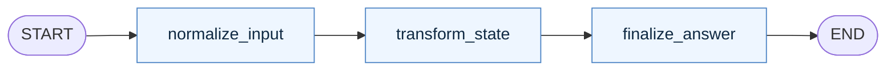
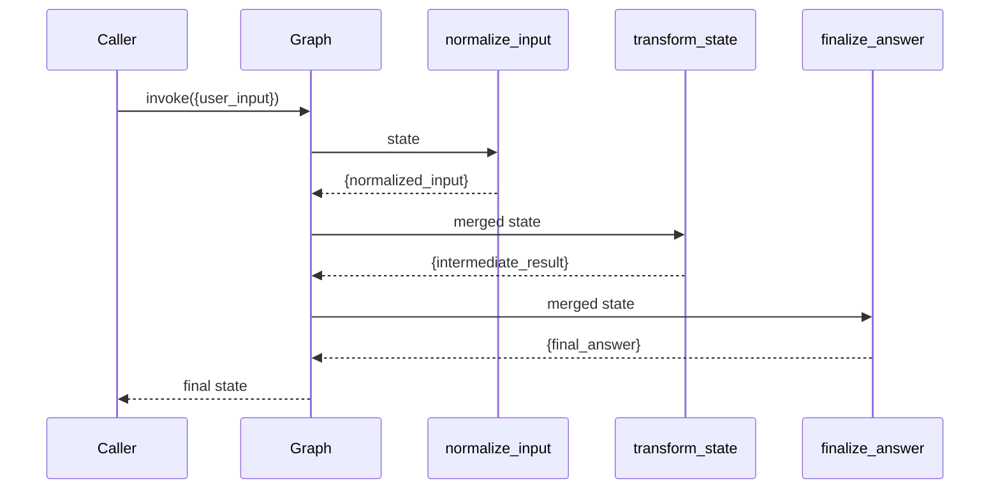

# Pattern 1: Basic state graph

[Back to agent pattern index](../README.md)

**Difficulty:** Beginner

## What this pattern is

A basic state graph is the smallest useful LangGraph program: a typed state object moves through named node functions, and static edges define a known execution order. It is not yet an “agent” in the autonomous sense. It is a state machine that makes data movement visible.

This pattern teaches the core contract used everywhere else in the catalog:

- state is the shared data object for one graph run;
- each node reads state and returns a partial update;
- static edges define the next node when there is no runtime decision;
- without a reducer, a returned value replaces the previous value for that key;
- `graph.invoke(initial_state)` returns the final state.

Use this pattern when the learner is still separating “a Python function” from “a graph node.”

## Flowchart



## Execution sequence



## State contract

```python
from typing_extensions import NotRequired, TypedDict

class State(TypedDict):
    user_input: str
    normalized_input: NotRequired[str]
    intermediate_result: NotRequired[str]
    final_answer: NotRequired[str]
```

Required fields are values the caller must provide. `NotRequired[...]` fields are values produced later by graph nodes. Use `state[...]` for fields guaranteed by the edge order and `state.get(...)` only for genuinely optional branches.

## What to practice

- Add one node at a time and print the state after each run.
- Name nodes by responsibility, not by implementation detail.
- Keep state values clean: strings, lists, dicts, or typed objects.
- Return only the keys a node changes.
- Draw the graph before writing code, then compare it with the compiled graph.

## Common mistakes

- Treating a node like a command that mutates global state instead of returning a partial update.
- Passing whole message objects when plain strings would make the state easier to inspect.
- Making every step an LLM call before the deterministic state flow is understood.
- Hiding too much logic inside one node, which defeats the purpose of practicing graph structure.

## Simulated-agent idea seeds

### Function Role Classifier

Classify a pasted function as a graph node, routing function, tool function, or graph-builder function. This teaches the difference between functions that transform state and functions that choose control flow.

### Request Lifecycle Explainer

Convert a backend request into staged explanations: receive request, validate input, choose handler, summarize response. This maps familiar backend concepts onto graph execution.

## Smallest deterministic version

Build a three-node graph where each node appends a labeled sentence to state. No LLM, no tools, no conditional routing.

## How the bootstrap skill should use this file

When this pattern is selected, the bootstrap skill should turn the graph shape, state contract, and smallest deterministic exercise into the per-agent README pair. Keep the first scaffold offline and simulated. Add real model calls only after the learner can explain the deterministic version.

## Revision history

- 2026-06-08: Expanded into a descriptive, pattern-accurate guide with diagrams and implementation cautions.
- 2026-05-18: Split from the original monolithic candidate-materials note.
