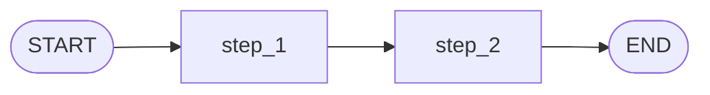

# Pattern 1: Basic state graph

[Back to agent pattern index](../README.md)

**Difficulty:** Beginner

### What the pattern teaches

A LangGraph graph is a state machine. It has:

- a state schema;
- node functions;
- edges that decide execution order;
- a compiled graph that receives initial state and returns final state.

Each node reads the current state and returns a partial update. By default, when a node returns a value for a key, that value replaces the previous value for that key.

This pattern is the foundation for every other pattern in this catalog.

### Basic graph shape



### Typical state

```python
class State(TypedDict):
    user_input: str
    step_1_result: NotRequired[str]
    final_result: NotRequired[str]
```

Use required fields for input that must exist at invocation time. Use `NotRequired[...]` for fields produced later by graph nodes.

### Implementation cautions

- Keep node functions small and named by responsibility.
- Use `state[...]` when the graph guarantees the field exists.
- Use `state.get(...)` only for genuinely optional branches.
- Store clean strings or simple data structures unless message objects are the learning point.

### Simulated-agent idea seeds

#### Function Role Classifier

Classify a Python function as a graph node, routing function, tool function, or graph-builder function.

State fields:

- `function_source`
- `role_label`
- `reason`
- `final_explanation`

Why it is useful: it teaches the difference between functions that transform state and functions that choose control flow.

#### Request Lifecycle Explainer

Turn a backend request into staged explanations: receive request, validate input, route to handler, produce response.

State fields:

- `request_description`
- `validated_input`
- `route`
- `response_summary`

Why it is useful: it maps backend knowledge onto graph concepts.

## Usage note

Use this pattern file only when the selected practice-agent idea needs this specific concept. Keep the main index in context for selection, then load this detail file for implementation planning.

## Revision history

- 2026-05-18: Split from the original monolithic candidate-materials note.
