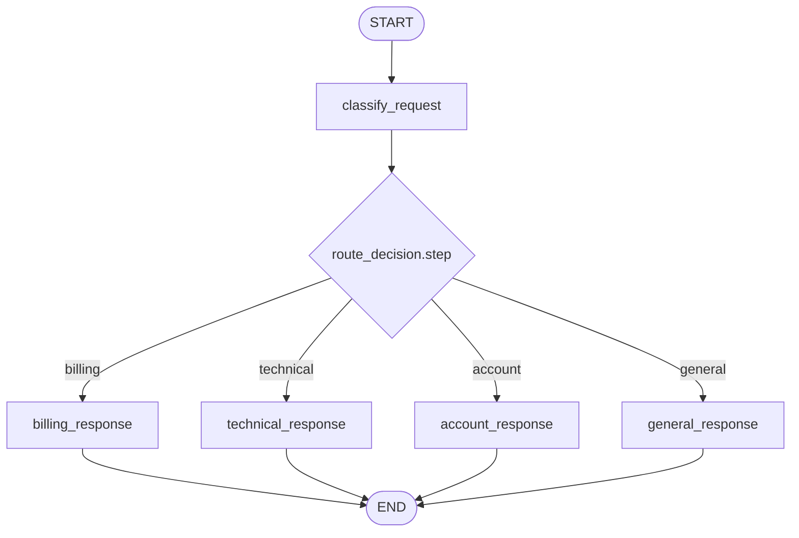
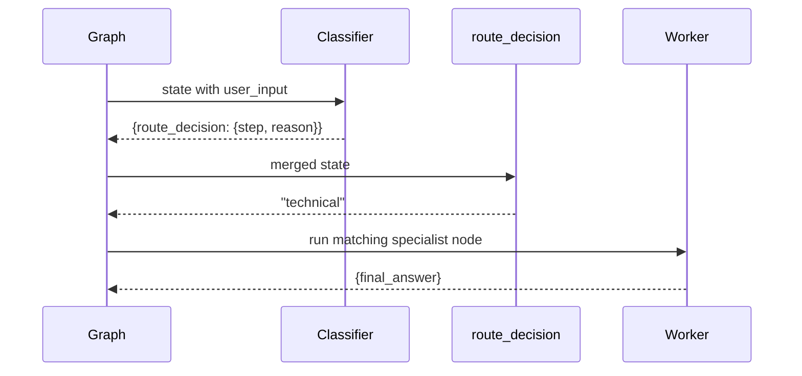

# Pattern 2: Conditional routing

[Back to agent pattern index](../README.md)

**Difficulty:** Beginner

## What this pattern is

Conditional routing lets runtime state choose the next node. A node writes a decision into state, or a routing function computes a route directly from state, and `add_conditional_edges(...)` maps that route to the next node.

This is the first pattern where graph control flow depends on data. It is ideal when the same input type can follow a small, known set of specialized paths.

## Flowchart



## Router sequence



## State contract

```python
from typing import Literal
from pydantic import BaseModel
from typing_extensions import NotRequired, TypedDict

class RouteDecision(BaseModel):
    step: Literal["billing", "technical", "account", "general"]
    reason: str

class State(TypedDict):
    user_input: str
    route_decision: NotRequired[RouteDecision]
    final_answer: NotRequired[str]
```

Use `Literal[...]` or an enum when a route must come from a fixed set. This matters especially when the route is produced by structured LLM output: the schema should make invalid labels hard to produce and easy to catch.

## What to practice

- Keep the classification node separate from worker nodes.
- Make route labels and node names easy to compare.
- Store the route reason for debugging, even if the final answer hides it.
- Start with deterministic keyword routing, then optionally replace the classifier with structured LLM output.

## Common mistakes

- Returning a route label that has no matching edge map entry.
- Embedding all worker logic inside the router, which turns routing into a hidden monolith.
- Creating multiple “agents” when one classifier plus simple worker nodes is enough.
- Using unconstrained strings when a fixed `Literal` route set would be clearer.

## Simulated-agent idea seeds

### Support Ticket Router

Route fake support tickets to billing, technical, account, or general response nodes. This practices structured classification and conditional edges.

### Learning Question Router

Route a study question to concept explanation, code example, debugging help, or quiz mode. This can later become a real tutor routing pattern.

## Smallest deterministic version

A classifier reads keywords like “refund,” “bug,” and “password,” stores a route decision, and the graph sends the ticket to a canned specialist response.

## How the bootstrap skill should use this file

When this pattern is selected, the bootstrap skill should turn the graph shape, state contract, and smallest deterministic exercise into the per-agent README pair. Keep the first scaffold offline and simulated. Add real model calls only after the learner can explain the deterministic version.

## Revision history

- 2026-06-08: Expanded into a descriptive, pattern-accurate guide with diagrams and implementation cautions.
- 2026-05-18: Split from the original monolithic candidate-materials note.
