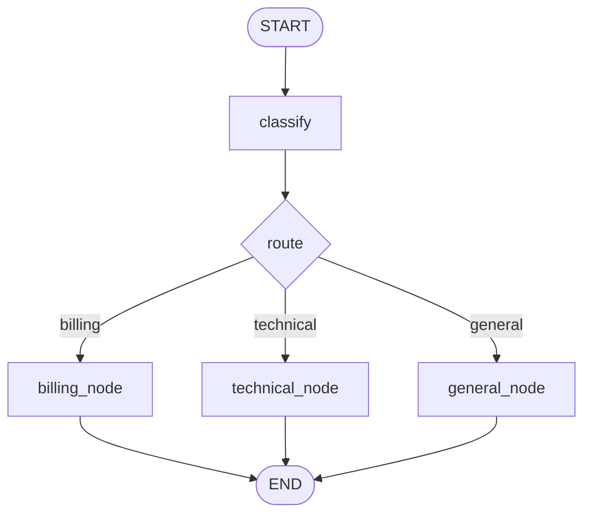

# Pattern 2: Conditional routing

[Back to agent pattern index](../README.md)

**Difficulty:** Beginner

### What the pattern teaches

Conditional routing lets runtime state choose the next node. Instead of every edge being fixed, a routing function reads state and returns a route label.

This is useful when one graph supports several specialized paths.

### Basic graph shape



### Typical state

```python
class RouteDecision(BaseModel):
    route: Literal["billing", "technical", "general"]
    reason: str

class State(TypedDict):
    user_input: str
    route_decision: NotRequired[RouteDecision]
    final_answer: NotRequired[str]
```

### Implementation cautions

- Use `Literal[...]` or an enum when a route must be one of a fixed set.
- Keep routing functions separate from worker nodes.
- Make route labels match node names or provide an explicit route map.
- Avoid turning simple deterministic classification into unnecessary multi-agent complexity.

### Simulated-agent idea seeds

#### Support Ticket Router

Route fake support tickets to billing, technical, account, or general response nodes.

Why it is useful: it practices structured classification and conditional edges.

#### Learning Question Router

Route a study question to concept explanation, code example, debugging help, or quiz mode.

Why it is useful: it can later become a real learning assistant route pattern.

## Usage note

Use this pattern file only when the selected practice-agent idea needs this specific concept. Keep the main index in context for selection, then load this detail file for implementation planning.

## Revision history

- 2026-05-18: Split from the original monolithic candidate-materials note.
