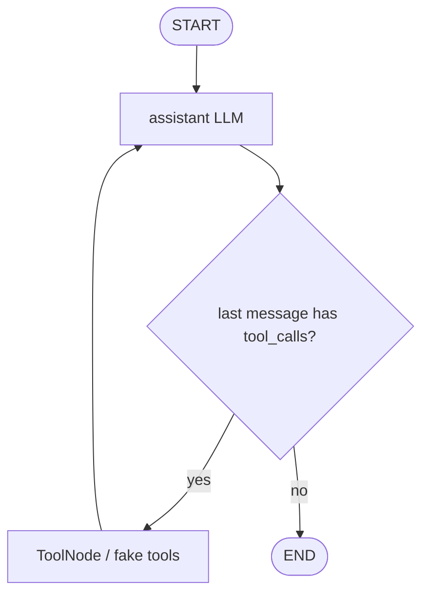
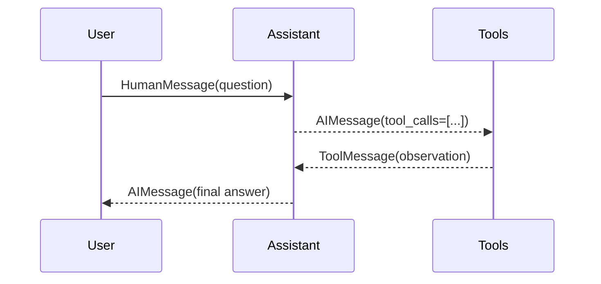

# Pattern 3: Tool-calling router and agent loop

[Back to agent pattern index](../README.md)

**Difficulty:** Beginner/Intermediate

## What this pattern is

A tool-calling router lets the model choose between answering directly and calling a tool. It becomes an agent loop when tool results are observations that go back into the model rather than final output.

This pattern is the classic ReAct-shaped graph:

1. assistant node calls an LLM with tools bound;
2. router checks whether the assistant emitted tool calls;
3. tool node executes the requested tools and appends tool messages;
4. graph loops back to the assistant;
5. assistant either calls another tool or returns a final answer.

## Flowchart



## Message sequence



## State contract

```python
from langgraph.graph import MessagesState

class State(MessagesState):
    pass
```

Or explicitly:

```python
from typing import Annotated
from langchain_core.messages import AnyMessage
from langgraph.graph.message import add_messages
from typing_extensions import TypedDict

class State(TypedDict):
    messages: Annotated[list[AnyMessage], add_messages]
```

`add_messages` is important because each assistant or tool node returns new messages; the graph should append or update messages rather than overwrite the whole conversation.

## What to practice

- Start with one or two fake deterministic tools.
- Give each tool a narrow description so the model has a reason not to call it unnecessarily.
- Log the message list after each step so the loop becomes visible.
- Add a loop limit in learning examples to avoid runaway tool calls.
- Make direct-answer cases just as important as tool-use cases.

## Common mistakes

- Treating a tool result as the final answer instead of feeding it back to the assistant.
- Letting tools do broad reasoning that belongs in the assistant node.
- Giving tool descriptions so broad that the model calls tools for every question.
- Forgetting that same-turn parallel tool calls cannot see each other’s results until the next assistant pass.

## Simulated-agent idea seeds

### Calculator Tutor Agent

The assistant either explains a math concept directly or calls fake arithmetic tools, then explains the result. This makes the assistant-tool-assistant loop obvious.

### Backend Helper ReAct Simulation

The assistant receives a fake bug report and may call fake tools such as `read_logs`, `inspect_config`, or `search_docs` before answering.

## Smallest deterministic version

Implement fake `multiply` and `add` tools. Ask one question that needs a tool and one question that should be answered without a tool.

## How the bootstrap skill should use this file

When this pattern is selected, the bootstrap skill should turn the graph shape, state contract, and smallest deterministic exercise into the per-agent README pair. Keep the first scaffold offline and simulated. Add real model calls only after the learner can explain the deterministic version.

## Revision history

- 2026-06-08: Expanded into a descriptive, pattern-accurate guide with diagrams and implementation cautions.
- 2026-05-18: Split from the original monolithic candidate-materials note.
