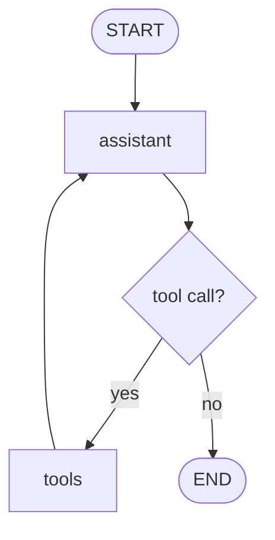

# Pattern 3: Tool-calling router and agent loop

[Back to agent pattern index](../README.md)

**Difficulty:** Beginner/Intermediate

### What the pattern teaches

A tool-calling graph lets the model choose between answering directly and calling a tool. The core shape is:

1. assistant node receives messages;
2. assistant may emit tool calls;
3. router checks whether tool calls exist;
4. tool node executes tools;
5. graph loops back to assistant so it can use tool results.

This becomes an agent loop when tool outputs are observations, not final answers.

### Basic graph shape



### Typical state

```python
class State(MessagesState):
    pass
```

or explicitly:

```python
class State(TypedDict):
    messages: Annotated[list[AnyMessage], add_messages]
```

### Implementation cautions

- Use message state when the model/tool loop is the learning point.
- Tool results should become messages visible to the next assistant call.
- Keep fake tools deterministic at first.
- Do not call real external services unless the simulation explicitly needs a safe stub boundary.

### Simulated-agent idea seeds

#### Calculator Tutor Agent

The assistant either explains a math concept or calls fake arithmetic tools, then explains the result.

Why it is useful: it makes the assistant-tool-assistant loop obvious.

#### Backend Helper ReAct Simulation

The assistant receives a fake bug report and may call fake tools such as `read_logs`, `inspect_config`, or `search_docs` before answering.

Why it is useful: it practices tool selection and observation-based final answers.

## Usage note

Use this pattern file only when the selected practice-agent idea needs this specific concept. Keep the main index in context for selection, then load this detail file for implementation planning.

## Revision history

- 2026-05-18: Split from the original monolithic candidate-materials note.
