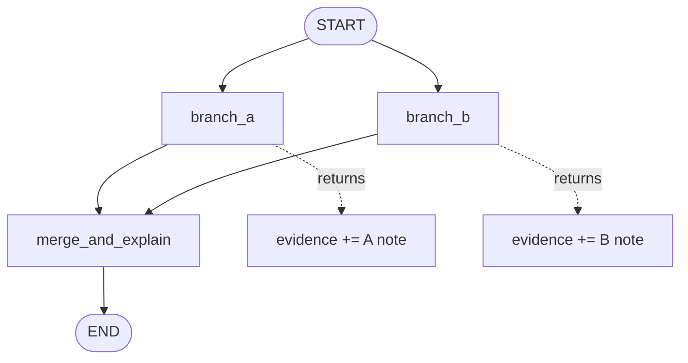

# Pattern 4: State reducers and parallel merge rules

[Back to agent pattern index](../README.md)

**Difficulty:** Beginner

## What this pattern is

A reducer defines how multiple updates to the same state key are merged. In a linear graph, overwriting may be fine. In a parallel graph, two branches can write the same key in the same super-step; without a reducer, you either lose data or get a conflict.

Think of state keys as channels. A reducer is the merge rule for a channel.

## Flowchart



## Merge model

```mermaid
flowchart LR
    U1[branch A update<br/>{evidence: [a]}] --> Reducer{operator.add}
    U2[branch B update<br/>{evidence: [b]}] --> Reducer
    Reducer --> State[evidence: [a, b]]
```

## State contract

```python
import operator
from typing import Annotated
from typing_extensions import NotRequired, TypedDict

class State(TypedDict):
    question: str
    evidence: Annotated[list[str], operator.add]
    final_answer: NotRequired[str]
```

Both branches can safely return `{"evidence": ["..."]}`. The reducer concatenates the lists. Use reducers because multiple updates must merge, not merely because a field happens to be a list.

## What to practice

- Run the same graph with and without a reducer to see the difference.
- Keep each branch output shape identical.
- Add a synthesis node that reads the merged list.
- Practice custom reducers only after `operator.add` is clear.

## Common mistakes

- Assuming lists automatically append without `Annotated[..., reducer]`.
- Writing reducers that mutate inputs in surprising ways.
- Depending on branch ordering unless the reducer or synthesis node explicitly handles order.
- Using a reducer to hide poorly separated state keys.

## Simulated-agent idea seeds

### Reducer Playground

Two fake workers produce notes about the same topic. The graph shows what happens with and without a reducer.

### Evidence Collector

Fake web search and fake documentation search run in parallel. Their evidence lists merge before a synthesis node writes the final answer.

## Smallest deterministic version

Fan out to two nodes from `START`, have each return one evidence string, then synthesize the combined list into a final explanation.

## How the bootstrap skill should use this file

When this pattern is selected, the bootstrap skill should turn the graph shape, state contract, and smallest deterministic exercise into the per-agent README pair. Keep the first scaffold offline and simulated. Add real model calls only after the learner can explain the deterministic version.

## Revision history

- 2026-06-08: Expanded into a descriptive, pattern-accurate guide with diagrams and implementation cautions.
- 2026-05-18: Split from the original monolithic candidate-materials note.
