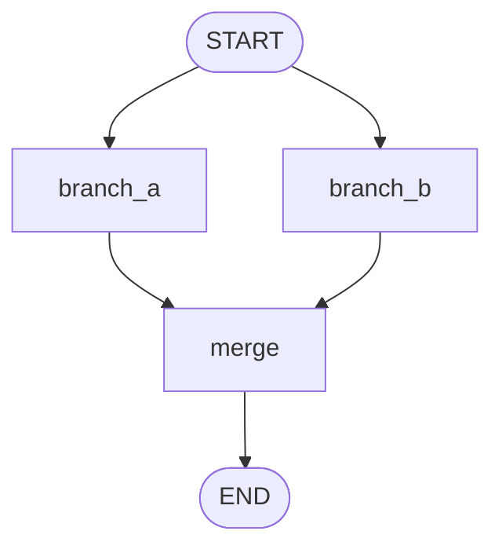

# Pattern 4: State reducers and parallel merge rules

[Back to agent pattern index](../README.md)

**Difficulty:** Beginner

### What the pattern teaches

Reducers define how updates to the same state key are merged. Without a reducer, a later update overwrites an earlier one. In parallel graphs, that can lose data or cause conflicts.

Reducers are especially important when several branches write to the same list.

### Basic graph shape



### Typical state

```python
class State(TypedDict):
    question: str
    evidence: Annotated[list[str], operator.add]
    final_answer: NotRequired[str]
```

Both `branch_a` and `branch_b` can return:

```python
{"evidence": ["some result"]}
```

The reducer combines the lists.

### Implementation cautions

- Add reducers to keys that multiple parallel branches update.
- Use simple reducer behavior first, such as list concatenation.
- Do not use a reducer just because a field is a list; use one because multiple updates must merge.
- Make worker output shape consistent.

### Simulated-agent idea seeds

#### Reducer Playground

Two fake workers produce notes about the same topic. The graph shows what happens with and without a reducer.

Why it is useful: it turns a hidden state-merge concept into visible behavior.

#### Evidence Collector

Fake web search and fake documentation search run in parallel. Their evidence lists merge before a synthesis node writes the final answer.

Why it is useful: it practices fan-out/fan-in plus reducer-backed state.

## Usage note

Use this pattern file only when the selected practice-agent idea needs this specific concept. Keep the main index in context for selection, then load this detail file for implementation planning.

## Revision history

- 2026-05-18: Split from the original monolithic candidate-materials note.
