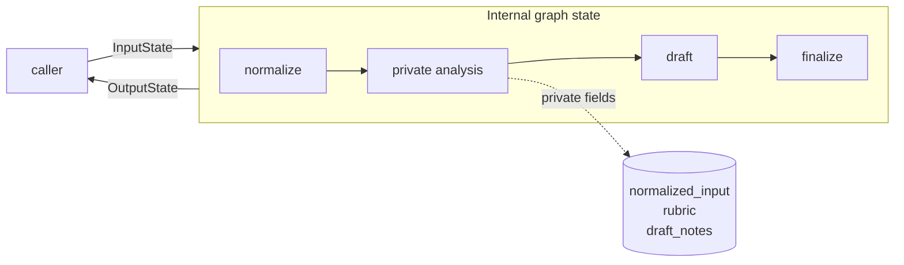

# Pattern 5: Public, private, input, and output schemas

[Back to agent pattern index](../README.md)

**Difficulty:** Beginner/Intermediate

## What this pattern is

A graph often needs more state internally than callers should provide or receive. Multiple schemas let you keep the public interface small while giving internal nodes the working fields they need.

This pattern separates four concerns:

- input schema: what the caller must provide;
- internal state schema: everything nodes may read/write;
- private node-to-node state: temporary implementation details;
- output schema: what the caller should receive.

## Boundary diagram



## State contract

```python
from typing_extensions import NotRequired, TypedDict

class InputState(TypedDict):
    question: str

class OverallState(TypedDict):
    question: str
    normalized_question: NotRequired[str]
    hidden_rubric: NotRequired[str]
    draft_answer: NotRequired[str]
    final_answer: NotRequired[str]

class OutputState(TypedDict):
    final_answer: str
```

For stricter runtime validation, Pydantic can be used where messy external values enter the system. For lightweight learning graphs, `TypedDict` keeps the state contract readable.

## What to practice

- Decide what fields a caller should never see.
- Keep final output narrow and user-facing.
- Use private fields for normalization, route reasons, drafts, scores, and traces.
- Prefer explicit field names over passing one opaque dict through every node.

## Common mistakes

- Exposing every internal field as final output because it is convenient.
- Making input schema as large as internal schema.
- Hiding important user-facing decisions in private state with no explanation.
- Using private state to avoid designing clean node responsibilities.

## Simulated-agent idea seeds

### Private State Pipeline

Normalize a user request, create hidden analysis, then output only a polished explanation.

### Hidden Rubric Evaluator

Generate an answer, score it with a hidden rubric, then return only the final answer plus a short user-facing reason.

## Smallest deterministic version

Input only `question`, internally produce `normalized_question` and `rubric_score`, and output only `final_answer`.

## How the bootstrap skill should use this file

When this pattern is selected, the bootstrap skill should turn the graph shape, state contract, and smallest deterministic exercise into the per-agent README pair. Keep the first scaffold offline and simulated. Add real model calls only after the learner can explain the deterministic version.

## Revision history

- 2026-06-08: Expanded into a descriptive, pattern-accurate guide with diagrams and implementation cautions.
- 2026-05-18: Split from the original monolithic candidate-materials note.
