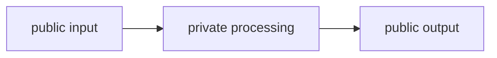

# Pattern 5: Public, private, input, and output schemas

[Back to agent pattern index](../README.md)

**Difficulty:** Beginner/Intermediate

### What the pattern teaches

A graph may need internal state that should not be part of the external input or final output. Separating schemas keeps the public interface clean while allowing private intermediate fields.

This matters when nodes need temporary calculations, draft values, or implementation details.

### Basic graph shape



### Typical state idea

- input schema: what callers provide;
- internal state schema: everything nodes may use;
- output schema: what callers should receive.

Example fields:

```python
class InputState(TypedDict):
    question: str

class InternalState(TypedDict):
    question: str
    normalized_question: str
    draft_answer: str
    critique: str
    final_answer: str

class OutputState(TypedDict):
    final_answer: str
```

### Implementation cautions

- Do not expose temporary fields just because they exist.
- Use private fields for intermediate drafts, route reasons, scores, and tool traces.
- Keep final output narrow and user-facing.

### Simulated-agent idea seeds

#### Private State Pipeline

Normalize a user request, create hidden analysis, then output only a polished explanation.

Why it is useful: it teaches interface boundaries.

#### Hidden Rubric Evaluator

Generate an answer, score it with a hidden rubric, then return only final answer plus a short reason.

Why it is useful: it separates internal quality control from user output.

## Usage note

Use this pattern file only when the selected practice-agent idea needs this specific concept. Keep the main index in context for selection, then load this detail file for implementation planning.

## Revision history

- 2026-05-18: Split from the original monolithic candidate-materials note.
