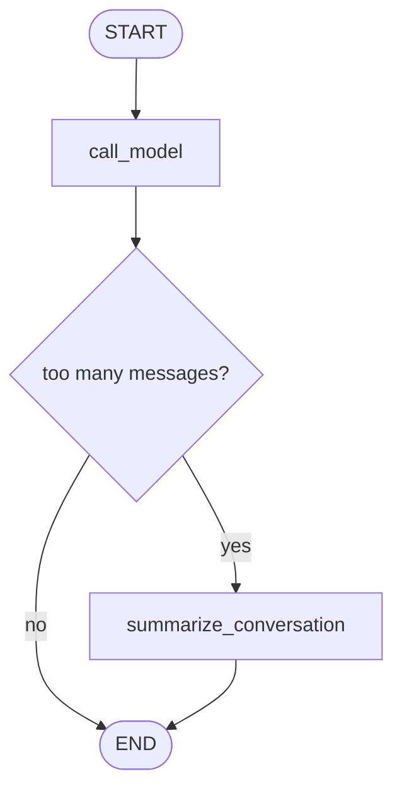

# Pattern 6: Message trimming and summarization

[Back to agent pattern index](../README.md)

**Difficulty:** Beginner/Intermediate

### What the pattern teaches

A chat graph can store a long message history, but the model does not always need to see all messages. Trimming, filtering, and summarization manage context size.

There are two different questions:

1. What does the graph store?
2. What does the model see on this call?

These can be different.

### Basic graph shape



### Typical state

```python
class State(MessagesState):
    summary: NotRequired[str]
```

### Implementation cautions

- Keep recent messages verbatim when possible.
- Summarize older messages into a dedicated `summary` field.
- Be explicit about whether a node deletes old messages or only filters model input.
- Do not confuse message state with long-term memory. Message state is conversation context; durable memory is a separate design choice.

### Simulated-agent idea seeds

#### Conversation Janitor

Given fake messages, decide which to keep, remove, or summarize.

Why it is useful: it teaches message state hygiene.

#### Summary Gate Chatbot

After a threshold, create a summary and continue with summary plus recent messages.

Why it is useful: it practices stateful chat without needing a production memory system.

## Usage note

Use this pattern file only when the selected practice-agent idea needs this specific concept. Keep the main index in context for selection, then load this detail file for implementation planning.

## Revision history

- 2026-05-18: Split from the original monolithic candidate-materials note.
