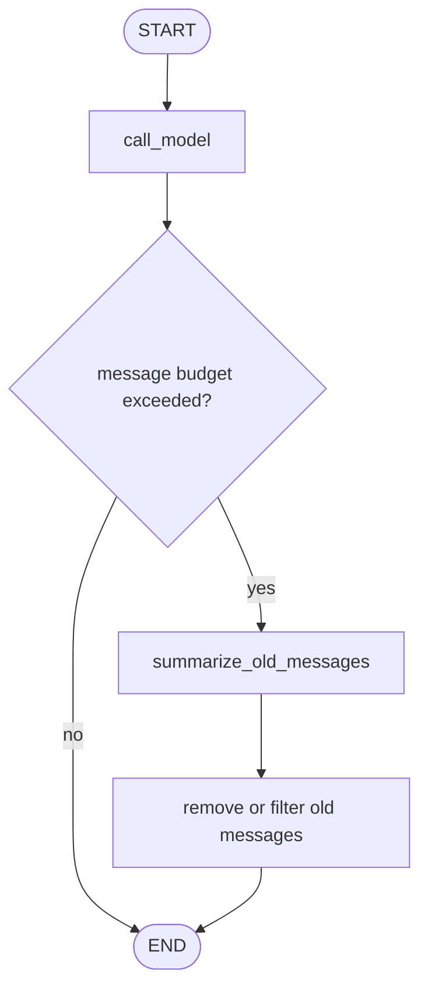
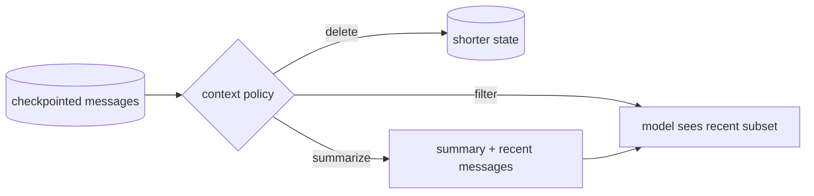

# Pattern 6: Message trimming and summarization

[Back to agent pattern index](../README.md)

**Difficulty:** Beginner/Intermediate

## What this pattern is

Message trimming and summarization manage chat context growth. The key distinction is between what the graph stores and what the model sees on a particular call.

A graph may keep full message history in checkpointed state, delete old messages from state, filter only the prompt input, or summarize older messages into a compact field. These are different design choices.

## Flowchart



## State vs prompt view



## State contract

```python
from typing_extensions import NotRequired
from langgraph.graph import MessagesState

class State(MessagesState):
    summary: NotRequired[str]
```

`MessagesState` uses the `add_messages` reducer. If you delete messages, use the message removal mechanism rather than mutating the list in place. If you only filter model input, make that explicit so learners do not confuse prompt compression with state deletion.

## What to practice

- Keep the latest user and assistant messages verbatim.
- Summarize older context into a dedicated `summary` field.
- Show before/after prompt payloads in debug logs.
- Add deterministic thresholds first, such as “summarize after 6 messages.”
- Pair summarization with checkpointing when you want continuity across invocations.

## Common mistakes

- Calling summarization “long-term memory.” It is prompt compression, not durable user memory.
- Deleting old messages without preserving important commitments in the summary.
- Letting the summary become stale after later corrections.
- Sending both a huge history and a summary, which defeats the purpose.

## Simulated-agent idea seeds

### Conversation Janitor

Given fake messages, decide which to keep, remove, or summarize. This teaches message state hygiene.

### Summary Gate Chatbot

After a threshold, create a summary and continue with summary plus recent messages.

## Smallest deterministic version

Feed eight fake messages to a graph, summarize the first five into one string, and keep the latest three as recent context.

## How the bootstrap skill should use this file

When this pattern is selected, the bootstrap skill should turn the graph shape, state contract, and smallest deterministic exercise into the per-agent README pair. Keep the first scaffold offline and simulated. Add real model calls only after the learner can explain the deterministic version.

## Revision history

- 2026-06-08: Expanded into a descriptive, pattern-accurate guide with diagrams and implementation cautions.
- 2026-05-18: Split from the original monolithic candidate-materials note.
