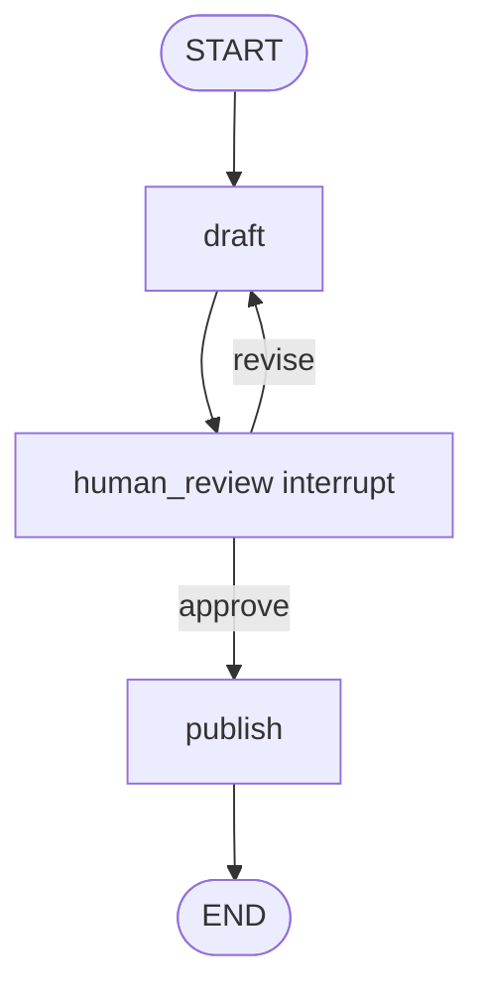

# Pattern 7: Human-in-the-loop interrupt and approval

[Back to agent pattern index](../README.md)

**Difficulty:** Intermediate

### What the pattern teaches

Human-in-the-loop graphs pause execution so a human can approve, reject, edit, or provide missing information. This is useful before risky actions, expensive work, or quality gates.

A checkpointer is important because paused execution must resume from the correct state.

### Basic graph shape



### Typical state

```python
class State(TypedDict):
    request: str
    draft: NotRequired[str]
    human_feedback: NotRequired[str]
    final_result: NotRequired[str]
    revision_count: NotRequired[int]
```

### Implementation cautions

- Use interruption for meaningful decision points, not every minor step.
- Keep a maximum revision count to prevent infinite loops.
- If a node returns `Command(goto=...)`, avoid also wiring a static edge from that same node unless you are certain both are intended.
- Approval should update state clearly, not just continue silently.

### Simulated-agent idea seeds

#### Editor-in-Chief Review Loop

Generate a draft, pause for human review, revise on feedback, or publish on approval.

Why it is useful: it directly practices approval/revision state flow.

#### Risky Tool Approval Agent

Prepare a fake action such as “send email” or “delete file,” pause for approval, then either execute a fake tool or cancel.

Why it is useful: it teaches safe agent boundaries.

#### Missing Info Interviewer

Pause until required fields are complete and valid, then proceed.

Why it is useful: it practices dynamic interrupts for incomplete input.

## Usage note

Use this pattern file only when the selected practice-agent idea needs this specific concept. Keep the main index in context for selection, then load this detail file for implementation planning.

## Revision history

- 2026-05-18: Split from the original monolithic candidate-materials note.
