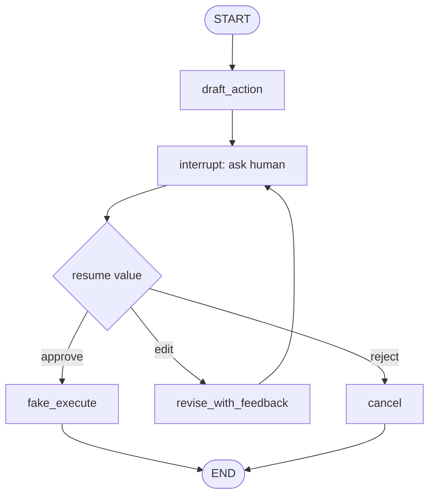
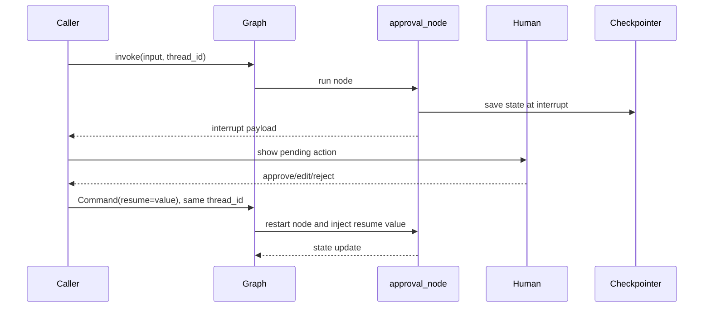

# Pattern 7: Human-in-the-loop interrupt and approval

[Back to agent pattern index](../README.md)

**Difficulty:** Intermediate

## What this pattern is

Human-in-the-loop graphs pause execution so a person can approve, reject, edit, or provide missing information. In LangGraph, dynamic `interrupt()` pauses inside a node; static breakpoints pause before or after configured nodes. Both need checkpointed state if execution should resume safely.

This pattern is for meaningful decision points: risky tools, expensive actions, missing required data, or quality gates.

## Flowchart



## Interrupt sequence



## State contract

```python
from typing import Literal
from typing_extensions import NotRequired, TypedDict

class State(TypedDict):
    request: str
    draft: NotRequired[str]
    human_decision: NotRequired[Literal["approve", "edit", "reject"]]
    human_feedback: NotRequired[str]
    revision_count: NotRequired[int]
    final_result: NotRequired[str]
```

## What to practice

- Use JSON-serializable interrupt payloads.
- Resume with the same `thread_id`; it is the persistent cursor.
- Keep interrupt calls in stable order inside a node.
- Remember that the node restarts from the beginning after resume.
- Add a maximum revision count for loops.

## Common mistakes

- Wrapping `interrupt()` in broad `try/except`, which can swallow the pause signal.
- Performing side effects before asking for approval.
- Using interruption for every minor step, making the graph unusable.
- Continuing silently without storing the human decision in state.

## Simulated-agent idea seeds

### Editor-in-Chief Review Loop

Generate a draft, pause for human review, revise on feedback, or publish on approval.

### Risky Tool Approval Agent

Prepare a fake action such as “send email” or “delete file,” pause for approval, then either execute a fake tool or cancel.

### Missing Info Interviewer

Pause until required fields are complete and valid, then proceed.

## Smallest deterministic version

Draft a fake newsletter title, interrupt for approval, and either publish, revise once, or cancel.

## How the bootstrap skill should use this file

When this pattern is selected, the bootstrap skill should turn the graph shape, state contract, and smallest deterministic exercise into the per-agent README pair. Keep the first scaffold offline and simulated. Add real model calls only after the learner can explain the deterministic version.

## Revision history

- 2026-06-08: Expanded into a descriptive, pattern-accurate guide with diagrams and implementation cautions.
- 2026-05-18: Split from the original monolithic candidate-materials note.
