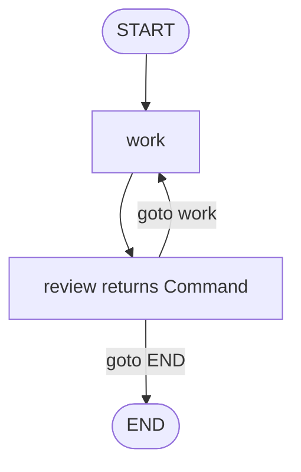

# Pattern 8: `Command` routing

[Back to agent pattern index](../README.md)

**Difficulty:** Intermediate

### What the pattern teaches

`Command` lets a node return both a state update and a routing decision. This is useful when the node itself has enough information to decide where execution should go next.

Conceptually:

```python
return Command(
    update={"feedback": human_feedback},
    goto="draft",
)
```

This differs from conditional edges where a separate routing function reads state after the node returns.

### Basic graph shape



### Typical state

```python
class State(TypedDict):
    task: str
    draft: NotRequired[str]
    feedback: NotRequired[str]
    status: NotRequired[Literal["approved", "revise", "reject"]]
```

### Implementation cautions

- Use `Command` when update and routing are tightly coupled.
- Use conditional edges when you want route logic separate and easy to test.
- Do not mix static outgoing edges and dynamic `Command(goto=...)` casually from the same node.
- Use `Literal[...]` to document possible destinations when helpful.

### Simulated-agent idea seeds

#### Revision Commander

A reviewer node returns `Command` to either revise, ask again, or end.

Why it is useful: it teaches dynamic control flow inside a node.

#### Escalation Router

A fake support node updates escalation reason and jumps to specialist, human review, or end.

Why it is useful: it practices state update plus next-step decision together.

## Usage note

Use this pattern file only when the selected practice-agent idea needs this specific concept. Keep the main index in context for selection, then load this detail file for implementation planning.

## Revision history

- 2026-05-18: Split from the original monolithic candidate-materials note.
