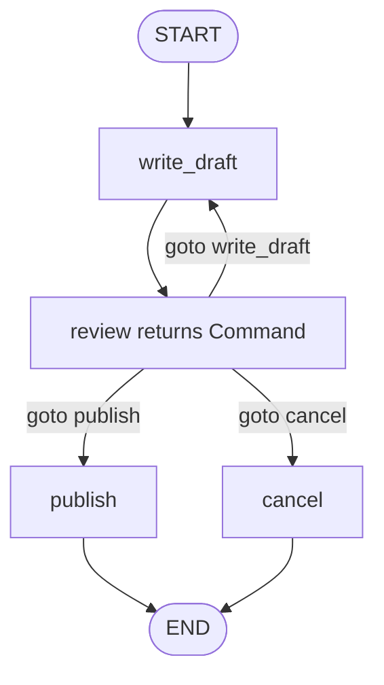
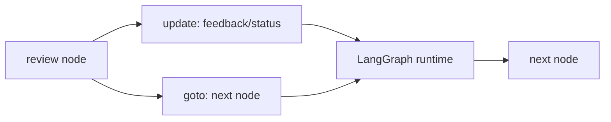

# Pattern 8: `Command` routing

[Back to agent pattern index](../README.md)

**Difficulty:** Intermediate

## What this pattern is

`Command` lets a node return a state update and a routing decision at the same time. Use it when the node that produces the update also owns the next-step decision.

This differs from conditional edges, where a node updates state and a separate routing function reads state afterward. Neither approach is universally better; they express different ownership boundaries.

## Flowchart



## Command payload model



## State contract

```python
from typing import Literal
from langgraph.types import Command
from typing_extensions import NotRequired, TypedDict

class State(TypedDict):
    task: str
    draft: NotRequired[str]
    feedback: NotRequired[str]
    status: NotRequired[Literal["approved", "revise", "reject"]]

def review(state: State) -> Command[Literal["write_draft", "publish", "cancel"]]:
    return Command(update={"status": "revise"}, goto="write_draft")
```

## What to practice

- Use `Command` when update and routing are tightly coupled.
- Use conditional edges when route logic should be separately testable.
- Type possible destinations with `Literal[...]` when practical.
- Keep `Command` returns explicit; do not hide them behind helper magic in learning examples.

## Common mistakes

- Mixing a static outgoing edge and `Command(goto=...)` from the same node without intending both.
- Returning `goto` destinations that are not in the graph.
- Using `Command` for every edge, making a simple graph harder to read.
- Forgetting that `Command` can update state and route; doing one without the other may indicate a simpler pattern.

## Simulated-agent idea seeds

### Revision Commander

A reviewer node returns `Command` to either revise, ask again, publish, or end.

### Escalation Router

A fake support node updates escalation reason and jumps to specialist, human review, or end.

## Smallest deterministic version

A reviewer inspects a draft length and returns `Command(update={...}, goto=...)` to either revise or publish.

## How the bootstrap skill should use this file

When this pattern is selected, the bootstrap skill should turn the graph shape, state contract, and smallest deterministic exercise into the per-agent README pair. Keep the first scaffold offline and simulated. Add real model calls only after the learner can explain the deterministic version.

## Revision history

- 2026-06-08: Expanded into a descriptive, pattern-accurate guide with diagrams and implementation cautions.
- 2026-05-18: Split from the original monolithic candidate-materials note.
