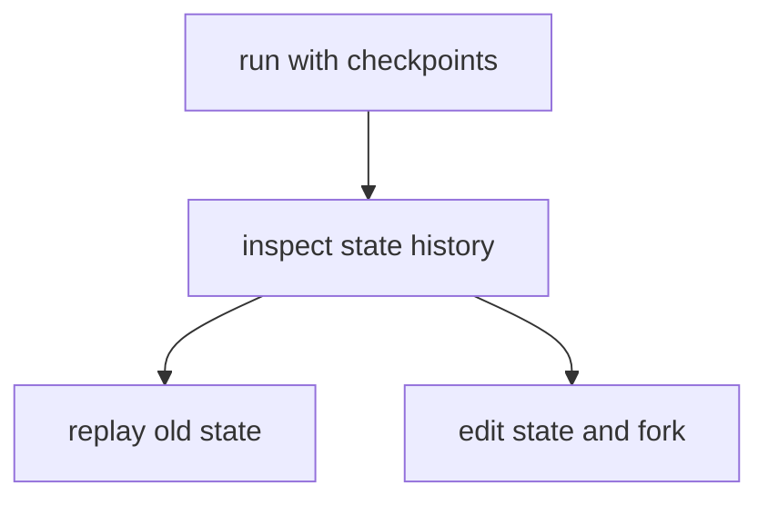

# Pattern 9: Time travel, replay, and state editing

[Back to agent pattern index](../README.md)

**Difficulty:** Intermediate/Advanced

### What the pattern teaches

When a graph uses checkpointing, execution history becomes inspectable. You can view previous states, resume from interruption, replay a path, or fork from an earlier checkpoint with edited state.

This is not just a debugging trick. It is an operational model for agents that need oversight.

### Basic graph shape



### Typical state

```python
class State(TypedDict):
    input: str
    draft: NotRequired[str]
    critique: NotRequired[str]
    final: NotRequired[str]
```

### Implementation cautions

- Use stable `thread_id` values when checkpointing.
- Make state fields readable so history inspection is useful.
- Keep side effects fake or idempotent in learning simulations.
- Do not replay real irreversible side effects.

### Simulated-agent idea seeds

#### Time Travel Debug Lab

Run a draft-review graph, inspect fake checkpoints, then fork with corrected feedback.

Why it is useful: it teaches checkpoint mental models without production risk.

#### Alternate Ending Simulator

Given one draft, fork into “strict reviewer” and “friendly reviewer” outcomes.

Why it is useful: it makes state forking concrete.

## Usage note

Use this pattern file only when the selected practice-agent idea needs this specific concept. Keep the main index in context for selection, then load this detail file for implementation planning.

## Revision history

- 2026-05-18: Split from the original monolithic candidate-materials note.
