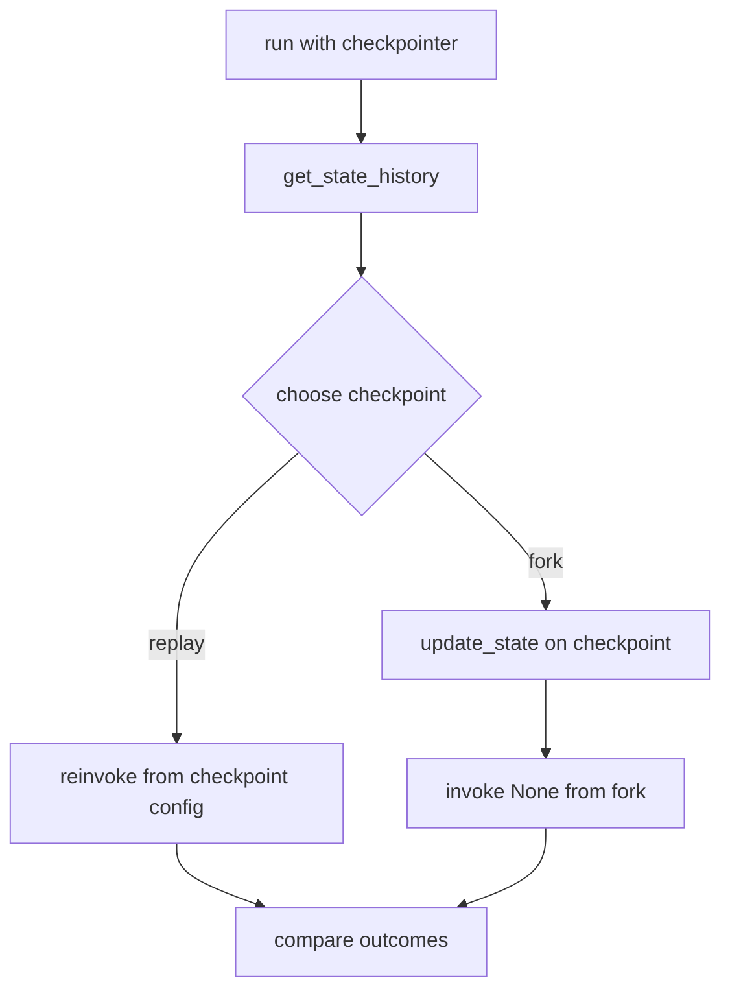
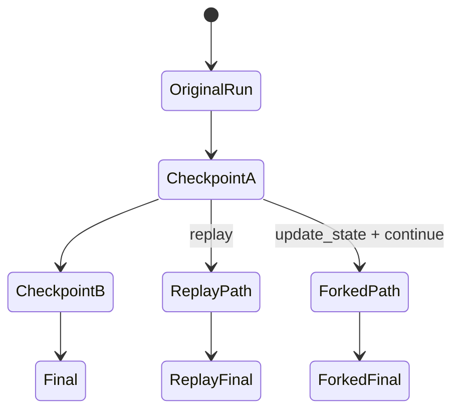

# Pattern 9: Time travel, replay, and state editing

[Back to agent pattern index](../README.md)

**Difficulty:** Intermediate/Advanced

## What this pattern is

With checkpointing, a graph run becomes a timeline of state snapshots. You can inspect the history, replay from an earlier checkpoint, or fork by editing state and continuing from that point.

This is more than debugging. It is an operational model for recoverable agents: observe what happened, correct state, and explore alternate futures without losing the original execution history.

## Flowchart



## Replay vs fork



## State contract

```python
from typing_extensions import NotRequired, TypedDict

class State(TypedDict):
    input: str
    draft: NotRequired[str]
    critique: NotRequired[str]
    final: NotRequired[str]
```

## What to practice

- Use stable `thread_id` values when checkpointing.
- Inspect `next` nodes and state values in history.
- Replay to understand behavior; fork to intervene.
- Keep fake side effects idempotent so replay is safe.
- Make state human-readable enough that history inspection is useful.

## Common mistakes

- Thinking replay is just reading cached output. Nodes after the replay point execute again.
- Treating `update_state` as rollback. It creates a new checkpoint branch.
- Replaying real irreversible side effects.
- Storing opaque blobs that make checkpoint inspection useless.

## Simulated-agent idea seeds

### Time Travel Debug Lab

Run a draft-review graph, inspect fake checkpoints, then fork with corrected feedback.

### Alternate Ending Simulator

Given one draft, fork into “strict reviewer” and “friendly reviewer” outcomes.

## Smallest deterministic version

Run a three-node draft/critique/final graph, inspect checkpoints, update the critique at the middle checkpoint, and continue to a new final answer.

## How the bootstrap skill should use this file

When this pattern is selected, the bootstrap skill should turn the graph shape, state contract, and smallest deterministic exercise into the per-agent README pair. Keep the first scaffold offline and simulated. Add real model calls only after the learner can explain the deterministic version.

## Revision history

- 2026-06-08: Expanded into a descriptive, pattern-accurate guide with diagrams and implementation cautions.
- 2026-05-18: Split from the original monolithic candidate-materials note.
