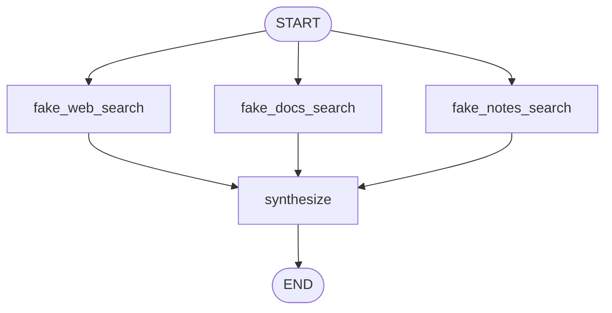

# Pattern 10: Fixed parallelization

[Back to agent pattern index](../README.md)

**Difficulty:** Intermediate

### What the pattern teaches

Fixed parallelization runs a known set of independent branches from the same input, then combines their outputs. The number of branches is known when the graph is built.

This is useful for collecting multiple perspectives or evidence sources.

### Basic graph shape



### Typical state

```python
class State(TypedDict):
    question: str
    evidence: Annotated[list[str], operator.add]
    final_answer: NotRequired[str]
```

### Implementation cautions

- Branches must be independent.
- Shared output channels need reducers.
- The synthesis node should assume it receives a list, not a single branch output.
- Use fake evidence first to keep tests offline.

### Simulated-agent idea seeds

#### Evidence Collector

Collect fake evidence from docs, notes, and examples, then synthesize an answer.

Why it is useful: it practices parallel fan-out/fan-in.

#### Multi-Lens Code Reviewer

Run readability, correctness, and testability review branches, then aggregate findings.

Why it is useful: it teaches independent analysis branches before final synthesis.

## Usage note

Use this pattern file only when the selected practice-agent idea needs this specific concept. Keep the main index in context for selection, then load this detail file for implementation planning.

## Revision history

- 2026-05-18: Split from the original monolithic candidate-materials note.
