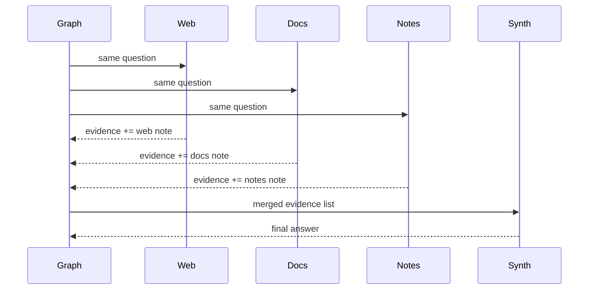

# Pattern 10: Fixed parallelization

[Back to agent pattern index](../README.md)

**Difficulty:** Intermediate

## What this pattern is

Fixed parallelization fans one input out to a known set of independent branches, then fans back in to a synthesis node. The branch count is known when the graph is built.

This is useful for collecting independent evidence, perspectives, checks, or drafts. It is not the same as dynamic map-reduce: fixed parallel branches are static nodes, while dynamic workers are created from runtime data.

## Flowchart


## Fan-in merge



## State contract

```python
import operator
from typing import Annotated
from typing_extensions import NotRequired, TypedDict

class State(TypedDict):
    question: str
    evidence: Annotated[list[str], operator.add]
    final_answer: NotRequired[str]
```

## What to practice

- Confirm branches are independent before parallelizing.
- Add reducers to shared output channels.
- Make the synthesis node read a collection, not one branch’s output.
- Keep branch names tied to their perspective or source.
- Start with fake evidence to keep tests offline.

## Common mistakes

- Writing parallel branches that secretly depend on each other.
- Forgetting reducers for shared list outputs.
- Assuming fan-in runs after the first branch rather than after required predecessors complete.
- Using fixed branches when the number of workers must be decided from input.

## Simulated-agent idea seeds

### Evidence Collector

Collect fake evidence from docs, notes, and examples, then synthesize an answer.

### Multi-Lens Code Reviewer

Run readability, correctness, and testability review branches, then aggregate findings.

## Smallest deterministic version

Three static branches return one string each into `evidence`; a final node joins them into a report.

## How the bootstrap skill should use this file

When this pattern is selected, the bootstrap skill should turn the graph shape, state contract, and smallest deterministic exercise into the per-agent README pair. Keep the first scaffold offline and simulated. Add real model calls only after the learner can explain the deterministic version.

## Revision history

- 2026-06-08: Expanded into a descriptive, pattern-accurate guide with diagrams and implementation cautions.
- 2026-05-18: Split from the original monolithic candidate-materials note.
