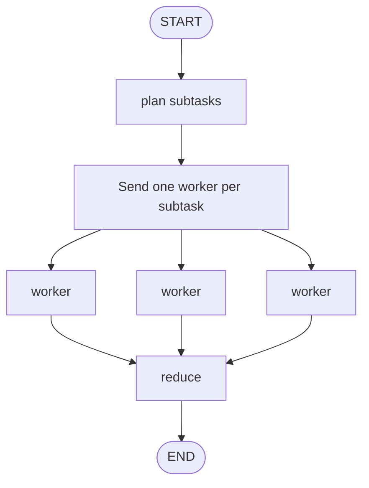

# Pattern 11: Dynamic map-reduce with `Send`

[Back to agent pattern index](../README.md)

**Difficulty:** Intermediate

### What the pattern teaches

Dynamic map-reduce creates parallel work at runtime. A routing function returns multiple `Send(...)` objects, each targeting a worker node with a slice of state.

This is useful when the number of subtasks depends on the input.

### Basic graph shape



### Typical state

```python
class OverallState(TypedDict):
    topic: str
    sections: list[str]
    completed_sections: Annotated[list[str], operator.add]
    final_report: NotRequired[str]

class WorkerState(TypedDict):
    section: str
```

### Implementation cautions

- Worker state should contain only what the worker needs.
- Aggregated output needs a reducer.
- The reduce node should handle any ordering assumptions explicitly.
- Keep max worker counts small in learning simulations.

### Simulated-agent idea seeds

#### Study Plan Map-Reduce

Generate subtopics, create a mini-lesson for each subtopic, then combine them into one study plan.

Why it is useful: it practices runtime-created worker tasks.

#### Bug Hypothesis Tournament

Generate hypotheses, score each in parallel, then choose the best root-cause explanation.

Why it is useful: it teaches map, evaluate, reduce.

## Usage note

Use this pattern file only when the selected practice-agent idea needs this specific concept. Keep the main index in context for selection, then load this detail file for implementation planning.

## Revision history

- 2026-05-18: Split from the original monolithic candidate-materials note.
