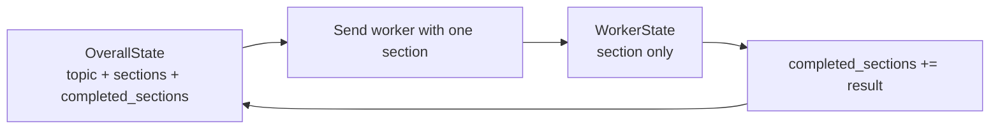

# Pattern 11: Dynamic map-reduce with `Send`

[Back to agent pattern index](../README.md)

**Difficulty:** Intermediate

## What this pattern is

Dynamic map-reduce creates parallel work at runtime. A planner node writes a list of subtasks, and a routing function returns one `Send(...)` per subtask. Each `Send` targets the same worker node with a different slice of state.

This is the LangGraph pattern for orchestrator-worker workflows when the number of workers cannot be predefined.

## Flowchart

```mermaid
flowchart TD
    Start([START]) --> Plan[plan_sections]
    Plan --> Assign{assign_workers returns Send[]}
    Assign -->|Send section A| WorkerA[write_section]
    Assign -->|Send section B| WorkerB[write_section]
    Assign -->|Send section N| WorkerN[write_section]
    WorkerA --> Synthesize[synthesize_report]
    WorkerB --> Synthesize
    WorkerN --> Synthesize
    Synthesize --> End([END])
```

## Worker state boundary



## State contract

```python
import operator
from typing import Annotated
from typing_extensions import NotRequired, TypedDict

class OverallState(TypedDict):
    topic: str
    sections: list[str]
    completed_sections: Annotated[list[str], operator.add]
    final_report: NotRequired[str]

class WorkerState(TypedDict):
    section: str
```

## What to practice

- Keep worker state narrow; do not pass the full graph state unless needed.
- Put a reducer on the aggregate output key.
- Add an explicit max worker count in learning examples.
- Make the reducer or synthesis node handle ordering if order matters.
- Distinguish planning quality from worker execution quality.

## Common mistakes

- Passing the entire state to every worker, bloating context and coupling workers.
- Forgetting that worker outputs arrive as concurrent updates.
- Treating `Send` as a normal edge; it is returned by a routing function.
- Choosing dynamic fan-out when a fixed three-branch graph would be clearer.

## Simulated-agent idea seeds

### Study Plan Map-Reduce

Generate subtopics, create a mini-lesson for each subtopic, then combine them into one study plan.

### Bug Hypothesis Tournament

Generate hypotheses, score each in parallel, then choose the best root-cause explanation.

## Smallest deterministic version

Split a topic into three hard-coded sections, `Send` one worker per section, and reduce the section notes into a final outline.

## How the bootstrap skill should use this file

When this pattern is selected, the bootstrap skill should turn the graph shape, state contract, and smallest deterministic exercise into the per-agent README pair. Keep the first scaffold offline and simulated. Add real model calls only after the learner can explain the deterministic version.

## Revision history

- 2026-06-08: Expanded into a descriptive, pattern-accurate guide with diagrams and implementation cautions.
- 2026-05-18: Split from the original monolithic candidate-materials note.
