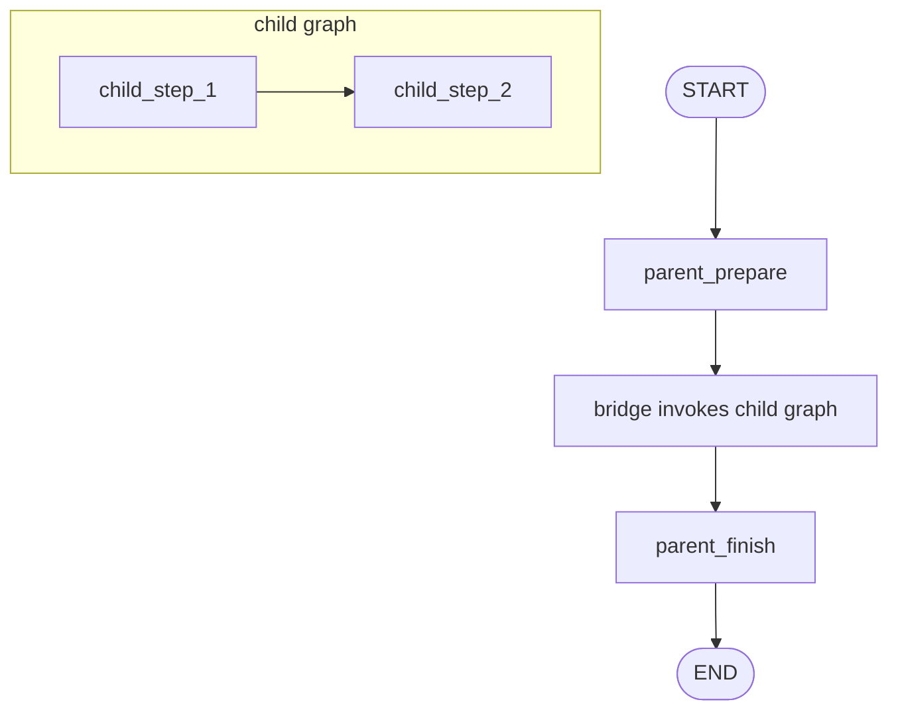

# Pattern 12: Subgraphs and bridge nodes

[Back to agent pattern index](../README.md)

**Difficulty:** Intermediate/Advanced

### What the pattern teaches

A compiled graph can be used as a node inside a parent graph. This lets you package a workflow as a reusable unit.

If parent and child state schemas differ, use a bridge node:

1. read parent state;
2. build child input;
3. invoke child graph;
4. map child output back into parent state.

### Basic graph shape



### Typical state

```python
class ParentState(TypedDict):
    user_request: str
    child_summary: NotRequired[str]
    final_answer: NotRequired[str]

class ChildState(TypedDict):
    child_input: str
    child_output: NotRequired[str]
```

### Implementation cautions

- Do not leak child-private state into parent state.
- Use direct subgraph nodes when schemas match.
- Use bridge functions when schemas differ.
- Keep child graphs independently understandable.

### Simulated-agent idea seeds

#### Department Workflow Simulator

A parent graph routes work through a research subgraph, writing subgraph, and review subgraph.

Why it is useful: it teaches graph composition.

#### Delivery Bridge Demo

A parent order graph invokes a child delivery graph through explicit input/output mapping.

Why it is useful: it teaches schema boundaries.

## Usage note

Use this pattern file only when the selected practice-agent idea needs this specific concept. Keep the main index in context for selection, then load this detail file for implementation planning.

## Revision history

- 2026-05-18: Split from the original monolithic candidate-materials note.
