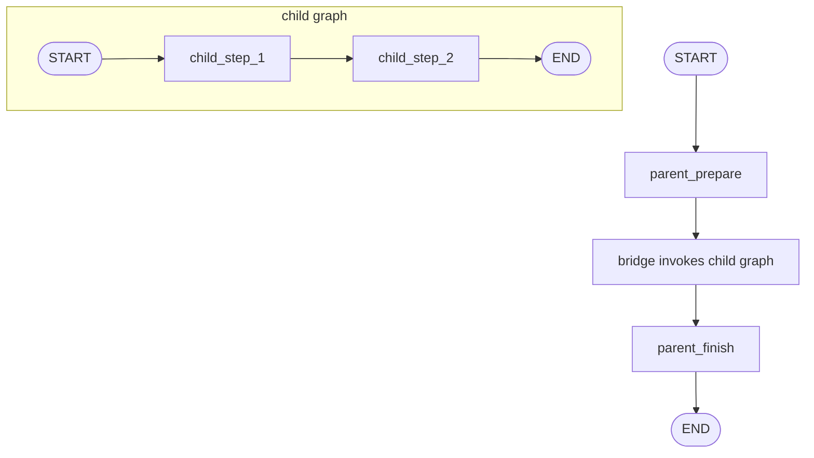
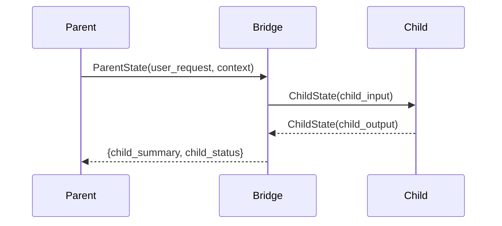

# Pattern 12: Subgraphs and bridge nodes

[Back to agent pattern index](../README.md)

**Difficulty:** Intermediate/Advanced

## What this pattern is

A compiled graph can be used as a node inside another graph. This packages a workflow as a reusable unit. If parent and child graphs share a compatible state schema, the child graph can be added directly. If their schemas differ, use a bridge node that maps parent input into child input and child output back into parent state.

This pattern teaches composition and schema boundaries.

## Flowchart



## Bridge sequence



## State contract

```python
from typing_extensions import NotRequired, TypedDict

class ParentState(TypedDict):
    user_request: str
    child_summary: NotRequired[str]
    final_answer: NotRequired[str]

class ChildState(TypedDict):
    child_input: str
    child_output: NotRequired[str]
```

## What to practice

- Use direct subgraph nodes only when schemas align.
- Use a bridge when parent and child vocabularies differ.
- Keep child-private fields out of parent state.
- Test the child graph independently before embedding it.
- Name the bridge by the contract it translates, not just `call_child`.

## Common mistakes

- Leaking all child internals into parent state.
- Making the parent know every child node detail, which defeats encapsulation.
- Using subgraphs too early when a simple node would teach the pattern better.
- Forgetting that subgraph state still needs clear reducers if it has parallel branches.

## Simulated-agent idea seeds

### Department Workflow Simulator

A parent graph routes work through research, writing, and review child workflows.

### Delivery Bridge Demo

A parent order graph invokes a child delivery graph through explicit input/output mapping.

## Smallest deterministic version

Build a child graph that turns `child_input` into `child_output`, then call it from a parent bridge node and store `child_summary`.

## How the bootstrap skill should use this file

When this pattern is selected, the bootstrap skill should turn the graph shape, state contract, and smallest deterministic exercise into the per-agent README pair. Keep the first scaffold offline and simulated. Add real model calls only after the learner can explain the deterministic version.

## Revision history

- 2026-06-08: Expanded into a descriptive, pattern-accurate guide with diagrams and implementation cautions.
- 2026-05-18: Split from the original monolithic candidate-materials note.
