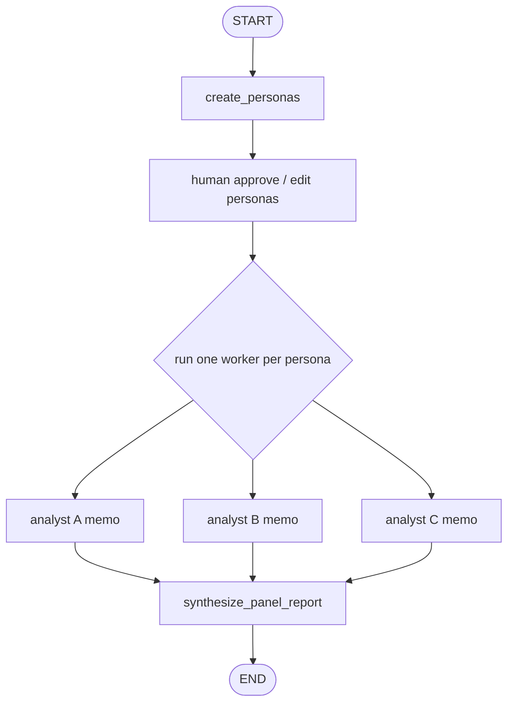
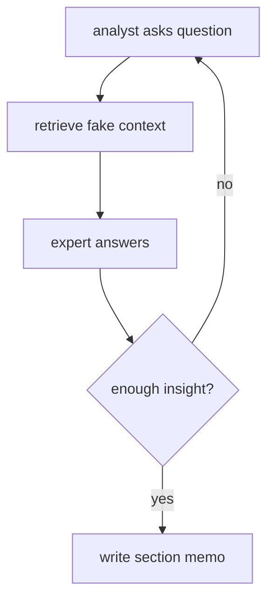

# Pattern 13: Persona workers and research panel

[Back to agent pattern index](../README.md)

**Difficulty:** Advanced

## What this pattern is

Persona-worker graphs create role-specific workers, run each worker with a distinct perspective or task slice, then synthesize their outputs. This is often called “multi-agent,” but in this learning repo the honest description is: a supervisor graph runs simulated roles or worker nodes.

The research-assistant shape is the canonical example: create analysts, optionally ask a human to approve them, run an interview or retrieval subgraph per analyst, then synthesize a report.

## Outer flow



## Inner interview loop



## State contract

```python
import operator
from typing import Annotated
from pydantic import BaseModel
from typing_extensions import NotRequired, TypedDict

class Persona(BaseModel):
    name: str
    role: str
    focus: str

class State(TypedDict):
    topic: str
    personas: NotRequired[list[Persona]]
    approved: NotRequired[bool]
    memos: Annotated[list[str], operator.add]
    final_report: NotRequired[str]
```

## What to practice

- Generate a small persona set, usually 2-3 roles.
- Ask for human approval before expensive fan-out.
- Give each worker only its persona and task.
- Store worker outputs as memos with source attribution.
- Let synthesis compare perspectives rather than concatenate them blindly.

## Common mistakes

- Claiming simulated personas are autonomous agents.
- Giving every persona the full global state and a vague objective.
- Skipping approval when persona quality determines downstream quality.
- Synthesizing without preserving which perspective contributed which insight.

## Simulated-agent idea seeds

### Mini Research Panel

Create 2-3 analyst personas, optionally approve them, run fake interviews, and synthesize a report.

### Product Project Review Board

Product, backend, and risk reviewers evaluate one project idea, then a moderator creates next steps.

## Smallest deterministic version

Use three fixed personas, produce one memo per persona from templates, and synthesize a final report with named sections.

## How the bootstrap skill should use this file

When this pattern is selected, the bootstrap skill should turn the graph shape, state contract, and smallest deterministic exercise into the per-agent README pair. Keep the first scaffold offline and simulated. Add real model calls only after the learner can explain the deterministic version.

## Revision history

- 2026-06-08: Expanded into a descriptive, pattern-accurate guide with diagrams and implementation cautions.
- 2026-05-18: Split from the original monolithic candidate-materials note.
