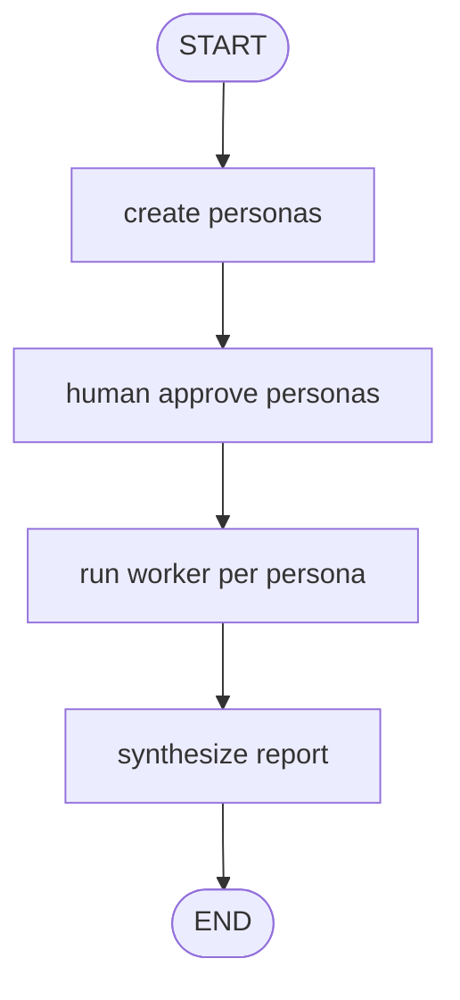

# Pattern 13: Persona workers and research panel

[Back to agent pattern index](../README.md)

**Difficulty:** Advanced

### What the pattern teaches

A graph can create multiple role/persona workers, run each worker with a different perspective, then synthesize their outputs. This is often called “multi-agent” in a lightweight sense, but the precise implementation is usually a supervisor graph plus multiple worker runs.

The important idea is not that the workers are autonomous beings. The important idea is that each worker receives a distinct role, state slice, or objective.

### Basic graph shape



### Typical state

```python
class Persona(BaseModel):
    name: str
    role: str
    focus: str

class State(TypedDict):
    topic: str
    personas: NotRequired[list[Persona]]
    memos: Annotated[list[str], operator.add]
    final_report: NotRequired[str]
```

### Implementation cautions

- Be honest: simulated personas are graph roles/workers, not proof of independent agents.
- Human approval before expensive fan-out is a good pattern.
- Each worker should receive only its persona and task.
- Synthesis should cite which perspective contributed what.

### Simulated-agent idea seeds

#### Mini Research Panel

Create 2-3 analyst personas, optionally approve them, run fake interviews, and synthesize a report.

Why it is useful: it combines persona generation, fan-out, and synthesis.

#### Product Project Review Board

Product, backend, and risk reviewers evaluate one project idea, then a moderator creates next steps.

Why it is useful: it extends the existing Debate Council idea into a richer graph.

## Usage note

Use this pattern file only when the selected practice-agent idea needs this specific concept. Keep the main index in context for selection, then load this detail file for implementation planning.

## Revision history

- 2026-05-18: Split from the original monolithic candidate-materials note.
