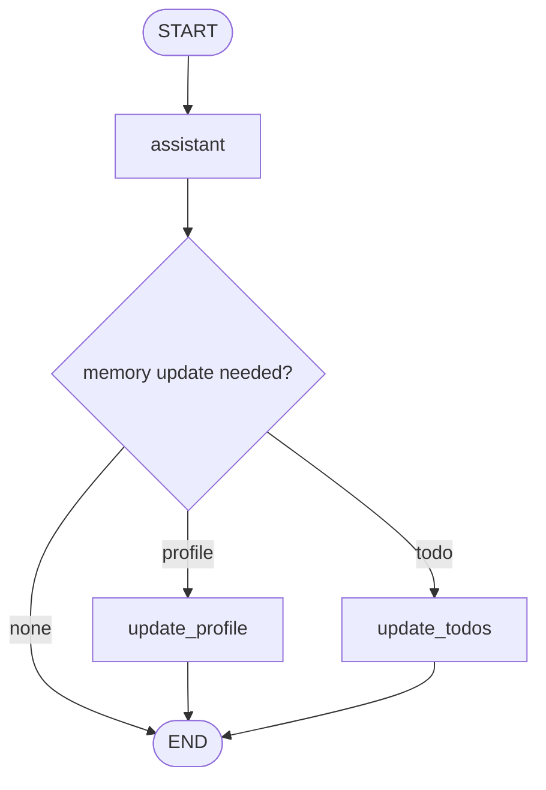

# Pattern 14: Long-term memory and profile updates

[Back to agent pattern index](../README.md)

**Difficulty:** Advanced

### What the pattern teaches

Long-term memory is different from conversation messages. Messages are run/thread context. Long-term memory stores stable facts, preferences, tasks, or instructions that should survive across conversations.

A memory graph often has:

1. a normal assistant response path;
2. memory extraction/update logic;
3. a store keyed by user or namespace;
4. visibility into what changed.

### Basic graph shape



### Typical state

```python
class UserProfile(BaseModel):
    name: str | None = None
    learning_style: str | None = None
    preferred_language: str | None = None

class State(MessagesState):
    memory_update_summary: NotRequired[str]
```

### Implementation cautions

- Keep memory updates explicit and reviewable.
- Distinguish stable facts from temporary chat context.
- Avoid storing sensitive information by default.
- In simulations, use an in-memory fake store first.

### Simulated-agent idea seeds

#### Learning Preference Memory Agent

Extract how the user likes to learn, store it in a fake profile, and adapt later explanations.

Why it is useful: it practices long-term memory without production storage.

#### Memory Diff Inspector

After each turn, show what memory changed and why.

Why it is useful: it makes memory behavior visible and debuggable.

## Usage note

Use this pattern file only when the selected practice-agent idea needs this specific concept. Keep the main index in context for selection, then load this detail file for implementation planning.

## Revision history

- 2026-05-18: Split from the original monolithic candidate-materials note.
