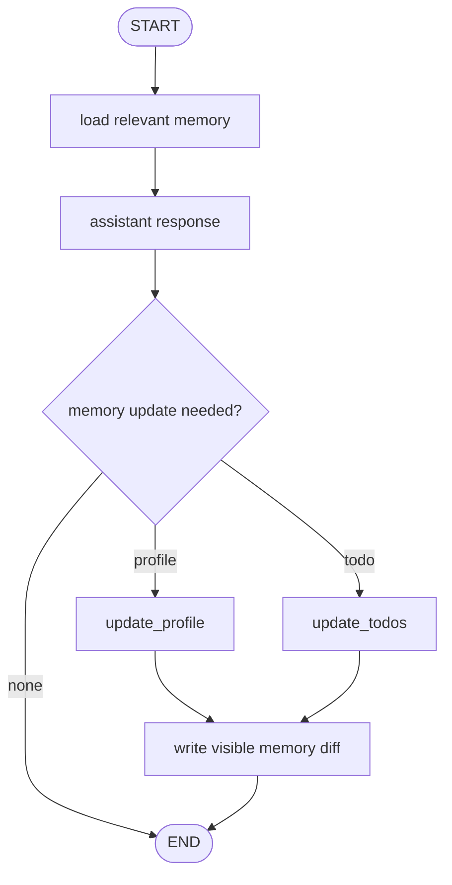
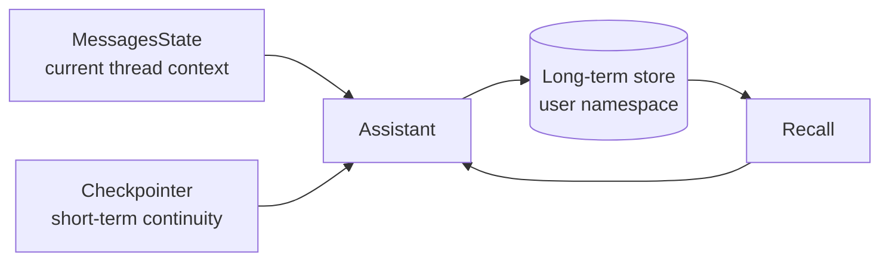

# Pattern 14: Long-term memory and profile updates

[Back to agent pattern index](../README.md)

**Difficulty:** Advanced

## What this pattern is

Long-term memory stores stable information that should survive beyond one thread or conversation: user preferences, facts, tasks, or instructions. It is different from message history and different from summarization.

In LangGraph terms, short-term continuity usually comes from checkpointed thread state. Long-term memory usually comes from a store keyed by namespace, user, or entity.

## Flowchart



## Memory layers



## State contract

```python
from pydantic import BaseModel
from typing_extensions import NotRequired
from langgraph.graph import MessagesState

class UserProfile(BaseModel):
    name: str | None = None
    learning_style: str | None = None
    preferred_language: str | None = None

class State(MessagesState):
    recalled_profile: NotRequired[UserProfile]
    memory_update_summary: NotRequired[str]
```

## What to practice

- Decide what is stable enough to remember.
- Use a fake in-memory store first.
- Show a memory diff after each update.
- Keep sensitive facts out by default.
- Separate recall from extraction/update.

## Common mistakes

- Storing every conversation detail as long-term memory.
- Confusing a summary field with durable memory.
- Updating memory invisibly so the user cannot correct it.
- Using one global namespace instead of user- or domain-specific keys.

## Simulated-agent idea seeds

### Learning Preference Memory Agent

Extract how the user likes to learn, store it in a fake profile, and adapt later explanations.

### Memory Diff Inspector

After each turn, show what memory changed and why.

## Smallest deterministic version

Detect statements like “I prefer examples first,” update a fake profile dict, and print a before/after memory diff.

## How the bootstrap skill should use this file

When this pattern is selected, the bootstrap skill should turn the graph shape, state contract, and smallest deterministic exercise into the per-agent README pair. Keep the first scaffold offline and simulated. Add real model calls only after the learner can explain the deterministic version.

## Revision history

- 2026-06-08: Expanded into a descriptive, pattern-accurate guide with diagrams and implementation cautions.
- 2026-05-18: Split from the original monolithic candidate-materials note.
