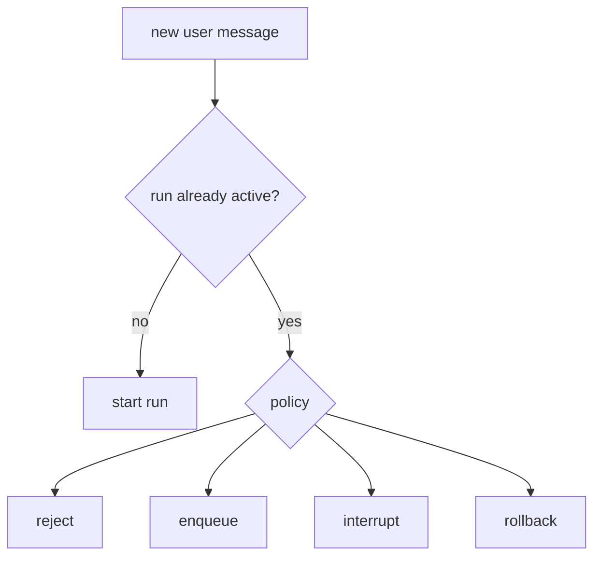

# Pattern 15: Runtime and double-texting policy

[Back to agent pattern index](../README.md)

**Difficulty:** Advanced

### What the pattern teaches

A deployed graph may receive a new user message while a previous run is still active. The system needs a policy for concurrent input.

Common policies:

- reject the new message;
- enqueue it after the current run;
- interrupt the current run;
- rollback and restart from a safer point.

This is more operational than algorithmic, but it matters for real agent applications.

### Basic graph shape



### Typical state

```python
class RunPolicyState(TypedDict):
    current_run_status: Literal["idle", "running", "paused"]
    new_message: str
    policy: NotRequired[Literal["reject", "enqueue", "interrupt", "rollback"]]
    explanation: NotRequired[str]
```

### Implementation cautions

- Do not simulate real deployment side effects unless explicitly requested.
- Focus on decision logic and explanation.
- Make policy tradeoffs visible.
- Keep examples deterministic.

### Simulated-agent idea seeds

#### Run Policy Simulator

Given current run status and a new message, choose reject, enqueue, interrupt, or rollback and explain why.

Why it is useful: it teaches production agent runtime thinking.

#### Assistant Config Lab

The same graph receives different assistant configurations, such as personal tutor vs work assistant, and changes behavior accordingly.

Why it is useful: it practices configurable graph behavior.

## Usage note

Use this pattern file only when the selected practice-agent idea needs this specific concept. Keep the main index in context for selection, then load this detail file for implementation planning.

## Revision history

- 2026-05-18: Split from the original monolithic candidate-materials note.
