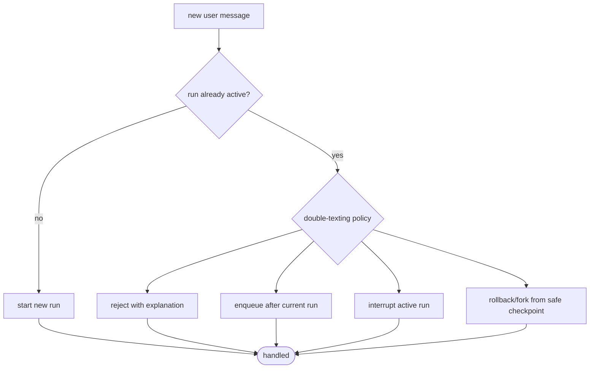
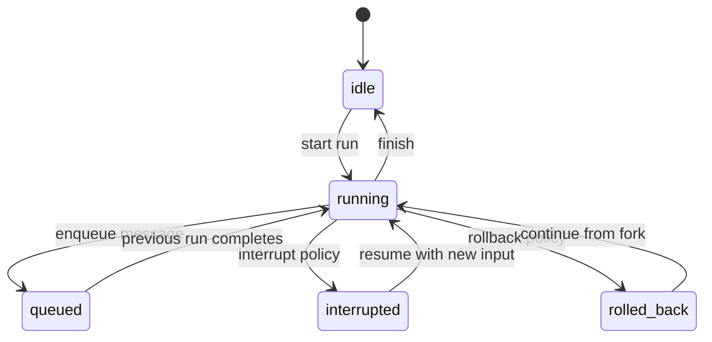

# Pattern 15: Runtime and double-texting policy

[Back to agent pattern index](../README.md)

**Difficulty:** Advanced

## What this pattern is

A deployed graph may receive a new user message while a previous run is still active. The runtime needs a double-texting policy: what should happen to the new input?

This pattern is operational rather than algorithmic. It teaches that agent behavior is not only graph nodes; it also includes run state, concurrency rules, interrupt policies, queueing, and rollback choices.

## Policy flow



## State model



## State contract

```python
from typing import Literal
from typing_extensions import NotRequired, TypedDict

class RunPolicyState(TypedDict):
    current_run_status: Literal["idle", "running", "paused"]
    new_message: str
    policy: NotRequired[Literal["reject", "enqueue", "interrupt", "rollback"]]
    explanation: NotRequired[str]
```

## What to practice

- Make the policy decision deterministic first.
- Explain the tradeoff for each policy.
- Connect rollback to checkpoint/time-travel concepts.
- Keep deployment side effects fake.
- Treat thread identity and active-run status as first-class runtime inputs.

## Common mistakes

- Ignoring concurrent input until production.
- Treating enqueue, interrupt, and rollback as equivalent.
- Letting a new message silently mutate an active run without a policy.
- Simulating real infrastructure before the policy table is clear.

## Simulated-agent idea seeds

### Run Policy Simulator

Given current run status and a new message, choose reject, enqueue, interrupt, or rollback and explain why.

### Assistant Config Lab

The same graph receives different assistant configurations, such as personal tutor vs work assistant, and changes behavior accordingly.

## Smallest deterministic version

A rule table maps `(run_status, urgency, user_intent)` to one policy and a human-readable explanation.

## How the bootstrap skill should use this file

When this pattern is selected, the bootstrap skill should turn the graph shape, state contract, and smallest deterministic exercise into the per-agent README pair. Keep the first scaffold offline and simulated. Add real model calls only after the learner can explain the deterministic version.

## Revision history

- 2026-06-08: Expanded into a descriptive, pattern-accurate guide with diagrams and implementation cautions.
- 2026-05-18: Split from the original monolithic candidate-materials note.
