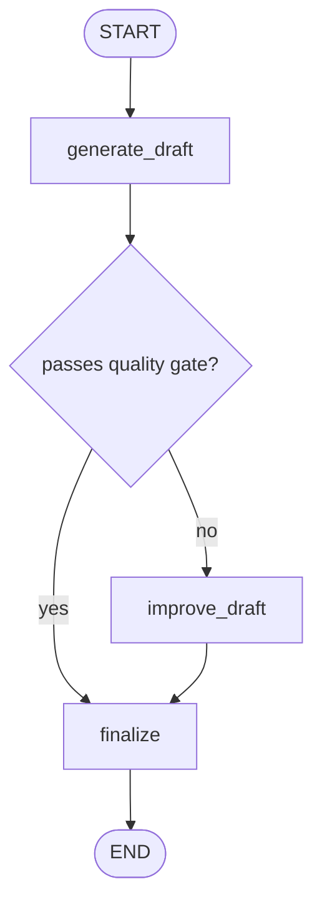
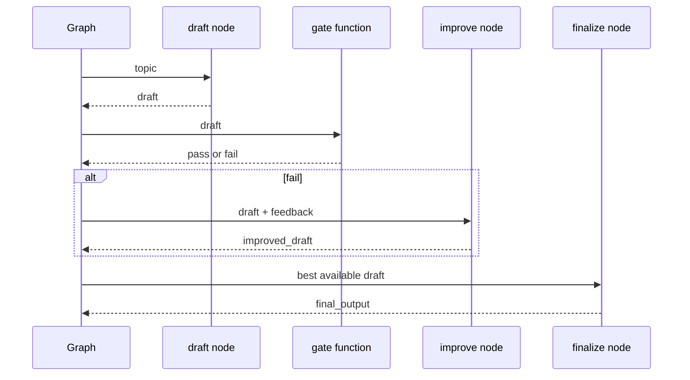

# Pattern 16: Prompt chaining and quality gates

[Back to agent pattern index](../README.md)

**Difficulty:** Beginner/Intermediate

## What this pattern is

Prompt chaining breaks a well-defined LLM task into ordered calls where each call uses the previous call’s output. A quality gate can inspect an intermediate result and either continue, skip a later step, or route to improvement.

This is a workflow, not an autonomous agent. The path is mostly predetermined, which makes it ideal for learning how to pass clean state between LLM calls.

## Flowchart



## Sequence



## State contract

```python
from typing import Literal
from typing_extensions import NotRequired, TypedDict

class State(TypedDict):
    topic: str
    draft: NotRequired[str]
    gate_result: NotRequired[Literal["pass", "fail"]]
    improvement_notes: NotRequired[str]
    final_output: NotRequired[str]
```

## What to practice

- Make each node transform one artifact into the next.
- Store intermediate artifacts so learners can inspect the chain.
- Use deterministic gates first, then optional LLM judges.
- Keep the final node responsible for packaging, not hidden evaluation.

## Common mistakes

- Calling every sequence of nodes an agent loop.
- Letting later prompts depend on implicit context instead of explicit state fields.
- Hiding quality gates inside generation prompts.
- Over-chaining when a single call would be more understandable.

## Simulated-agent idea seeds

### Translation QA Chain

Draft a translation, check terminology, improve if needed, then produce final text.

### README Polisher

Generate a rough README section, check for required headings, improve missing pieces, then finalize.

## Smallest deterministic version

Generate a fake draft string, check whether it contains a required keyword, improve it if missing, and finalize.

## How the bootstrap skill should use this file

When this pattern is selected, the bootstrap skill should turn the graph shape, state contract, and smallest deterministic exercise into the per-agent README pair. Keep the first scaffold offline and simulated. Add real model calls only after the learner can explain the deterministic version.

## Revision history

- 2026-06-08: Expanded into a descriptive, pattern-accurate guide with diagrams and implementation cautions.
- 2026-05-18: Split from the original monolithic candidate-materials note.
