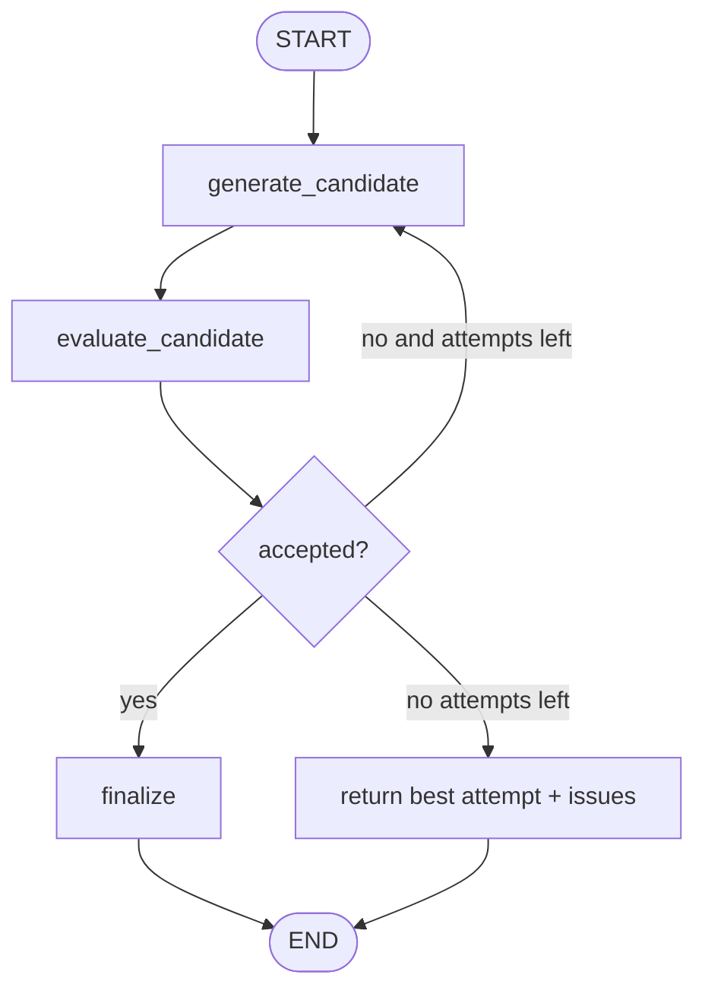
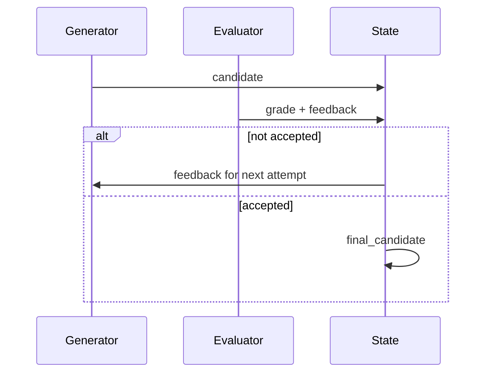

# Pattern 17: Evaluator-optimizer loop

[Back to agent pattern index](../README.md)

**Difficulty:** Intermediate

## What this pattern is

An evaluator-optimizer loop has one node generate an artifact and another node judge it against explicit criteria. If the artifact fails, feedback loops back to the generator. The loop stops when the evaluator accepts the artifact or a maximum iteration count is reached.

This pattern is useful when success criteria are known but the first attempt may not satisfy them.

## Flowchart



## Feedback loop



## State contract

```python
from typing import Literal
from pydantic import BaseModel
from typing_extensions import NotRequired, TypedDict

class Evaluation(BaseModel):
    grade: Literal["pass", "fail"]
    feedback: str

class State(TypedDict):
    task: str
    candidate: NotRequired[str]
    evaluation: NotRequired[Evaluation]
    attempt_count: NotRequired[int]
    final_output: NotRequired[str]
```

## What to practice

- Make criteria explicit before generation.
- Store evaluator feedback in state and feed it into the next generation.
- Add a hard attempt limit.
- Keep evaluator output structured.
- Decide what to do when all attempts fail.

## Common mistakes

- Infinite revision loops with no max count.
- Vague evaluation criteria like “make it better.”
- Letting the generator ignore feedback because it is not passed in state.
- Using LLM evaluation when a deterministic check would be safer and cheaper.

## Simulated-agent idea seeds

### Tagline Optimizer

Generate a tagline, evaluate for length and required tone, revise until acceptable.

### Answer Rubric Coach

Draft an answer, grade it against a hidden rubric, revise with feedback, then show the final answer and a short explanation.

## Smallest deterministic version

Generate a candidate sentence, fail it if it is longer than a limit, revise once, and stop with either pass or best attempt.

## How the bootstrap skill should use this file

When this pattern is selected, the bootstrap skill should turn the graph shape, state contract, and smallest deterministic exercise into the per-agent README pair. Keep the first scaffold offline and simulated. Add real model calls only after the learner can explain the deterministic version.

## Revision history

- 2026-06-08: Expanded into a descriptive, pattern-accurate guide with diagrams and implementation cautions.
- 2026-05-18: Split from the original monolithic candidate-materials note.
