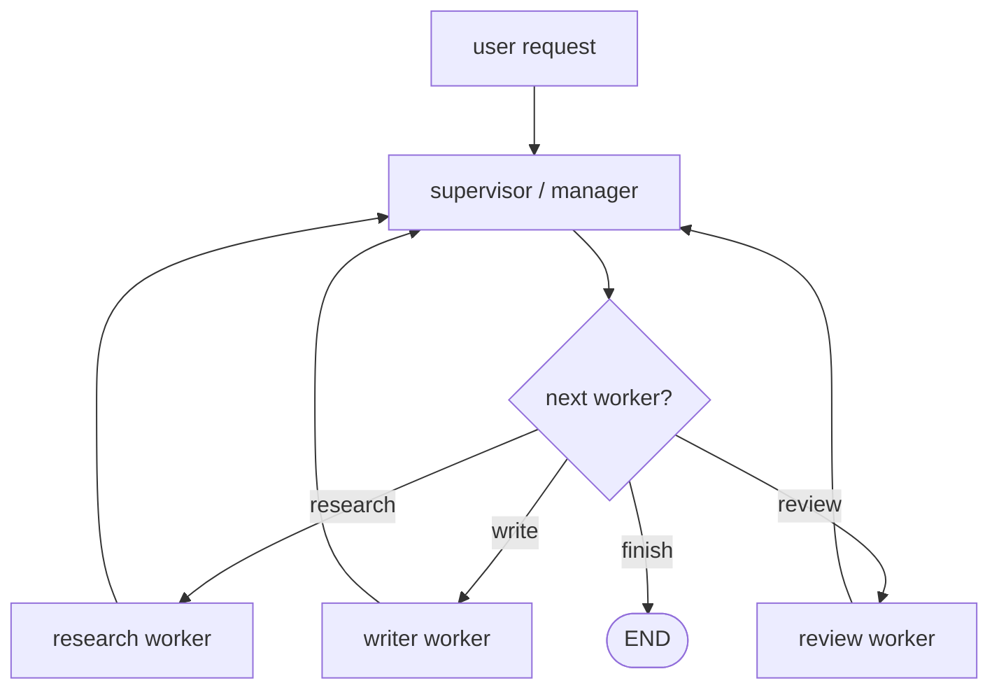
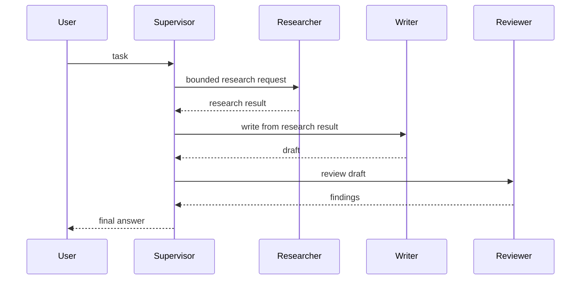

# Pattern 18: Supervisor and subagents

[Back to agent pattern index](../README.md)

**Difficulty:** Advanced

## What this pattern is

A supervisor architecture has one central controller decide which specialized worker or subagent should act. All routing passes through the supervisor, so control and auditability are centralized.

In learning simulations, the “subagents” can be plain graph nodes, tool-wrapped workflows, or role-specific LLM calls. The important design question is what context each worker sees and what result contract it returns.

## Flowchart



## Control sequence



## State contract

```python
from typing import Literal
from typing_extensions import NotRequired, TypedDict

class State(TypedDict):
    user_request: str
    next_worker: NotRequired[Literal["research", "write", "review", "finish"]]
    research_result: NotRequired[str]
    draft: NotRequired[str]
    review: NotRequired[str]
    final_answer: NotRequired[str]
```

## What to practice

- Start with workers as deterministic nodes before making them LLM subagents.
- Give each worker a narrow input and output contract.
- Keep the supervisor responsible for sequencing and final response.
- Track why the supervisor chose each worker.
- Compare latency/cost against a single-agent version.

## Common mistakes

- Creating subagents because task names are different, not because context or control boundaries differ.
- Letting workers talk directly to the user in a centralized supervisor pattern.
- Passing the entire conversation to every worker.
- Losing final responsibility because every worker partially answers.

## Simulated-agent idea seeds

### Research-Write-Review Supervisor

A manager routes through researcher, writer, and reviewer workers before producing a final response.

### Support Desk Supervisor

A supervisor dispatches to billing, technical, or refund workers, then summarizes the result for the user.

## Smallest deterministic version

Build three worker nodes that return canned outputs. The supervisor chooses the next worker from a fixed plan and assembles the final answer.

## How the bootstrap skill should use this file

When this pattern is selected, the bootstrap skill should turn the graph shape, state contract, and smallest deterministic exercise into the per-agent README pair. Keep the first scaffold offline and simulated. Add real model calls only after the learner can explain the deterministic version.

## Revision history

- 2026-06-08: Expanded into a descriptive, pattern-accurate guide with diagrams and implementation cautions.
- 2026-05-18: Split from the original monolithic candidate-materials note.
