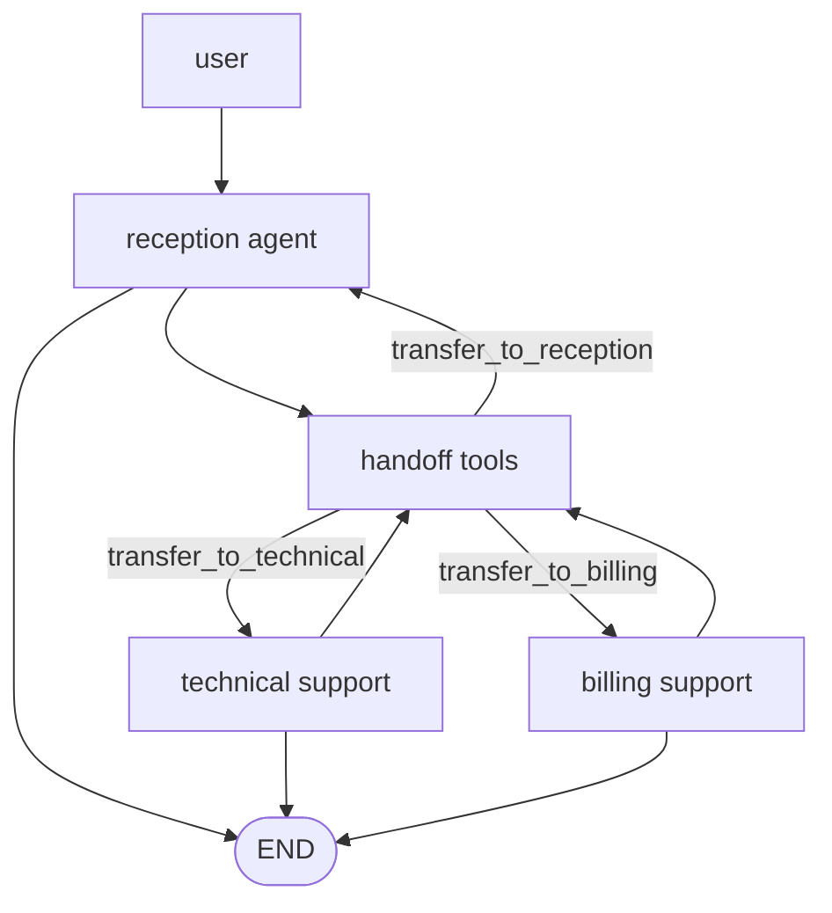
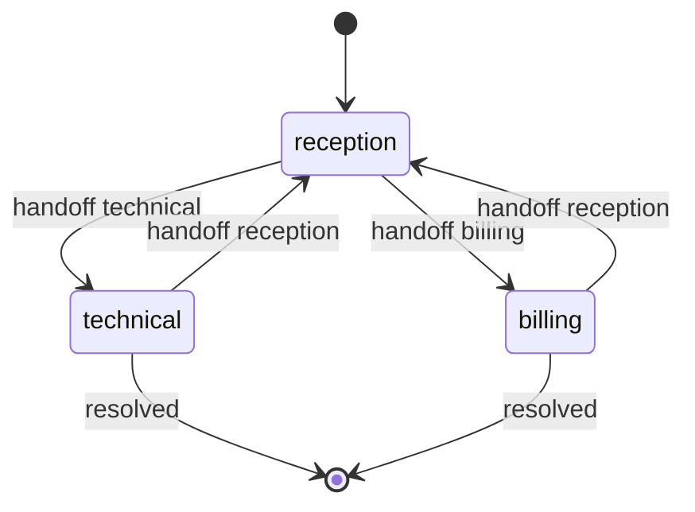

# Pattern 19: Handoff network

[Back to agent pattern index](../README.md)

**Difficulty:** Advanced

## What this pattern is

A handoff network lets the currently active agent transfer control to another agent. Unlike a centralized supervisor, the active agent can decide that another specialist should take over. This is useful when user interaction should continue with the specialist rather than always returning through a manager.

In LangGraph, handoffs are often represented with tool calls or `Command(goto=...)` updates that change the active node or active agent state.

## Flowchart



## Active-agent state



## State contract

```python
from typing import Literal
from typing_extensions import NotRequired, TypedDict

class State(TypedDict):
    user_message: str
    active_agent: Literal["reception", "technical", "billing"]
    handoff_reason: NotRequired[str]
    final_answer: NotRequired[str]
```

## What to practice

- Define explicit handoff tools or commands.
- Store the handoff reason in state.
- Decide what context moves with the handoff.
- Keep each specialist’s allowed tools and prompt narrow.
- Use a fallback path back to reception or human review.

## Common mistakes

- Letting any agent jump anywhere without a contract.
- Confusing handoff with parallel collaboration; handoff is usually active-control transfer.
- Carrying malformed or bloated message history between agents.
- Forgetting to explain to the user that they are now interacting with a different specialist.

## Simulated-agent idea seeds

### Customer Support Handoff Network

Reception routes a user to technical or billing support, and each specialist can resolve or transfer back.

### Tutor Mode Handoff

A general tutor hands off to quiz mode, code-debug mode, or concept-explanation mode based on the learner’s need.

## Smallest deterministic version

Represent each specialist as a simple node. A route string changes `active_agent`, stores `handoff_reason`, and jumps to the specialist node.

## How the bootstrap skill should use this file

When this pattern is selected, the bootstrap skill should turn the graph shape, state contract, and smallest deterministic exercise into the per-agent README pair. Keep the first scaffold offline and simulated. Add real model calls only after the learner can explain the deterministic version.

## Revision history

- 2026-06-08: Expanded into a descriptive, pattern-accurate guide with diagrams and implementation cautions.
- 2026-05-18: Split from the original monolithic candidate-materials note.
