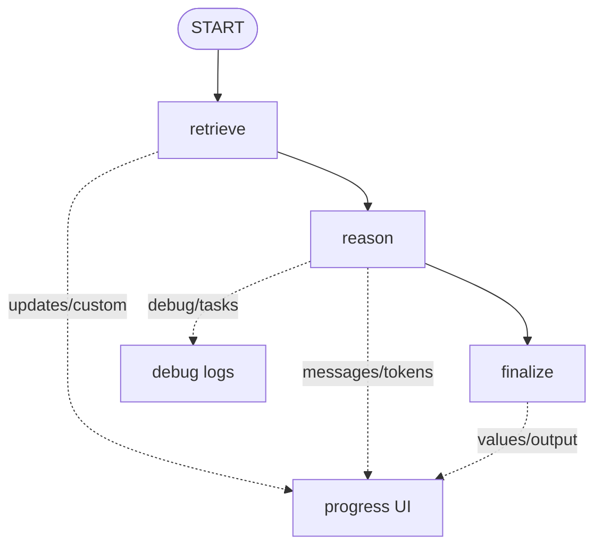
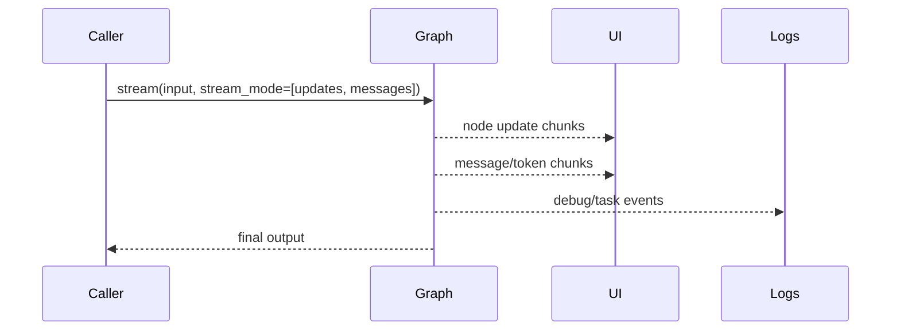

# Pattern 20: Streaming and observability

[Back to agent pattern index](../README.md)

**Difficulty:** Intermediate/Advanced

## What this pattern is

Streaming exposes what a graph is doing while it runs. It is the visibility layer that makes debugging, user progress updates, and human intervention practical.

Useful views include node updates, full state values, LLM tokens/messages, custom progress events, task/debug events, and subgraph outputs. For new applications, event streaming provides typed projections; stream modes remain useful for direct graph-runtime inspection.

## Observability flow



## Streaming sequence



## State contract

```python
from typing_extensions import NotRequired, TypedDict

class State(TypedDict):
    request: str
    progress_note: NotRequired[str]
    intermediate_result: NotRequired[str]
    final_answer: NotRequired[str]
```

## What to practice

- Stream `updates` when you want concise node deltas.
- Stream `values` when you need full state after each step.
- Stream `messages` or event projections for chat UI/token output.
- Emit custom progress for long-running fake tasks.
- Use streaming before adding human-in-the-loop so pauses are visible.

## Common mistakes

- Treating streaming as only a UI feature; it is also debugging evidence.
- Printing full state everywhere when updates would be clearer.
- Streaming sensitive hidden state to a user-facing UI.
- Ignoring subgraph names and node metadata, making traces hard to read.

## Simulated-agent idea seeds

### Graph Trace Tutor

Run a small graph and display each node update with an explanation of what changed.

### Long Task Progress Simulator

Fake a research workflow that streams progress notes, intermediate evidence, and final output.

## Smallest deterministic version

A three-node graph emits a custom progress note at each node and the caller prints streamed updates in order.

## How the bootstrap skill should use this file

When this pattern is selected, the bootstrap skill should turn the graph shape, state contract, and smallest deterministic exercise into the per-agent README pair. Keep the first scaffold offline and simulated. Add real model calls only after the learner can explain the deterministic version.

## Revision history

- 2026-06-08: Expanded into a descriptive, pattern-accurate guide with diagrams and implementation cautions.
- 2026-05-18: Split from the original monolithic candidate-materials note.
