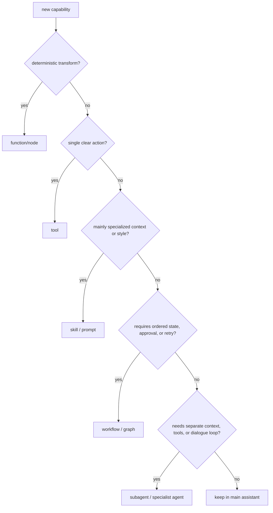

# Pattern 21: Tool-skill-workflow-agent escalation

[Back to agent pattern index](../README.md)

**Difficulty:** Advanced

## What this pattern is

This pattern is a design decision guide: do not create a new agent until a simpler abstraction is insufficient. Many tasks are best represented as a function, tool, skill/prompt, or explicit workflow before they become a dedicated agent or subagent.

The useful ladder is:

1. function: deterministic transformation;
2. tool: a callable action exposed to an LLM;
3. skill/prompt: specialized instructions or context loaded on demand;
4. workflow/graph: ordered state machine with gates, approvals, or loops;
5. subagent: separate context, tools, permissions, or judgment loop.

## Escalation diagram

## Decision table

| Situation | Prefer |
| --- | --- |
| Pure calculation or formatting | Function/node |
| One concrete external action | Tool |
| Domain-specific tone, examples, or instructions | Skill/prompt |
| Must enforce order, approval, retries, or state transitions | Workflow/graph |
| Needs isolated context, specialist tools, or direct specialist conversation | Subagent/handoff |

## What to practice

- Start with the smallest abstraction that expresses the requirement.
- Promote only when the current abstraction causes confusion, unsafe behavior, or context overload.
- Write down what new responsibility the higher abstraction owns.
- Compare latency and debugging cost before and after promotion.
- Keep simulated examples honest: a role name alone does not make something an agent.

## Common mistakes

- Creating an “EmailAgent” for a single `send_email` tool call.
- Splitting every domain into a subagent before proving the main agent cannot route tools reliably.
- Using a prompt skill when a state machine is needed to enforce safety.
- Using a workflow when a pure function would be easier to test.

## Simulated-agent idea seeds

### Capability Escalation Coach

Given a feature request, classify whether it should be a function, tool, skill, workflow, or subagent and explain the tradeoff.

### Email Automation Boundary Lab

Compare “send one email” as a tool, “draft with house style” as a skill, “draft-review-send” as a workflow, and “manage ongoing inbox” as an agent.

## Smallest deterministic version

A rule-based classifier reads a capability description and outputs the recommended abstraction plus one reason and one rejected alternative.

## How the bootstrap skill should use this file

When this pattern is selected, the bootstrap skill should turn the graph shape, state contract, and smallest deterministic exercise into the per-agent README pair. Keep the first scaffold offline and simulated. Add real model calls only after the learner can explain the deterministic version.

## Revision history

- 2026-06-08: Expanded into a descriptive, pattern-accurate guide with diagrams and implementation cautions.
- 2026-05-18: Split from the original monolithic candidate-materials note.
