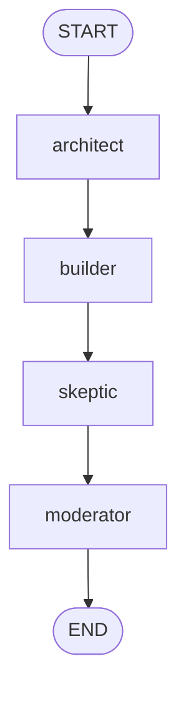

# Debate Council implementation feedback

Review target: `simulated_agents/debate_council/graph.py`

## Overall verdict

Your implementation has the right LangGraph shape:



The core sequence is correct for a learning-only simulated multi-agent council. The biggest remaining improvements are not about graph wiring; they are about state discipline and prompt payload cleanliness.

## What you did well

- You modeled the council as separate graph nodes instead of pretending they are real independent agents.
- You used `TypedDict, total=False`, which fits LangGraph state that grows over time.
- You fixed the earlier edge typo and now wire `architect -> builder -> skeptic -> moderator` correctly.
- `respond()` now returns the moderator's final `.content` instead of the raw state dictionary.
- The implementation is small enough to read top-to-bottom, which is good for this simulation folder.

## Main issues to improve

### 1. Store clean strings in graph state instead of full `AIMessage` objects

Current state:

```python
class CouncilState(TypedDict, total=False):
    question: str
    architect_response: AIMessage
    builder_response: AIMessage
    skeptic_response: AIMessage
    final_summary: AIMessage
```

This works, but it makes later prompts receive the full `AIMessage` representation unless you remember to use `.content` every time.

Example risk:

```python
ARCHITECT_RESPONSE: {architect_response}
```

That can include message metadata instead of only the text answer.

For this simulation, prefer:

```python
class CouncilState(TypedDict):
    question: str
    architect_response: NotRequired[str]
    builder_response: NotRequired[str]
    skeptic_response: NotRequired[str]
    final_summary: NotRequired[str]
```

Why this is better:

- state is easier to inspect;
- prompts stay clean;
- final output is already a string;
- future persistence/checkpointing is simpler.

### 2. Avoid silent `{}` returns for missing required previous state

Current pattern:

```python
question = state.get("question", "")
if not question:
    return {}
```

This is okay while learning, but it can hide graph bugs. In a fixed sequence graph, later nodes should be allowed to assume earlier nodes produced their required fields.

For example, `builder` should depend on:

```python
question = state["question"]
architect_response = state["architect_response"]
```

If `architect_response` is missing, that is a graph invariant failure, and seeing the error is useful.

A good rule:

- use `state.get(...)` for truly optional data;
- use `state[...]` for data guaranteed by graph flow.

### 3. `respond()` is acceptable as a thin CLI adapter, but the reference should show direct invocation

Your current wrapper:

```python
def respond(user_input: str) -> str:
    result = graph.invoke({"question": user_input})
    ...
```

This is convenient and matches the bootstrap workflow. For learning LangGraph state flow, it is also valuable to see the direct invocation shape:

```python
initial_state: CouncilState = {"question": user_input}
result = graph.invoke(initial_state)
print(result["final_summary"])
```

So the selected workflow is: keep `respond()` in beginner/user-facing `graph.py` when useful, but let `graph_reference.py` show direct graph invocation so the state lifecycle is visible.

### 4. Prompt role separation can be clearer

Most nodes currently put everything into one `SystemMessage`. A cleaner pattern is:

```python
llm.invoke([
    SystemMessage(content="You are the Architect..."),
    HumanMessage(content=f"Question: {question}"),
])
```

This separates:

- role/instructions: `SystemMessage`;
- task/user payload: `HumanMessage`.

That separation becomes more important when prompts get longer.

## Suggested next learning target

Compare your `graph.py` with `graph_reference.py` in this folder.

Focus especially on:

1. required vs optional state fields;
2. strings in state vs message objects in state;
3. direct graph invocation versus a thin `respond()` CLI adapter;
4. failing loudly when graph invariants are broken.
