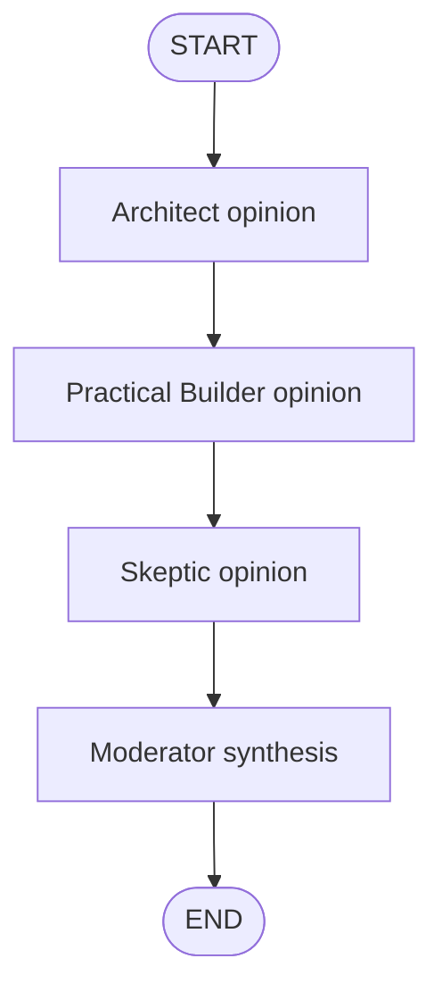

# Debate Council simulated agent

[한국어](./README.md) | English

This folder is a bootstrap space for **Debate Council**, a learning-only simulated agent.

Debate Council practices a pattern where several fake role nodes review one user question from different perspectives, then a Moderator combines the perspectives into a balanced conclusion. `graph.py` now contains the user implementation, and `graph_reference.py` provides a reference implementation that makes state handling and direct graph invocation more explicit.

## Goal

- LangGraph pattern to practice: sequential multi-agent orchestration / moderator synthesis
- Example user input: `Should I learn LangGraph before building tool-calling agents?`
- Expected output or behavior: create short Architect, Practical Builder, and Skeptic opinions, then have the Moderator summarize the final recommendation.

## Draft graph

## Draft key state fields

| Field | Meaning |
| --- | --- |
| `question` | The user's original question |
| `architect_response` | Opinion from the long-term structure and design perspective |
| `builder_response` | Opinion from the smallest practical implementation perspective |
| `skeptic_response` | Counterpoint about risks, over-abstraction, and missing constraints |
| `final_summary` | Moderator's combined final answer |

## File responsibilities

| File | Responsibility |
| --- | --- |
| `graph.py` | User-written sequential Debate Council graph implementation |
| `graph_reference.py` | Reference implementation that stores state as strings and shows direct `graph.invoke(...)` usage |
| `FEEDBACK.md` | Review notes and improvement points for the current implementation |
| `README.md` | Korean learning note and implementation plan |
| `README.en.md` | English learning note and implementation plan |
| `__init__.py` | Simulation package marker |

## Implementation notes

- Do not connect this simulation to production API/CLI surfaces.
- Debate Council roles are simulated as LangGraph nodes, not real independent agents.
- Start with deterministic template responses to learn the state flow, then optionally extend to OpenAI-backed responses.
- After implementation, update this README with the real graph flow, routing rule, stop condition, and fake/simulation boundaries.
