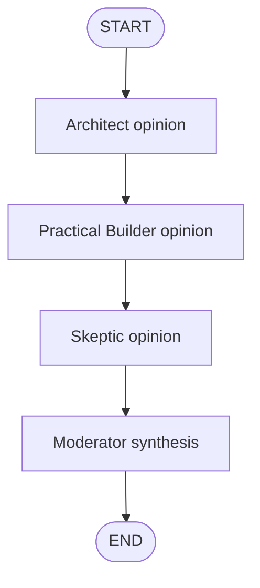

# Debate Council simulated agent

[English](./README.en.md)

이 폴더는 **학습 전용 simulated agent**인 Debate Council을 만들기 위한 부트스트랩 공간입니다.

Debate Council은 하나의 사용자 질문을 여러 관점의 가짜 역할 노드가 차례로 검토한 뒤, Moderator가 균형 잡힌 결론으로 합치는 패턴을 연습합니다. 현재 `graph.py`는 사용자가 작성한 Debate Council 구현이며, `graph_reference.py`는 상태 처리와 직접 graph invocation을 더 명시적으로 보여주는 참고 구현입니다.

## 목표

- 연습할 LangGraph 패턴: sequential multi-agent orchestration / moderator synthesis
- 사용자 입력 예시: `Should I learn LangGraph before building tool-calling agents?`
- 기대 출력 또는 동작: Architect, Practical Builder, Skeptic 관점의 짧은 의견을 만든 뒤 Moderator가 최종 추천을 요약합니다.

## 그래프 초안

## 핵심 상태 필드 초안

| 필드 | 의미 |
| --- | --- |
| `question` | 사용자의 원래 질문 |
| `architect_response` | 장기 구조와 설계 관점의 의견 |
| `builder_response` | 가장 작게 실행 가능한 구현 관점의 의견 |
| `skeptic_response` | 리스크, 과한 추상화, 빠진 조건에 대한 반론 |
| `final_summary` | Moderator가 합친 최종 답변 |

## 파일 책임

| 파일 | 책임 |
| --- | --- |
| `graph.py` | 사용자가 작성한 sequential Debate Council graph 구현 |
| `graph_reference.py` | 상태를 문자열로 관리하고 직접 `graph.invoke(...)`를 보여주는 참고 구현 |
| `FEEDBACK.md` | 현재 구현에 대한 리뷰와 개선 포인트 |
| `README.md` | 한국어 학습 노트와 구현 계획 |
| `README.en.md` | English learning note and implementation plan |
| `__init__.py` | simulation package marker |

## 구현 메모

- 프로덕션 API/CLI surface에 연결하지 마세요.
- Debate Council의 역할들은 실제 독립 에이전트가 아니라 LangGraph 노드로 시뮬레이션합니다.
- 먼저 deterministic template 응답으로 상태 흐름을 익힌 뒤, 필요하면 OpenAI-backed 응답으로 확장하세요.
- 구현 후 이 README에 실제 graph flow, routing rule, stop condition, fake/simulation 경계를 업데이트하세요.
