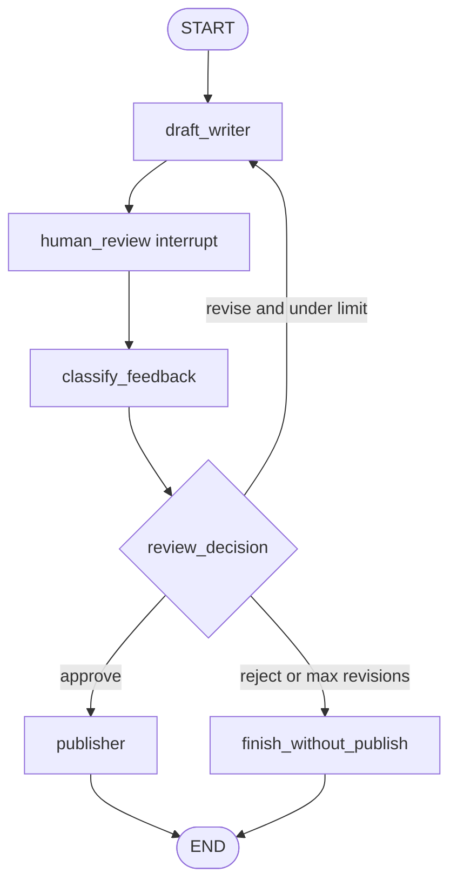

# Editor In Chief Review Loop implementation feedback

Review target: `simulated_agents/editor_in_chief_review_loop/graph.py`

## Overall verdict

Good learning direction: the implementation now has the right high-level graph shape for a human-in-the-loop review workflow, and using `llm.with_structured_output(...)` for the `approve | revise | reject` routing decision is the right industry-shaped instinct when an LLM output controls program flow.

The main bug behind `KeyError: 'final_result'` was a terminal-state invariant issue: some routes reached `END` without passing through a node that writes `final_result`.



## What you did well

- You modeled the workflow as graph state instead of one long procedural function.
- You separated drafting, human review, classification, publishing, and routing into distinct nodes.
- You used `with_structured_output` for a decision that controls graph routing.
- You kept the publish step simulated instead of adding real side effects.

## Main issues to improve

### 1. Make every terminal path write the same final contract

The original failure pattern was:

```python
if decision == "reject":
    return "END"

if revision_count >= 2:
    return "END"

# CLI later assumed:
print(result["final_result"])
```

Only `publisher` wrote `final_result`, so reject/max-revision paths could end without that key.

The fix is not just `try/except KeyError`. Prefer a graph invariant: all completed terminal paths pass through a node that writes `final_result`.

```python
def finish_without_publish(state: EditorInChiefReviewState) -> dict[str, str]:
    return {
        "final_result": "Not published: reviewer rejected or max revisions reached."
    }
```

Then route to `finish_without_publish` instead of routing directly to `END`.

### 2. Use static types to show required input vs node-produced fields

Use `TypedDict` with required initial fields and `NotRequired[...]` for fields produced later:

```python
class EditorInChiefReviewState(TypedDict):
    user_request: str
    draft: NotRequired[str]
    review_decision: NotRequired[Literal["approve", "revise", "reject"]]
    human_feedback: NotRequired[str]
    revision_count: NotRequired[int]
    final_result: NotRequired[str]
```

This does not fully prove LangGraph terminal invariants statically, but it makes the risk visible: `final_result` is optional until a terminal node writes it.

For a stronger boundary check, validate the final state at the CLI boundary:

```python
class TerminalResult(BaseModel):
    final_result: str

return TerminalResult.model_validate(state).final_result
```

That turns a vague `KeyError` into an intentional contract assertion.

### 3. Give the classifier the actual feedback

The structured-output classifier should receive the reviewer feedback as task payload:

```python
llm.with_structured_output(ReviewDecision).invoke(
    [
        SystemMessage(content="Classify review feedback as approve, revise, or reject."),
        HumanMessage(content=f"Review feedback:\n{feedback}"),
    ]
)
```

A good split is:

- `SystemMessage`: role, constraints, output expectations;
- `HumanMessage`: actual user/reviewer payload.

### 4. Understand what static checks can and cannot catch

Static typing can help catch “this field may not exist yet” when you model produced fields as `NotRequired`, especially with stricter tools such as pyright/mypy. But it cannot automatically prove that every LangGraph route writes `final_result` before `END`.

For this kind of graph, use three layers:

1. **Type design**: required input fields + `NotRequired` produced fields.
2. **Graph design**: route all terminal paths through finalizer nodes.
3. **Runtime boundary validation**: validate a required output model at the CLI/API boundary.

### 5. Interrupts need a resume loop

A graph using `interrupt(...)` does not finish on the first `graph.invoke(...)`. It returns an interrupt payload and must be resumed with `Command(resume=...)` using the same thread config.

See `graph_reference.py` for a compact `run_until_terminal(...)` example.

## Suggested next learning target

Compare `graph.py` with `graph_reference.py`, focusing on:

1. why all terminal routes write `final_result`;
2. how `NotRequired[...]` communicates state lifecycle;
3. why `TerminalResult` is a good CLI/API boundary assertion;
4. how interrupt/resume changes the shape of `respond()`.
