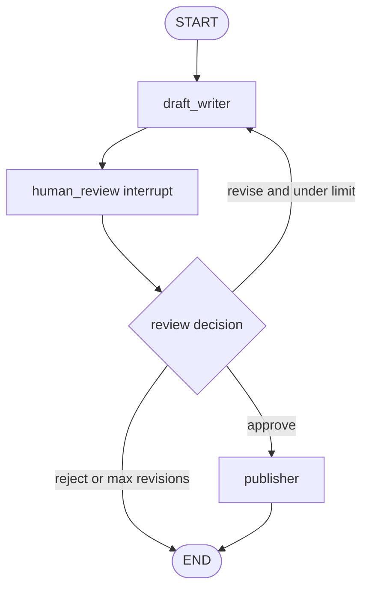

# Editor In Chief Review Loop simulated agent

[한국어](./README.md)

This folder is an agent development lab for practicing the **human-in-the-loop approval / revision loop** pattern.

`graph.py` currently contains only a bootstrap terminal loop. The goal is not production polish; the goal is to practice translating “draft → human review → approve/revise/reject → finish or retry” into LangGraph nodes, state, routing, and stop conditions.

## Pattern to practice

```text
User
  ↓
Draft writer
  ↓
Human review interrupt
  ├── approve → Publisher → END
  ├── revise  → Draft writer
  └── reject  → END
```

The core idea is that the graph does not automatically continue through risky or quality-sensitive steps. It receives a human approval/revision/rejection decision as state and routes from there.

- **Draft writer**: creates the first draft from the user request, or revises the draft from reviewer feedback.
- **Human review interrupt**: shows the current draft to a human and receives one of `approve`, `revise`, or `reject`.
- **Publisher**: finalizes the approved draft. It does not perform a real external publish side effect.
- **Route function**: reads the review decision and revision count, then chooses publish, revise, or reject/end.

## Agent goal

When the user enters a writing request, Editor In Chief Review Loop should create a draft and wait for a human review decision. If approved, it returns a final result. If revision is requested, it rewrites the draft. If rejected, it exits safely.

Example input:

```text
Write a short paragraph introducing my AI backend project.
```

## Required behavior

### 1. Draft writer node

The Draft writer does not publish the final result without human review.

On the first pass, it creates a `draft` from the user request and stores it in state.

```python
{
    "draft": "This backend project demonstrates FastAPI, LangGraph, auth, permissions, and citation-backed RAG...",
    "revision_count": 0,
}
```

On later passes, it reads `human_feedback` and increments `revision_count`.

Draft writer responsibilities:

- identify the purpose and tone of the requested writing;
- store the current draft in `draft`;
- apply revision feedback when present;
- avoid publish/cancel-style external side effects.

### 2. Human review interrupt node

Human review shows the current draft to a person and receives a decision.

During implementation, this can use LangGraph interrupt/checkpointer behavior. For earlier practice, the same state transition can be simulated through CLI input.

Example review result:

```python
{
    "review_decision": "revise",
    "human_feedback": "Make it less generic and mention permission-aware retrieval.",
}
```

Allowed decisions:

- `approve`: finalize the current draft.
- `revise`: return to Draft writer with `human_feedback`.
- `reject`: end without publishing.

### 3. Publisher node

Publisher copies the approved `draft` into `final_result`.

This simulated agent does not actually save a file, send an email, or publish a blog post.

Publisher responsibilities:

- finalize only an approved draft;
- make the review decision behind the final result clear;
- avoid exposing hidden chain-of-thought or private reviewer reasoning.

## Routing / loop rule

If human review returns `approve`, route to Publisher.

If human review returns `revise`, return to Draft writer.

If human review returns `reject`, end.

Start with a maximum revision count of 2 to prevent infinite loops.

```python
if review_decision == "approve":
    return "publisher"

if review_decision == "reject":
    return "END"

if revision_count >= 2:
    return "END"

return "draft_writer"
```

## State design

Name the shared graph state `EditorInChiefReviewState`.

```python
class EditorInChiefReviewState(TypedDict, total=False):
    user_request: str
    draft: str
    review_decision: Literal["approve", "revise", "reject"]
    human_feedback: str
    revision_count: int
    final_result: str
```

It is not called `AgentState` because the state belongs to the whole review workflow, not to a single node.

## Draft graph



## Review artifacts

- `FEEDBACK.md`: learner-facing review of the current implementation and the `final_result` terminal-state bug
- `graph_reference.py`: reference implementation where every terminal path writes `final_result`

## How to run

`graph.py` and `graph_reference.py` now use OpenAI-backed drafting/classification, so `OPENAI_API_KEY` is required.

```bash
uv run python -m simulated_agents.editor_in_chief_review_loop.graph
```

Exit with:

```text
/exit
```

After implementation, prefer debug logs like these for learning:

```text
[draft_writer] writing or revising draft
[human_review] waiting for approve/revise/reject
[classify_feedback] classifying reviewer feedback
[route] deciding next node
[publisher] finalizing approved draft
[finish_without_publish] ending without publish
[final result]
```

## Learning points

This graph practices a pattern that does not overlap with the existing simulated agents.

- It uses a human review decision to resume the graph instead of an automatic critic loop.
- It handles an approval/revision/rejection quality gate instead of only choosing a route label.
- The implementation focus is storing an approval decision in state through interrupt/checkpointer behavior or a CLI-simulated interrupt.

This pattern is common in real agent systems:

- approval before sending email;
- approval before deleting files or deploying;
- blog/document draft review;
- approval before expensive tool calls.

## Simulation boundaries

- Human review is simulated through CLI input or LangGraph interrupt behavior during practice.
- Publisher only creates `final_result`; it does not publish, send email, or save files.
- Draft content is example text and does not guarantee real editing quality or factual correctness.

## Production promotion notes

To promote this simulated agent into a real product feature, it would need:

- a checkpointer-backed interrupt/resume contract;
- reviewer identity, permission, and audit logs;
- a tool boundary that connects external side effects only after approval;
- cancellation, timeout, and retry policies;
- an output contract where every terminal path writes `final_result`;
- tests for approve, revise, reject, and max-revision paths.

## Implementation constraints

- Keep the implementation mostly inline.
- Prefer understanding LangGraph primitives over reusable wrapper functions.
- Do not connect this simulated graph to the production API/CLI surface.
- Do not add real publish side effects.
- Debug prints may intentionally remain for learning.
