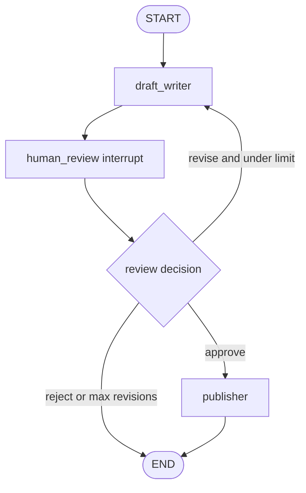

# Editor In Chief Review Loop simulated agent

[English](./README.en.md)

이 폴더는 **Human-in-the-loop approval / revision loop** 패턴을 연습하기 위한 에이전트 개발 랩입니다.

`graph.py`는 현재 bootstrap terminal loop만 포함합니다. 구현 목적은 프로덕션 품질보다 “초안 생성 → 사람 검토 → 승인/수정/거절 → 종료 또는 재시도” 흐름을 LangGraph 노드, 상태, 라우팅, 종료 조건으로 직접 번역하는 연습입니다.

## 연습할 패턴

```text
User
  ↓
Draft writer
  ↓
Human review interrupt
  ├── approve → Publisher → END
  ├── revise  → Draft writer
  └── reject  → END
```

이 패턴의 핵심은 그래프가 위험하거나 품질이 중요한 지점에서 자동으로 계속 진행하지 않고, 사람의 승인/수정/거절 결정을 상태로 받아 다음 경로를 정하는 것입니다.

- **Draft writer**: 사용자 요청을 바탕으로 초안을 만들거나, reviewer feedback을 반영해 초안을 수정합니다.
- **Human review interrupt**: 사람에게 현재 초안을 보여주고 `approve`, `revise`, `reject` 중 하나를 받는 중단 지점입니다.
- **Publisher**: 승인된 초안을 최종 결과로 확정합니다. 실제 외부 publish side effect는 하지 않습니다.
- **Route function**: review decision과 revision count를 보고 publish, revise, reject/end 중 하나를 선택합니다.

## 에이전트 목표

사용자가 글쓰기 요청을 입력하면, Editor In Chief Review Loop는 초안을 만들고 사람의 검토 결정을 받아야 합니다. 승인되면 최종 결과를 반환하고, 수정 피드백이 있으면 초안을 다시 작성하며, 거절되면 안전하게 종료합니다.

예시 입력:

```text
내 제품형 백엔드 프로젝트를 소개하는 짧은 문단을 작성해줘.
```

## 요구 동작

### 1. Draft writer node

Draft writer는 human review 없이 최종 publish를 하지 않습니다.

첫 실행에서는 사용자 요청을 바탕으로 `draft`를 만들고 상태에 저장합니다.

```python
{
    "draft": "This backend project demonstrates FastAPI, LangGraph, auth, permissions, and citation-backed RAG...",
    "revision_count": 0,
}
```

수정 루프에서 다시 실행될 때는 `human_feedback`을 읽고 `revision_count`를 올립니다.

Draft writer 책임:

- 사용자가 원하는 글의 목적과 톤을 파악합니다.
- 현재 초안을 `draft`에 저장합니다.
- 수정 피드백이 있으면 피드백을 반영합니다.
- publish/cancel 같은 외부 side effect는 수행하지 않습니다.

### 2. Human review interrupt node

Human review는 현재 초안을 사람에게 보여주고 결정을 받는 지점입니다.

구현 단계에서는 LangGraph interrupt/checkpointer를 사용하거나, 학습 초기에는 CLI 입력으로 같은 상태 전환을 시뮬레이션할 수 있습니다.

검토 결과 예시:

```python
{
    "review_decision": "revise",
    "human_feedback": "Make it less generic and mention permission-aware retrieval.",
}
```

허용 decision:

- `approve`: 현재 초안을 최종 결과로 확정합니다.
- `revise`: `human_feedback`을 반영해 Draft writer로 돌아갑니다.
- `reject`: publish하지 않고 종료합니다.

### 3. Publisher node

Publisher는 승인된 `draft`를 `final_result`에 복사합니다.

이 simulated agent에서는 실제 파일 저장, 이메일 발송, 블로그 게시 같은 side effect를 하지 않습니다.

Publisher 책임:

- 승인된 초안만 최종 결과로 확정합니다.
- 최종 결과가 어떤 검토 결정으로 만들어졌는지 명확히 남깁니다.
- 숨겨진 chain-of-thought나 reviewer 내부 판단을 출력하지 않습니다.

## 라우팅 / 반복 규칙

Human review 결과가 `approve`이면 Publisher로 이동합니다.

Human review 결과가 `revise`이면 Draft writer로 돌아갑니다.

Human review 결과가 `reject`이면 종료합니다.

무한 수정 루프를 막기 위해 최대 수정 횟수는 2번으로 시작합니다.

```python
if review_decision == "approve":
    return "publisher"

if review_decision == "reject":
    return "END"

if revision_count >= 2:
    return "END"

return "draft_writer"
```

## 상태 설계

공유 그래프 상태 이름은 `EditorInChiefReviewState`로 둡니다.

```python
class EditorInChiefReviewState(TypedDict, total=False):
    user_request: str
    draft: str
    review_decision: Literal["approve", "revise", "reject"]
    human_feedback: str
    revision_count: int
    final_result: str
```

이름이 `AgentState`가 아닌 이유는 상태가 한 node의 소유물이 아니라 전체 review workflow의 공유 노트북이기 때문입니다.

## 그래프 초안



## Review artifacts

- `FEEDBACK.md`: 현재 구현에 대한 learner-facing review와 `final_result` terminal-state bug 설명
- `graph_reference.py`: 모든 종료 경로가 `final_result`를 쓰도록 만든 reference implementation

## 실행 방법

현재 `graph.py`와 `graph_reference.py`는 OpenAI-backed draft/classification을 사용하므로 `OPENAI_API_KEY`가 필요합니다.

```bash
uv run python -m simulated_agents.editor_in_chief_review_loop.graph
```

종료:

```text
/exit
```

구현 후에는 학습을 위해 다음 debug 로그를 출력하는 것을 권장합니다.

```text
[draft_writer] writing or revising draft
[human_review] waiting for approve/revise/reject
[classify_feedback] classifying reviewer feedback
[route] deciding next node
[publisher] finalizing approved draft
[finish_without_publish] ending without publish
[final result]
```

## 학습 포인트

이 그래프는 기존 simulated agent들과 겹치지 않는 새 패턴을 연습합니다.

- 자동 critic loop가 아니라 사람이 review decision을 내려 그래프를 재개합니다.
- 단순 조건부 route label 선택이 아니라 승인/수정/거절이라는 품질 게이트를 다룹니다.
- 구현 핵심은 interrupt/checkpointer 또는 CLI-simulated interrupt를 통해 승인 결정을 상태에 반영하는 것입니다.

이 패턴은 실제 agent 시스템에서도 자주 쓰입니다.

- 이메일 발송 전 승인
- 파일 삭제/배포 전 승인
- 블로그나 문서 초안 검토
- 비용이 큰 tool call 전 승인

## Simulation 경계

- 사람 검토는 학습 단계에서 CLI 입력이나 LangGraph interrupt로 시뮬레이션합니다.
- Publisher는 `final_result`만 만들며 실제 게시, 이메일 발송, 파일 저장을 하지 않습니다.
- 초안 내용은 예시 텍스트이며 실제 편집 품질이나 factual correctness를 보장하지 않습니다.

## Production으로 승격하려면

이 simulated agent를 실제 제품 기능으로 승격하려면 다음이 필요합니다.

- checkpointer-backed interrupt/resume contract
- reviewer identity, permission, audit log
- 승인된 결과만 외부 side effect로 연결하는 tool boundary
- 취소/timeout/retry 정책
- 모든 terminal path가 `final_result`를 만드는 output contract
- 테스트에서 승인, 수정, 거절, 최대 수정 횟수 경로 검증

## 구현 제약

- 가능한 한 inline 코드로 구현합니다.
- 재사용 가능한 wrapper 함수보다 LangGraph primitive 이해를 우선합니다.
- 프로덕션 API/CLI surface로 연결하지 않습니다.
- 실제 publish side effect는 만들지 않습니다.
- debug print는 학습을 위해 의도적으로 남겨둘 수 있습니다.
