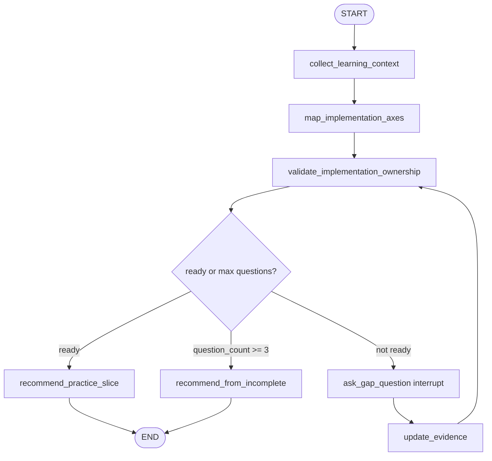

# Implementation Gap Interviewer implementation feedback

Review target: `simulated_agents/implementation_gap_interviewer/graph.py`

## Overall verdict

Good milestone: this is no longer just a bootstrap. You implemented the intended interrupt/resume loop and got an OpenAI-backed structured-output graph to run, which is a real step up from only reading `missing_info_interviewer`.

The graph shape is directionally correct:



The biggest next improvement is to make the state contract and structured-output schemas more explicit and less provider-fragile. Right now the pattern works, but a few details can make it easier to reason about when something breaks.

## What you did well

- You kept the simulation boundary clear: this is a learning graph, not a production API surface.
- You used `interrupt(...)` and `Command(resume=...)` in the correct conceptual places.
- You separated the human resume boundary (`ask_gap_question`) from evidence interpretation (`update_evidence`). That is a strong node-boundary choice.
- You discovered a real LangChain/OpenAI structured-output compatibility issue and adapted from tuple output to object-list output.
- You used `state[...]` for values guaranteed by earlier edges in several nodes, which helps graph invariant failures surface loudly.

## Main issues to improve

### 1. Add strict config to every structured-output model

You added `ConfigDict(extra="forbid")` to some models, but not all of them. OpenAI strict structured output requires object schemas to reject extra fields. Make every Pydantic model used with `with_structured_output(...)` explicit.

```python
class RequiredAxes(BaseModel):
    model_config = ConfigDict(extra="forbid")

    axes: list[str] = Field(default_factory=list)
```

Do the same for `OwnershipEvidence` and `UpdateEvidenceResult`.

### 2. Avoid mutable list defaults

This is Python/Pydantic hygiene. Prefer `Field(default_factory=list)` over `=[]`.

```python
current_mode: list[CurrentMode] = Field(default_factory=list)
missing_axes: list[str] = Field(default_factory=list)
```

This is especially useful in learning code because it avoids teaching accidental shared mutable defaults.

### 3. Keep LLM extraction and graph control separate

The current `validate_implementation_ownership` lets the LLM decide `ready_to_recommend` and `missing_axes`. That is acceptable for a first working version, but the stronger LangGraph lesson is:

```text
LLM = extract/update semantic evidence
Python = compute missing axes and route deterministically
```

A better later version would let the LLM output evidence only, then compute:

```python
missing_axes = [
    axis for axis in required_axes
    if ownership_evidence.get(axis, "none") in {"none", "watched", "reviewed"}
]
ready_to_recommend = bool(ownership_evidence) and len(missing_axes) <= 2
```

You do not need to switch immediately, but this is the next architecture improvement.

### 4. Use unique thread IDs for each CLI conversation

The current global config uses a fixed thread id:

```python
config = {"configurable": {"thread_id": "1"}}
```

Because you compile with `InMemorySaver`, repeated CLI runs can share checkpoint state in surprising ways. Prefer creating a new thread id inside `respond()`.

```python
from uuid import uuid4

config: RunnableConfig = {"configurable": {"thread_id": str(uuid4())}}
```

### 5. Make the CLI adapter thinner and safer

`respond()` is valid as a beginner-friendly adapter. Keep it thin: build initial state, invoke graph, render interrupts, return final output.

Two small fixes:

```python
answer = input(f"AI: {interrupt_payload['question']}\n🧑‍💻 Answer: ")
```

and:

```python
return str(state["final_result"])
```

The quote fix matters because nested double quotes inside an f-string can create a syntax error depending on the exact file contents.

### 6. Import ordering / formatting

Ruff will likely reorder imports and flag spacing. This is normal. The reference file uses the repo style so you can compare.

### 7. Repeated-question bug: answers are not becoming durable state

Your sample run showed the graph asking essentially the same deployment question three times even after you answered:

```text
FastAPI on AWS and SQLite for storage
serverless and custom fastapi. I haven't deployed to actual platform.
1. local, 2. FastAPI, 3. SQLite
```

That means the problem is probably not the user answer. The likely issue is that `update_evidence` stores only `ownership_evidence`, while the validator also needs durable facts extracted from the answer. If useful answer details stay only in `last_answer`, the next `validate_implementation_ownership` call can lose them or fail to treat them as answered. The loop then repeats a similar question until `question_count >= 3` and falls into `recommend_from_incomplete`.

Do **not** hardcode a `deployment_context` field unless this simulated agent becomes specifically deployment-focused. For the general implementation-gap interviewer, prefer generic durable context:

```python
class ImplementationGapInterviewState(TypedDict):
    user_request: str
    # ... existing fields ...
    context_facts: NotRequired[list[dict[str, str]]]
    blockers: NotRequired[list[str]]
```

Then make `update_evidence` return generic facts plus evidence. For the deployment sample, the generic facts could look like:

```python
{
    "context_facts": [
        {
            "key": "target_environment",
            "value": "AWS serverless",
            "source": "interview_answer",
        },
        {
            "key": "serving_style",
            "value": "custom FastAPI",
            "source": "interview_answer",
        },
        {
            "key": "storage",
            "value": "SQLite",
            "source": "interview_answer",
        },
        {
            "key": "current_stage",
            "value": "local development, not deployed",
            "source": "interview_answer",
        },
    ],
    "ownership_evidence": {
        "deployment": "none",
        "fastapi_serving": "reviewed",
        "sqlite_storage": "modified",
    },
    "blockers": ["has not deployed to actual platform"],
}
```

The same `context_facts` structure can also support non-deployment answers, for example RAG, LangGraph interrupts, testing, auth, or streaming. The core design principle is: **interrupt answers must be converted into durable structured state before the graph loops back to validation.**

Also pass the accumulated state back into validation, not only target area and required axes:

```python
HumanMessage(
    content=(
        f"Original request:\n{state['user_request']}\n\n"
        f"Learner context:\n{state.get('learner_context', {})}\n\n"
        f"Required axes:\n{state['required_axes']}\n\n"
        f"Current evidence:\n{state.get('ownership_evidence', {})}\n\n"
        f"Context facts:\n{state.get('context_facts', [])}\n\n"
        f"Latest answer:\n{state.get('last_answer', '')}\n\n"
        f"Blockers:\n{state.get('blockers', [])}"
    )
)
```

For this learning graph, it is also reasonable to add a deterministic anti-repeat rule: after at least one meaningful answer, recommend a smallest safe practice slice instead of asking the same category again.

```python
if state.get("last_answer") and state.get("question_count", 0) >= 1:
    ready_to_recommend = True
```

The exact rule can be more nuanced later, but the immediate fix is to store generic answer facts durably.

### 8. Make incomplete fallback useful, not a dead end

The current fallback says:

```text
I cannot recommend without more information about you.
```

For a learning coach graph, this is too pessimistic. Even incomplete evidence should produce the smallest safe exercise. For your sample, a useful fallback would be:

```text
Based on incomplete information, start with the smallest deployment exercise:
Deploy a minimal FastAPI /health endpoint locally first, then package it for one AWS target.
Use SQLite only locally and write down what would need to change for a hosted environment.
```

A better `recommend_from_incomplete` should mention:

- known target area;
- known partial context facts;
- still-missing axes;
- one tiny safe exercise;
- stop condition.

## Suggested next learning target

Compare `graph.py` with `graph_reference.py`, focusing on:

1. structured-output schema strictness;
2. `Field(default_factory=list)` vs mutable defaults;
3. unique checkpoint thread IDs;
4. whether route decisions belong to the LLM or deterministic Python;
5. how `ask_gap_question -> update_evidence -> validate` forms the interrupt/resume state loop.

After that, your next solo exercise should be: implement only the deterministic route/missing-axis computation yourself, without changing the LLM extraction nodes.
