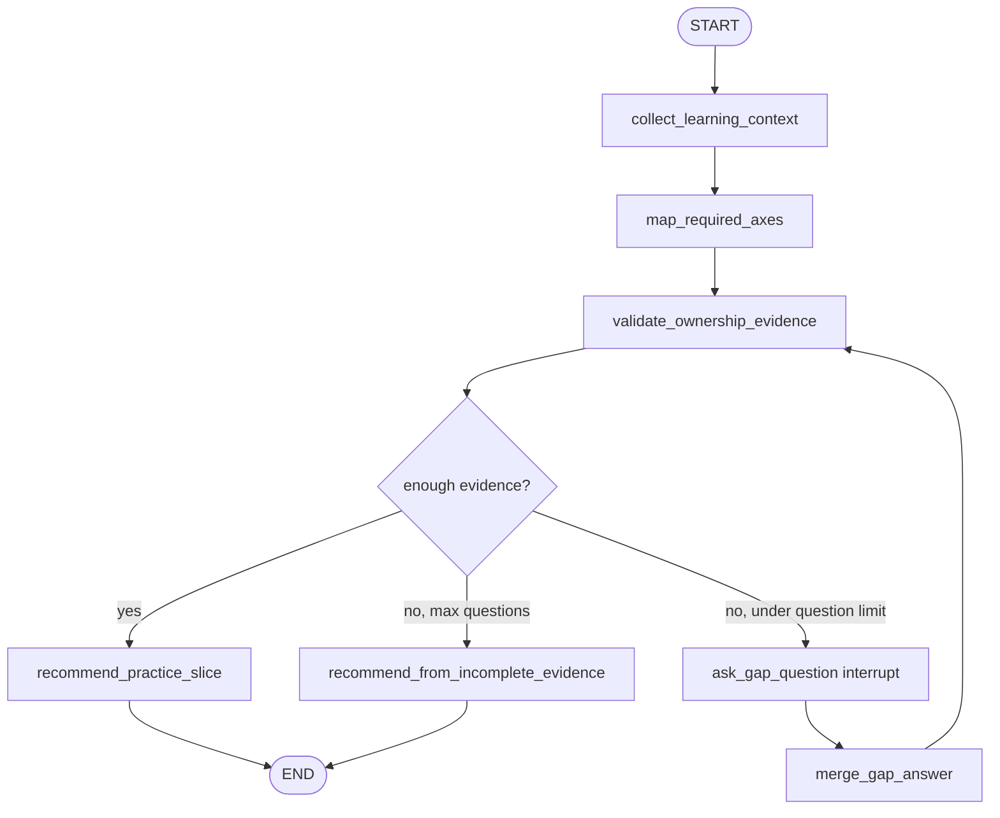

# Implementation Gap Interviewer simulated agent

[한국어](./README.md) | English

This folder is an agent development lab for practicing a **dynamic interrupt interview for implementation-ownership gaps**.

`graph.py` contains the learner implementation of this pattern. The goal is not production polish; the goal is to practice a graph that can notice when a learner understands an agent-built artifact but lacks enough evidence of independent implementation ability, ask for the missing evidence, and end with a small practice slice. `graph_reference.py` is a comparison artifact, not a replacement.

## Pattern to practice

```text
User
  ↓
Collect learning context
  ↓
Map required implementation axes
  ↓
Validate ownership evidence
  ├── missing evidence → Ask gap question interrupt → Merge answer → Validate again
  └── enough evidence → Recommend next practice slice → END
```

This is intentionally similar to `missing_info_interviewer`: the graph must not guess when required information is missing. The difference is the missing information is not ordinary task metadata; it is evidence about whether the learner can independently implement a smaller version of a production-shaped feature.

- **Collect learning context**: preserves the learner's target and any self-reported current ability.
- **Map required implementation axes**: chooses the skills that must be owned for the target, such as schemas, routes, persistence, streaming, tests, or deployment.
- **Validate ownership evidence**: checks which axes have real evidence and which are only understood from review.
- **Ask gap question interrupt**: asks one focused question about the highest-risk missing evidence.
- **Merge answer**: merges the resumed answer into state and validates again.
- **Recommend next practice slice**: produces one small, from-scratch exercise with success criteria.

## Agent goal

When the user describes a gap like “Codex built the product, I can review it, but I cannot recreate it from scratch,” Implementation Gap Interviewer should identify the highest-risk missing implementation evidence and guide the learner toward a small solo exercise.

Example input:

```text
I understand the FastAPI conversation endpoint Codex wrote, but I don't think I can build one from scratch.
```

The graph should avoid reassurance-only answers. It should ask for missing evidence, then produce a concrete practice task such as “from an empty folder, build `/health` and `/chat` with Pydantic schemas and tests.”

## Required behavior

### 1. Collect learning context node

This node does not produce the final practice plan.

It preserves the original learner statement in `user_request` and stores any confidently extracted context in `learner_context`.

```python
{
    "user_request": "I can review FastAPI code but cannot build it from scratch.",
    "learner_context": {
        "target_area": "FastAPI backend endpoint",
        "current_mode": "reviewing agent-built code",
    },
}
```

Collect responsibilities:

- preserve the original statement;
- store only information actually present;
- distinguish “can review/follow” from “can implement independently”;
- avoid flattering or shaming language.

### 2. Map required implementation axes node

This node maps the target area to a short list of implementation axes.

Start with deterministic mappings before adding LLM extraction later.

```python
IMPLEMENTATION_AXES = {
    "fastapi_endpoint": ["route", "schema", "service_boundary", "test"],
    "conversation_streaming": ["route", "sse_contract", "persistence", "failure_path", "test"],
    "rag_service": ["ingestion", "chunking", "retrieval", "citation", "evaluation"],
    "langgraph_interrupt": ["state", "interrupt", "resume", "routing", "checkpoint"],
}
```

Example state update:

```python
{
    "target_area": "conversation_streaming",
    "required_axes": ["route", "sse_contract", "persistence", "failure_path", "test"],
}
```

### 3. Validate ownership evidence node

This node checks whether each required axis has evidence of independent implementation.

Use conservative evidence levels:

```text
none < watched < reviewed < modified < rebuilt_from_scratch
```

Example state update:

```python
{
    "ownership_evidence": {
        "route": "reviewed",
        "sse_contract": "none",
        "persistence": "reviewed",
        "test": "modified",
    },
    "missing_axes": ["sse_contract", "failure_path"],
    "ready_to_recommend": False,
}
```

Validation responsibilities:

- do not treat review ability as implementation ownership;
- identify the highest-risk missing axis;
- set `ready_to_recommend=True` only when enough evidence exists to choose a useful practice slice;
- keep a maximum question count to avoid endless self-assessment.

### 4. Ask gap question interrupt node

Ask gap question uses `interrupt(...)` to pause graph execution.

Payload keys such as `question`, `missing_axes`, and `current_evidence` are a caller convention, not special LangGraph fields.

```python
answer = interrupt(
    {
        "type": "implementation_gap_required",
        "question": state["next_question"],
        "missing_axes": state["missing_axes"],
        "current_evidence": state.get("ownership_evidence", {}),
        "answer_format": "axis=evidence_level; blocker=...",
    }
)
```

Ask responsibilities:

- ask one focused question at a time;
- do not call terminal `input()` inside the graph node;
- return the resumed answer so the next node can merge it;
- keep the tone specific and non-judgmental.

### 5. Merge answer node

The first implementation can use a simple key-value syntax instead of an LLM.

```text
sse_contract=none; failure_path=watched; blocker=I don't know how StreamingResponse persists after errors
```

Example state update:

```python
{
    "ownership_evidence": {
        "sse_contract": "none",
        "failure_path": "watched",
    },
    "blockers": ["I don't know how StreamingResponse persists after errors"],
}
```

### 6. Recommend next practice slice node

The final result is not a career judgment. It is one small exercise the learner can implement without Codex writing the production code.

Example final result:

```text
Next solo practice slice:
Build a minimal FastAPI SSE endpoint from an empty folder.

Success criteria:
- POST /runs/stream accepts {"message": "..."}
- emits answer_delta and run_completed events
- has one test that parses the SSE stream
- no database, no LangGraph, no auth yet

Allowed help:
- docs and error explanations are allowed
- AI may review your code after the first working attempt
- AI should not write the first implementation
```

## Routing / loop rule

If enough evidence exists to choose a practice slice, route to `recommend_practice_slice`.

If evidence is missing and `question_count < 3`, route to `ask_gap_question`.

If the graph reaches the question limit, route to `recommend_from_incomplete_evidence` and choose the safest smallest exercise.

```python
if ready_to_recommend:
    return "recommend_practice_slice"

if question_count >= 3:
    return "recommend_from_incomplete_evidence"

return "ask_gap_question"
```

Both final nodes must write `final_result`.

## State design

Name the shared graph state `ImplementationGapInterviewState`.

```python
class ImplementationGapInterviewState(TypedDict):
    user_request: str
    learner_context: NotRequired[dict[str, str]]
    target_area: NotRequired[str]
    required_axes: NotRequired[list[str]]
    ownership_evidence: NotRequired[dict[str, str]]
    missing_axes: NotRequired[list[str]]
    blockers: NotRequired[list[str]]
    next_question: NotRequired[str]
    last_answer: NotRequired[str]
    question_count: NotRequired[int]
    ready_to_recommend: NotRequired[bool]
    final_result: NotRequired[str]
```

Only `user_request` is required initial input. The rest are graph-produced fields.

## Draft graph



## Review artifacts

- `FEEDBACK.md`: learner-facing review of the first working implementation.
- `graph_reference.py`: runnable reference implementation for comparison; it does not replace `graph.py`.

## How to run

The current bootstrap runs without an OpenAI API key.

```bash
uv run python -m simulated_agents.implementation_gap_interviewer.graph
```

Exit with:

```text
/exit
```

After implementation, prefer node-level debug logs for learning:

```text
[collect_learning_context] extracting self-assessment
[map_required_axes] choosing implementation axes
[validate_ownership_evidence] checking ownership evidence
[route] deciding next node
[final result]
```

## Learning points

This graph practices an ownership-focused version of the missing-info pattern.

- Compared with `missing_info_interviewer`, this graph asks for evidence of implementation ability rather than task metadata.
- It appears in real mentoring systems, onboarding systems, interview prep tools, and adaptive learning agents.
- Pay attention to `interrupt`, `Command(resume=...)`, checkpointer config, route functions, and conservative state updates.

## Implementation constraints

- Keep the first version deterministic and inline.
- Use key-value parsing before adding LLM extraction.
- Do not connect this simulation to production API/CLI surfaces.
- Do not let the graph produce broad career advice; it should produce one practice slice.
- Keep fake data and self-assessment labels clearly marked as simulation.
