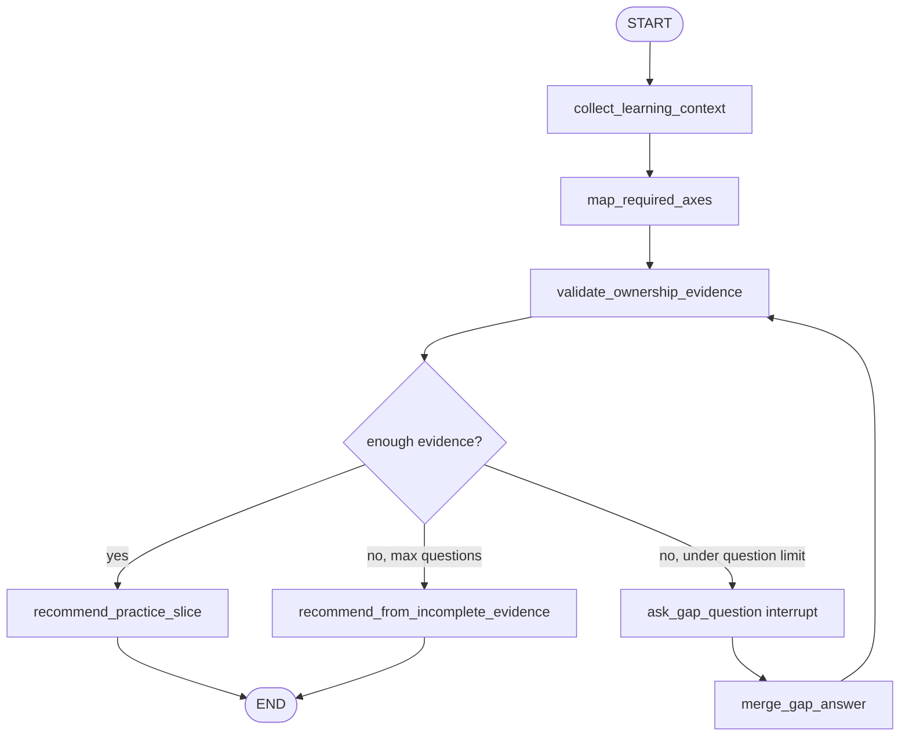

# Implementation Gap Interviewer simulated agent

[English](./README.en.md)

이 폴더는 **구현 소유권 gap을 찾는 dynamic interrupt interview** 패턴을 연습하기 위한 에이전트 개발 랩입니다.

`graph.py`에는 이 패턴의 학습자 구현이 들어 있습니다. 목표는 프로덕션 품질이 아니라, “에이전트가 만든 코드는 따라가지만 직접 처음부터 만들 자신은 없다”는 상태를 LangGraph의 state, node, interrupt/resume, route, stop condition으로 직접 모델링하는 연습입니다. `graph_reference.py`는 대체 파일이 아니라 비교용 reference입니다.

## 연습할 패턴

```text
User
  ↓
학습 상황 수집
  ↓
필요 구현 축 매핑
  ↓
구현 소유권 evidence 검증
  ├── evidence 부족 → gap 질문 interrupt → 답변 병합 → 다시 검증
  └── evidence 충분 → 다음 solo practice slice 추천 → END
```

이 패턴은 `missing_info_interviewer`와 의도적으로 비슷합니다. 그래프는 필요한 정보가 없을 때 추측하지 않고 멈춰서 질문해야 합니다. 차이는 missing information이 일반 task metadata가 아니라, 학습자가 production-shaped feature를 더 작은 형태로 직접 구현할 수 있는지에 대한 evidence라는 점입니다.

- **학습 상황 수집**: 학습자의 목표와 현재 능력 self-report를 보존합니다.
- **필요 구현 축 매핑**: schemas, routes, persistence, streaming, tests, deployment처럼 목표에 필요한 구현 축을 고릅니다.
- **구현 소유권 evidence 검증**: 어떤 축은 직접 구현했고 어떤 축은 리뷰만 했는지 구분합니다.
- **gap 질문 interrupt**: 가장 위험한 missing evidence에 대해 한 가지 집중 질문을 합니다.
- **답변 병합**: resume된 답변을 state에 병합하고 다시 검증합니다.
- **다음 practice slice 추천**: 작고 독립적인 from-scratch 연습 과제와 성공 기준을 만듭니다.

## 에이전트 목표

사용자가 “제품 데모는 Codex가 만들었고 나는 리뷰는 가능하지만 처음부터 구현하라면 실패할 것 같다” 같은 gap을 말하면, Implementation Gap Interviewer는 가장 위험한 구현 evidence 부족 지점을 찾고 작은 solo exercise로 연결해야 합니다.

예시 입력:

```text
I understand the FastAPI conversation endpoint Codex wrote, but I don't think I can build one from scratch.
```

그래프는 위로만 하는 답변을 피해야 합니다. 대신 부족한 evidence를 묻고, “빈 폴더에서 `/health`와 `/chat`을 Pydantic schema와 test까지 직접 만든다” 같은 작은 연습 과제를 만들어야 합니다.

## 요구 동작

### 1. collect_learning_context node

이 노드는 최종 practice plan을 바로 만들지 않습니다.

원본 학습자 문장을 `user_request`에 보존하고, 확실히 추출 가능한 내용만 `learner_context`에 저장합니다.

```python
{
    "user_request": "I can review FastAPI code but cannot build it from scratch.",
    "learner_context": {
        "target_area": "FastAPI backend endpoint",
        "current_mode": "reviewing agent-built code",
    },
}
```

책임:

- 원본 문장을 보존합니다.
- 실제로 말한 정보만 저장합니다.
- “리뷰/이해 가능”과 “독립 구현 가능”을 구분합니다.
- 과한 위로나 비난을 피합니다.

### 2. map_required_axes node

이 노드는 목표 영역을 짧은 구현 축 목록으로 매핑합니다.

처음에는 LLM 없이 deterministic mapping으로 시작합니다.

```python
IMPLEMENTATION_AXES = {
    "fastapi_endpoint": ["route", "schema", "service_boundary", "test"],
    "conversation_streaming": ["route", "sse_contract", "persistence", "failure_path", "test"],
    "rag_service": ["ingestion", "chunking", "retrieval", "citation", "evaluation"],
    "langgraph_interrupt": ["state", "interrupt", "resume", "routing", "checkpoint"],
}
```

예시 state update:

```python
{
    "target_area": "conversation_streaming",
    "required_axes": ["route", "sse_contract", "persistence", "failure_path", "test"],
}
```

### 3. validate_ownership_evidence node

이 노드는 각 구현 축에 독립 구현 evidence가 있는지 확인합니다.

Evidence level은 보수적으로 둡니다.

```text
none < watched < reviewed < modified < rebuilt_from_scratch
```

예시 state update:

```python
{
    "ownership_evidence": {
        "route": "reviewed",
        "sse_contract": "none",
        "persistence": "reviewed",
        "test": "modified",
    },
    "missing_axes": ["sse_contract", "failure_path"],
    "ready_to_recommend": False,
}
```

검증 책임:

- 리뷰 가능성을 구현 소유권으로 취급하지 않습니다.
- 가장 위험한 missing axis를 찾습니다.
- 유용한 practice slice를 고를 만큼 정보가 있을 때만 `ready_to_recommend=True`를 설정합니다.
- 자기평가 루프가 끝없이 돌지 않도록 질문 횟수 제한을 둡니다.

### 4. ask_gap_question interrupt node

Ask gap question은 `interrupt(...)`로 그래프 실행을 잠시 멈춥니다.

`question`, `missing_axes`, `current_evidence` 같은 payload key는 LangGraph의 특별한 필드가 아니라 caller/CLI/frontend가 렌더링하기 위한 약속입니다.

```python
answer = interrupt(
    {
        "type": "implementation_gap_required",
        "question": state["next_question"],
        "missing_axes": state["missing_axes"],
        "current_evidence": state.get("ownership_evidence", {}),
        "answer_format": "axis=evidence_level; blocker=...",
    }
)
```

책임:

- 한 번에 한 가지 집중 질문만 합니다.
- graph node 안에서 terminal `input()`을 직접 호출하지 않습니다.
- resume된 답변을 다음 node가 병합할 수 있게 반환합니다.
- 구체적이고 비판단적인 톤을 유지합니다.

### 5. merge_gap_answer node

첫 구현은 LLM 대신 간단한 key-value syntax를 사용합니다.

```text
sse_contract=none; failure_path=watched; blocker=I don't know how StreamingResponse persists after errors
```

예시 state update:

```python
{
    "ownership_evidence": {
        "sse_contract": "none",
        "failure_path": "watched",
    },
    "blockers": ["I don't know how StreamingResponse persists after errors"],
}
```

### 6. recommend_practice_slice node

최종 결과는 커리어 판단이 아닙니다. Codex가 production code를 대신 작성하지 않아도 학습자가 직접 할 수 있는 작은 exercise여야 합니다.

예시 final result:

```text
Next solo practice slice:
Build a minimal FastAPI SSE endpoint from an empty folder.

Success criteria:
- POST /runs/stream accepts {"message": "..."}
- emits answer_delta and run_completed events
- has one test that parses the SSE stream
- no database, no LangGraph, no auth yet

Allowed help:
- docs and error explanations are allowed
- AI may review your code after the first working attempt
- AI should not write the first implementation
```

## 라우팅 / 반복 규칙

Practice slice를 고를 만큼 evidence가 있으면 `recommend_practice_slice`로 보냅니다.

Evidence가 부족하고 `question_count < 3`이면 `ask_gap_question`으로 보냅니다.

질문 제한에 도달하면 `recommend_from_incomplete_evidence`로 보내고 가장 안전하게 작은 연습 과제를 고릅니다.

```python
if ready_to_recommend:
    return "recommend_practice_slice"

if question_count >= 3:
    return "recommend_from_incomplete_evidence"

return "ask_gap_question"
```

두 final node는 반드시 `final_result`를 써야 합니다.

## 상태 설계

공유 graph state 이름은 `ImplementationGapInterviewState`로 둡니다.

```python
class ImplementationGapInterviewState(TypedDict):
    user_request: str
    learner_context: NotRequired[dict[str, str]]
    target_area: NotRequired[str]
    required_axes: NotRequired[list[str]]
    ownership_evidence: NotRequired[dict[str, str]]
    missing_axes: NotRequired[list[str]]
    blockers: NotRequired[list[str]]
    next_question: NotRequired[str]
    last_answer: NotRequired[str]
    question_count: NotRequired[int]
    ready_to_recommend: NotRequired[bool]
    final_result: NotRequired[str]
```

초기 입력에서 필수인 것은 `user_request`뿐입니다. 나머지는 node가 만들어내는 필드입니다.

## 그래프 초안



## 리뷰 산출물

- `FEEDBACK.md`: 첫 working implementation에 대한 학습자용 리뷰입니다.
- `graph_reference.py`: 비교용 runnable reference implementation이며 `graph.py`를 대체하지 않습니다.

## 실행 방법

현재 bootstrap은 OpenAI API 키 없이 실행됩니다.

```bash
uv run python -m simulated_agents.implementation_gap_interviewer.graph
```

종료:

```text
/exit
```

구현 후에는 학습을 위해 node-level debug log를 남기는 것을 권장합니다.

```text
[collect_learning_context] extracting self-assessment
[map_required_axes] choosing implementation axes
[validate_ownership_evidence] checking ownership evidence
[route] deciding next node
[final result]
```

## 학습 포인트

이 그래프는 missing-info 패턴을 “구현 소유권 evidence”에 맞춘 버전입니다.

- `missing_info_interviewer`와 비교하면 task metadata가 아니라 구현 능력 evidence를 질문합니다.
- 실제 멘토링 시스템, 온보딩 시스템, 인터뷰 준비 도구, adaptive learning agent에서 쓰일 수 있는 패턴입니다.
- `interrupt`, `Command(resume=...)`, checkpointer config, route function, 보수적인 state update에 집중하세요.

## 구현 제약

- 첫 버전은 deterministic하고 inline으로 구현합니다.
- LLM extraction을 붙이기 전에 key-value parsing으로 시작합니다.
- 프로덕션 API/CLI surface에 연결하지 않습니다.
- 넓은 커리어 상담을 하지 말고, 하나의 작은 practice slice를 출력합니다.
- fake data와 self-assessment label은 simulation임을 분명히 합니다.
